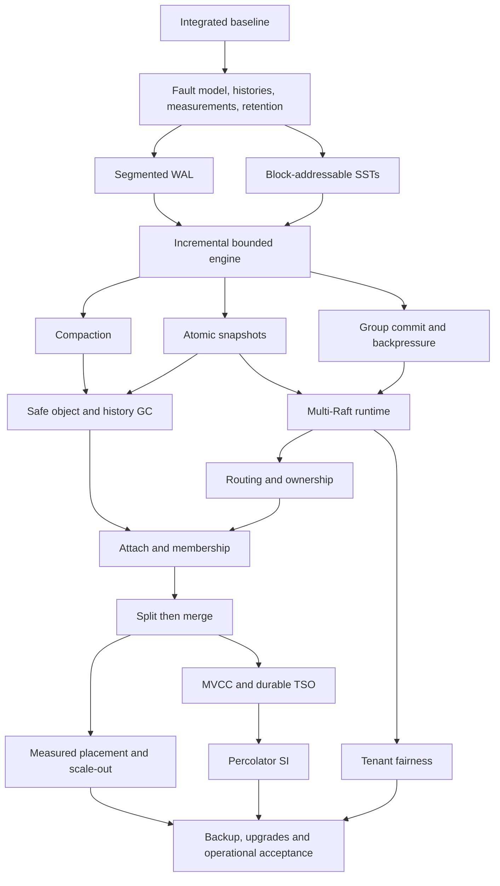

# Detailed development path

> Latest performance direction: [matched read-stage diagnosis](READ-STAGE-RESULTS.md)
> identifies the c1 quorum round trip and c64 remote completion resumption.
> A bounded global-queue polling experiment is in progress; default selection
> and the Redis read milestone remain open. The prior uninstrumented results
> retain their original scope.

Updated: 2026-09-11. GitHub tracker: [#9](https://github.com/c4pt0r/kv9/issues/9).

See [CURRENT-STATUS.md](CURRENT-STATUS.md) for the current performance baseline,
published experiments and next executable steps. Read performance remains the
active product milestone, followed by dynamic multi-Raft and automatic splits.
The dependency index and proof/fault/availability gates below still apply;
partial experimental results do not complete their broader work packages.

The [completed notification screen](COALESCED-OWNER-PERFORMANCE.md) finds
candidate `42e0117` improves c64 GET throughput 1.123% and c64 mixed throughput
2.730%, with better loaded/mixed GET mean and p99 in both repetitions. C1 GET
remains unimproved (-0.248% throughput, +0.260% mean); its mean is about 6.67x
same-run Redis. All 49,944,895 measured calls succeed in one attempt, and all
24 cohorts plus exact environment restoration pass the independent audit.
This is shared-host loopback with ordinary three-voter quorum/sync on tmpfs WAL,
not equal-durability, real-disk, cross-host or sustained-capacity evidence.

[Proof/source/ordinary-recovery qualification](COALESCED-OWNER-VALIDATION.md)
passes: new scheduling refinement 14 theorems / 64 obligations, unchanged
scheduling dependency 33 / 294, 438 default tests/doctests (one existing ignored),
214 overlapping testing-feature tests/doctests, formatting/Clippy and 369 checked
recovery operations (341 OK / 28 unknown). The three new race tests cover
concurrent publication, bounded drain and terminal stop. Full implementation
proofs and actual candidate Chaos remain open; do not close a broad work package.

Keep CRC selected and the notification candidate frozen for applicable broader
point/batch measurements and actual exact-source Chaos acceptance. Prioritize
isolated GET serial RPC/owner/completion costs for the next bounded diagnostic.
The [CPU/scheduler investigation](PEER-SCHEDULING-DIAGNOSTIC.md) led to this change;
its sampled 4% notification stacks never predicted the measured effect size.
The earlier outbound-executor regression and body-handoff investigation retain
their original decisions; do not rerun their rejected candidates.

Preserve fresh Safe ReadIndex, sealed groups, complete successful pump/apply/view
fences, durable writes, cancellation/deadlines and bounded ownership. Dynamic
multi-Raft and automatic splits follow the still-open read milestone and their
existing storage/recovery/proof prerequisites. CI stays local.

<!-- kv9-roadmap-20260908:epic -->
This is the execution tracker for evolving kv9 from its basic distributed Raw KV baseline into an industrial-grade distributed database. Priorities are consistency, recoverability, bounded resources, measured throughput and scalable ownership. Complex private-network TLS configuration is P4 work.

## Published baseline

Implementation commit: [ec50678](https://github.com/c4pt0r/kv9/commit/ec506780f273663da9b1d37fe9357495d549bf7c). The baseline adds metadata repairs, atomic WAL v2 data/position recovery, real MinIO checkpoints and durable pending-flush reconciliation. Existing #5, #6, #7 and #8 retain their original scope; C00 owns integrated acceptance.

Local evidence: 413 normal tests, 20 doctests, 21 real MinIO tests and eight E2E paths. These numbers do not assert hosted CI success. The full dataset still resides in memory, checkpoints have a 48 MiB serialized ceiling, Raft history is retained, and there is no incremental LSM or multi-group data runtime yet.

Hosted baseline acceptance: [GitHub Actions run 34274338807](https://github.com/c4pt0r/kv9/actions/runs/34274338807) completed successfully with all nine jobs passing. This is evidence for the published implementation, not completion of the future work packages.

## Mandatory correctness and availability gates

These requirements supplement every work package without removing existing deliverables. Full contract: [correctness gates](https://github.com/c4pt0r/kv9/blob/master/docs/CORRECTNESS-GATES.md).

- Core algorithms require rigorous proofs with explicit state, transitions, invariants, safety and conditional liveness. Machine-check protocol lemmas and document their mapping to implementation events; bounded model checking and E2E tests do not replace proofs.
- E2E must run actual Chaos Mesh fault injection with positive effect observations, independent operation histories and retained success/failure artifacts. SIGKILL is not a power-loss model.
- The database must have no service-critical single point of failure except the object-store dependency. Cover metadata, TSO, schedulers, coordinators, discovery and client routing. Availability is conditional on the stated quorum/failure budget; test every voter and later separate host failure domains.

Each issue remains open until its applicable proof, fault and availability obligations have evidence. An abstract lemma does not establish a complete implementation proof, and a one-host Kind run does not establish host-loss tolerance.

## Execution rules

1. Follow the explicit issue dependencies. Stage exit gates are additional acceptance requirements; interface/design work may overlap, but later-stage claims require the earlier gates.
2. Start C00, then develop deterministic faults, history checking, measurement and retention contracts. Keep the same correctness workload while changing persistence, batching and ownership.
3. Snapshot installation and its recovery anchor precede Raft truncation. Durable pins and pending-history evidence precede SST/history GC.
4. Measure throughput with unchanged durability and read semantics. A matching final state, mock-only storage run, zero selected tests or unknown checker result is not acceptance.
5. Do not silently weaken cross-region Raw semantics. Unsupported atomic operations must refuse before side effects; unknown writes remain unknown unless deduplication proves a safe retry.
6. Close implementation issues only with linked commits and check evidence. Phase gates and the tracker remain open until all applicable acceptance criteria are met. Dates are not promised without capacity estimates.

## Stages and issue checklist

### P0 - Verified foundation

C00 integrates the baseline; C01/C02/C03/C04 can start independently afterward. Complete the fault model, history checker, measurements and retention contract before accepting P1 capacity or performance claims.

- [x] [#10](https://github.com/c4pt0r/kv9/issues/10) **C00** - Integrate the takeover fixes and establish a reproducible acceptance baseline
- [ ] [#11](https://github.com/c4pt0r/kv9/issues/11) **C01** - Build deterministic fault injection and a persistence recovery matrix
- [ ] [#12](https://github.com/c4pt0r/kv9/issues/12) **C02** - Record and check linearizable Raw KV and metadata histories
- [ ] [#13](https://github.com/c4pt0r/kv9/issues/13) **C03** - Establish observability and reproducible single-group performance baselines
- [ ] [#14](https://github.com/c4pt0r/kv9/issues/14) **C04** - Define format compatibility, recovery anchors and shared retention rules

### P1 - Bounded storage and throughput

Implement segmented WAL and block reads, then incremental views. Compaction, snapshot installation and batching follow their explicit dependencies. Enable physical GC only after retention and snapshot safety are proven. Exit with a dataset larger than RAM, bounded resources and unchanged correctness guarantees.

- [ ] [#15](https://github.com/c4pt0r/kv9/issues/15) **S01** - Implement segmented engine WAL and watermark-based reclamation
- [ ] [#16](https://github.com/c4pt0r/kv9/issues/16) **S02** - Add block-addressable SST reads and a bounded cache
- [ ] [#17](https://github.com/c4pt0r/kv9/issues/17) **S03** - Integrate incremental flush and immutable versioned read views
- [ ] [#18](https://github.com/c4pt0r/kv9/issues/18) **S04** - Implement compaction with safe point and range tombstone retention
- [ ] [#19](https://github.com/c4pt0r/kv9/issues/19) **S05** - Implement atomic Raft snapshot installation and safe log truncation
- [ ] [#20](https://github.com/c4pt0r/kv9/issues/20) **S06** - Add proposal batching, group commit and end-to-end backpressure
- [ ] [#21](https://github.com/c4pt0r/kv9/issues/21) **S07** - Implement pin-aware SST garbage collection and manifest history pruning

### P2 - Multi-group ownership and scale-out

Build the group runtime and routing before replica attachment, split/merge and automatic placement. Exit with recoverable ownership transitions and measured independent-hotspot scaling across machines.

- [ ] [#22](https://github.com/c4pt0r/kv9/issues/22) **D01** - Build RegionManager and a resource-bounded multi-Raft runtime
- [ ] [#23](https://github.com/c4pt0r/kv9/issues/23) **D02** - Route requests to real regions with epoch fencing and bounded retries
- [ ] [#24](https://github.com/c4pt0r/kv9/issues/24) **D03** - Implement remote learner attachment and recoverable replica migration
- [ ] [#25](https://github.com/c4pt0r/kv9/issues/25) **D04** - Implement recoverable pre-sharding and region splits
- [ ] [#26](https://github.com/c4pt0r/kv9/issues/26) **D05** - Implement adjacent region merges with crash recovery
- [ ] [#27](https://github.com/c4pt0r/kv9/issues/27) **D06** - Add load-aware placement, hotspot control and scale-out acceptance

### P3 - Transactions and tenant isolation

Land MVCC/TSO before Percolator SI and its independent checker. Tenant fairness may overlap late P2 once shared resource interfaces are stable. Exit with verified SI and bounded noisy-neighbor impact.

- [ ] [#28](https://github.com/c4pt0r/kv9/issues/28) **T01** - Implement MVCC storage and durable TSO/timeline authority
- [ ] [#29](https://github.com/c4pt0r/kv9/issues/29) **T02** - Implement Percolator SI, lock recovery and transaction history checking
- [ ] [#30](https://github.com/c4pt0r/kv9/issues/30) **T03** - Implement tenant quotas, fair scheduling and resource accounting

### P4 - Operational delivery

Deliver complete backup/PITR and versioned upgrade protocols, then long-duration operational acceptance. TLS/mTLS and backend compatibility remain explicit later priorities. Exit with actual restore/upgrade/soak evidence, not a production-readiness label based on short tests.

- [ ] [#31](https://github.com/c4pt0r/kv9/issues/31) **O01** - Deliver complete backup and point-in-time recovery
- [ ] [#32](https://github.com/c4pt0r/kv9/issues/32) **O02** - Implement format migration and verified rolling upgrades
- [ ] [#33](https://github.com/c4pt0r/kv9/issues/33) **O03** - Complete operational controls, diagnostics and long-duration acceptance
- [ ] [#34](https://github.com/c4pt0r/kv9/issues/34) **O04** - Add TLS configuration, credential rotation and S3 backend compatibility

## Dependency index

| Key | Deliverable | Depends on |
|---|---|---|
| C00 | [#10](https://github.com/c4pt0r/kv9/issues/10) Integrate the takeover fixes and establish a reproducible acceptance baseline | Existing #5-#8 integration |
| C01 | [#11](https://github.com/c4pt0r/kv9/issues/11) Build deterministic fault injection and a persistence recovery matrix | [#10](https://github.com/c4pt0r/kv9/issues/10) (C00) |
| C02 | [#12](https://github.com/c4pt0r/kv9/issues/12) Record and check linearizable Raw KV and metadata histories | [#10](https://github.com/c4pt0r/kv9/issues/10) (C00) |
| C03 | [#13](https://github.com/c4pt0r/kv9/issues/13) Establish observability and reproducible single-group performance baselines | [#10](https://github.com/c4pt0r/kv9/issues/10) (C00) |
| C04 | [#14](https://github.com/c4pt0r/kv9/issues/14) Define format compatibility, recovery anchors and shared retention rules | [#10](https://github.com/c4pt0r/kv9/issues/10) (C00) |
| S01 | [#15](https://github.com/c4pt0r/kv9/issues/15) Implement segmented engine WAL and watermark-based reclamation | [#11](https://github.com/c4pt0r/kv9/issues/11) (C01), [#14](https://github.com/c4pt0r/kv9/issues/14) (C04) |
| S02 | [#16](https://github.com/c4pt0r/kv9/issues/16) Add block-addressable SST reads and a bounded cache | [#13](https://github.com/c4pt0r/kv9/issues/13) (C03), [#14](https://github.com/c4pt0r/kv9/issues/14) (C04) |
| S03 | [#17](https://github.com/c4pt0r/kv9/issues/17) Integrate incremental flush and immutable versioned read views | [#15](https://github.com/c4pt0r/kv9/issues/15) (S01), [#16](https://github.com/c4pt0r/kv9/issues/16) (S02), [#12](https://github.com/c4pt0r/kv9/issues/12) (C02), [#14](https://github.com/c4pt0r/kv9/issues/14) (C04) |
| S04 | [#18](https://github.com/c4pt0r/kv9/issues/18) Implement compaction with safe point and range tombstone retention | [#17](https://github.com/c4pt0r/kv9/issues/17) (S03), [#11](https://github.com/c4pt0r/kv9/issues/11) (C01), [#12](https://github.com/c4pt0r/kv9/issues/12) (C02), [#14](https://github.com/c4pt0r/kv9/issues/14) (C04) |
| S05 | [#19](https://github.com/c4pt0r/kv9/issues/19) Implement atomic Raft snapshot installation and safe log truncation | [#15](https://github.com/c4pt0r/kv9/issues/15) (S01), [#17](https://github.com/c4pt0r/kv9/issues/17) (S03), [#11](https://github.com/c4pt0r/kv9/issues/11) (C01), [#14](https://github.com/c4pt0r/kv9/issues/14) (C04) |
| S06 | [#20](https://github.com/c4pt0r/kv9/issues/20) Add proposal batching, group commit and end-to-end backpressure | [#11](https://github.com/c4pt0r/kv9/issues/11) (C01), [#12](https://github.com/c4pt0r/kv9/issues/12) (C02), [#13](https://github.com/c4pt0r/kv9/issues/13) (C03), [#17](https://github.com/c4pt0r/kv9/issues/17) (S03) |
| S07 | [#21](https://github.com/c4pt0r/kv9/issues/21) Implement pin-aware SST garbage collection and manifest history pruning | [#18](https://github.com/c4pt0r/kv9/issues/18) (S04), [#19](https://github.com/c4pt0r/kv9/issues/19) (S05), [#12](https://github.com/c4pt0r/kv9/issues/12) (C02), [#14](https://github.com/c4pt0r/kv9/issues/14) (C04) |
| D01 | [#22](https://github.com/c4pt0r/kv9/issues/22) Build RegionManager and a resource-bounded multi-Raft runtime | [#19](https://github.com/c4pt0r/kv9/issues/19) (S05), [#20](https://github.com/c4pt0r/kv9/issues/20) (S06) |
| D02 | [#23](https://github.com/c4pt0r/kv9/issues/23) Route requests to real regions with epoch fencing and bounded retries | [#22](https://github.com/c4pt0r/kv9/issues/22) (D01), [#12](https://github.com/c4pt0r/kv9/issues/12) (C02) |
| D03 | [#24](https://github.com/c4pt0r/kv9/issues/24) Implement remote learner attachment and recoverable replica migration | [#22](https://github.com/c4pt0r/kv9/issues/22) (D01), [#23](https://github.com/c4pt0r/kv9/issues/23) (D02), [#19](https://github.com/c4pt0r/kv9/issues/19) (S05), [#21](https://github.com/c4pt0r/kv9/issues/21) (S07) |
| D04 | [#25](https://github.com/c4pt0r/kv9/issues/25) Implement recoverable pre-sharding and region splits | [#23](https://github.com/c4pt0r/kv9/issues/23) (D02), [#24](https://github.com/c4pt0r/kv9/issues/24) (D03), [#18](https://github.com/c4pt0r/kv9/issues/18) (S04), [#21](https://github.com/c4pt0r/kv9/issues/21) (S07), [#12](https://github.com/c4pt0r/kv9/issues/12) (C02) |
| D05 | [#26](https://github.com/c4pt0r/kv9/issues/26) Implement adjacent region merges with crash recovery | [#25](https://github.com/c4pt0r/kv9/issues/25) (D04), [#24](https://github.com/c4pt0r/kv9/issues/24) (D03), [#21](https://github.com/c4pt0r/kv9/issues/21) (S07), [#12](https://github.com/c4pt0r/kv9/issues/12) (C02) |
| D06 | [#27](https://github.com/c4pt0r/kv9/issues/27) Add load-aware placement, hotspot control and scale-out acceptance | [#24](https://github.com/c4pt0r/kv9/issues/24) (D03), [#25](https://github.com/c4pt0r/kv9/issues/25) (D04), [#26](https://github.com/c4pt0r/kv9/issues/26) (D05), [#13](https://github.com/c4pt0r/kv9/issues/13) (C03) |
| T01 | [#28](https://github.com/c4pt0r/kv9/issues/28) Implement MVCC storage and durable TSO/timeline authority | [#23](https://github.com/c4pt0r/kv9/issues/23) (D02), [#25](https://github.com/c4pt0r/kv9/issues/25) (D04), [#18](https://github.com/c4pt0r/kv9/issues/18) (S04), [#14](https://github.com/c4pt0r/kv9/issues/14) (C04) |
| T02 | [#29](https://github.com/c4pt0r/kv9/issues/29) Implement Percolator SI, lock recovery and transaction history checking | [#28](https://github.com/c4pt0r/kv9/issues/28) (T01), [#24](https://github.com/c4pt0r/kv9/issues/24) (D03), [#26](https://github.com/c4pt0r/kv9/issues/26) (D05), [#12](https://github.com/c4pt0r/kv9/issues/12) (C02) |
| T03 | [#30](https://github.com/c4pt0r/kv9/issues/30) Implement tenant quotas, fair scheduling and resource accounting | [#20](https://github.com/c4pt0r/kv9/issues/20) (S06), [#22](https://github.com/c4pt0r/kv9/issues/22) (D01), [#13](https://github.com/c4pt0r/kv9/issues/13) (C03) |
| O01 | [#31](https://github.com/c4pt0r/kv9/issues/31) Deliver complete backup and point-in-time recovery | [#14](https://github.com/c4pt0r/kv9/issues/14) (C04), [#19](https://github.com/c4pt0r/kv9/issues/19) (S05), [#21](https://github.com/c4pt0r/kv9/issues/21) (S07), [#29](https://github.com/c4pt0r/kv9/issues/29) (T02) |
| O02 | [#32](https://github.com/c4pt0r/kv9/issues/32) Implement format migration and verified rolling upgrades | [#14](https://github.com/c4pt0r/kv9/issues/14) (C04), [#24](https://github.com/c4pt0r/kv9/issues/24) (D03), [#29](https://github.com/c4pt0r/kv9/issues/29) (T02) |
| O03 | [#33](https://github.com/c4pt0r/kv9/issues/33) Complete operational controls, diagnostics and long-duration acceptance | [#27](https://github.com/c4pt0r/kv9/issues/27) (D06), [#29](https://github.com/c4pt0r/kv9/issues/29) (T02), [#30](https://github.com/c4pt0r/kv9/issues/30) (T03), [#31](https://github.com/c4pt0r/kv9/issues/31) (O01), [#32](https://github.com/c4pt0r/kv9/issues/32) (O02), [#13](https://github.com/c4pt0r/kv9/issues/13) (C03) |
| O04 | [#34](https://github.com/c4pt0r/kv9/issues/34) Add TLS configuration, credential rotation and S3 backend compatibility | [#14](https://github.com/c4pt0r/kv9/issues/14) (C04), [#24](https://github.com/c4pt0r/kv9/issues/24) (D03) |

## Critical path

The diagram is a critical-path summary; the dependency index and each issue define the complete prerequisites.

## Release evidence

- P0: reproducible fault cuts, independent histories, typed refusal/unknown semantics, retention and compatibility contracts.
- P1: a dataset exceeding configured RAM, bounded live resource usage across compaction cycles, safe truncation/GC and repeatable throughput results.
- P2: actual groups and recoverable ownership changes, with byte-accounted attachment and cross-machine scaling evidence.
- P3: independently verified SI and measured tenant isolation under overload.
- P4: empty-environment restore, real mixed-version upgrades, measured RPO/RTO, and completed long-duration runs. TLS remains a later deployment capability.

Reference documents: [architecture](https://github.com/c4pt0r/kv9/blob/ec506780f273663da9b1d37fe9357495d549bf7c/DESIGN.md), [roadmap](https://github.com/c4pt0r/kv9/blob/ec506780f273663da9b1d37fe9357495d549bf7c/docs/ROADMAP.md), [object-storage contract](https://github.com/c4pt0r/kv9/blob/ec506780f273663da9b1d37fe9357495d549bf7c/docs/OBJECT-STORAGE.md), and [testing rules](https://github.com/c4pt0r/kv9/blob/ec506780f273663da9b1d37fe9357495d549bf7c/docs/TESTING.md).

## Detailed work packages

### C00 - Integrate the takeover fixes and establish a reproducible acceptance baseline

Issue: [#10](https://github.com/c4pt0r/kv9/issues/10)

<!-- kv9-roadmap-20260908:C00 -->
Parent: [Roadmap tracker](https://github.com/c4pt0r/kv9/issues/9)

**Stage:** P0 - Verified foundation
**Depends on:** No new roadmap dependency; integrate the existing #5, #6, #7 and #8 work.
**Code entry points:** crates/{meta,engine,raft,server}; .github/workflows/ci.yml; docs/TAKEOVER-*

#### Problem and outcome

The next stages depend on the metadata fixes, positioned WAL recovery, and production MinIO path prepared on 2026-09-08. Local results must be tied to an exact published commit and verified hosted checks.

#### Implementation sequence

1. Integrate the coherent metadata, Raft/WAL, checkpoint and pending-recovery changes with their tests and documentation. Record the exact commit. Existing #5, #6, #7 and #8 retain ownership of their original implementation requirements; this issue owns composition and acceptance.
2. Verify statement atomicity, FK/ID constraints, bootstrap barriers, same-term catalog proposals, quorum reads, epoch fences, atomic data/position durability, and recovery of the original pending identity.
3. Keep selected test counts, exit codes, exclusive completion markers and uploaded artifacts in CI. Ensure fault-injection features are absent from the default binary.
4. Update the audit and quickstart against the published tree. Link completed work to existing issues only after the corresponding commit and hosted results can be checked.

#### Acceptance criteria

- [ ] A clean checkout passes workspace tests, doctests, Clippy with -D warnings, formatting and documentation checks at a recorded commit.
- [ ] Real MinIO backend/checkpoint suites and all eight existing E2E scripts execute with nonzero selection, their own completion markers and retained logs.
- [ ] The documented three-replica workflow supports keyspace creation, reads/writes/deletes, failover and full restart. The local reference run recorded 413 normal tests, 20 doctests and 21 real MinIO tests; report actual counts as the suite evolves.

#### Scope boundary

No incremental LSM, multi-Raft implementation or new TLS configuration in this integration issue. Hosted checks remain pending until actually observed.

#### Mandatory correctness and availability gates

The [shared correctness contract](https://github.com/c4pt0r/kv9/blob/master/docs/CORRECTNESS-GATES.md) supplements this issue's original scope.

- [ ] Core protocol changes have rigorous proofs, checked lemmas and an explicit implementation refinement record; unresolved assumptions remain visible. Infrastructure-only changes identify the proof obligations they preserve.
- [ ] Applicable E2E scenarios run under actual Chaos Mesh with observed fault effects, correct operation histories and retained success/failure evidence. Record any uncovered fault family explicitly.
- [ ] The component's authority, recovery and client path require no indispensable database node or singleton service. State the quorum/failure-domain assumptions and provide every-voter or role-takeover evidence as applicable; the object store is the sole allowed dependency exception.

#### Completion evidence

Link the implementation commits or PRs and actual check runs. Record selected tests, failure cuts, and known coverage limits. Performance claims require the configuration and raw results from C03.

Implementation reference: [ec50678](https://github.com/c4pt0r/kv9/commit/ec506780f273663da9b1d37fe9357495d549bf7c). See the published [audit](https://github.com/c4pt0r/kv9/blob/ec506780f273663da9b1d37fe9357495d549bf7c/docs/TAKEOVER-AUDIT.md) and [validation record](https://github.com/c4pt0r/kv9/blob/ec506780f273663da9b1d37fe9357495d549bf7c/docs/TAKEOVER-VALIDATION.md).

### C01 - Build deterministic fault injection and a persistence recovery matrix

Issue: [#11](https://github.com/c4pt0r/kv9/issues/11)

<!-- kv9-roadmap-20260908:C01 -->
Parent: [Roadmap tracker](https://github.com/c4pt0r/kv9/issues/9)

**Stage:** P0 - Verified foundation
**Depends on:** [#10](https://github.com/c4pt0r/kv9/issues/10)
**Code entry points:** engine/{wal,persist,checkpoint,flush_journal,testing}; raft/{driver,storage,testing}; scripts/

#### Problem and outcome

Existing process crash cuts and byte-truncation tests do not cover the complete write/fsync/rename/send ordering or storage and network failure combinations.

#### Implementation sequence

1. Document the failure model: process crash, loss of unsynced writes, torn records, EIO/ENOSPC, unavailable objects, and dropped/duplicated/reordered messages. Separate tolerated failures, required recovery refusal and failures beyond the durability assumptions.
2. Add nondefault test cuts around WAL and directory durability, Ready persistence before send, upload visibility, pending publication, manifest apply, checkpoint pointers and WAL replacement.
3. Implement a seeded deterministic runner with a replayable schedule. Its filesystem model must distinguish visible writes from durable writes; SIGKILL alone is not a power-loss simulation.
4. Extend the real-process prepare/apply crash tests to bootstrap, membership transitions, partitions and healing. Retain minimal reproducers and original files on failure.

#### Acceptance criteria

- [ ] Every named cut has positive arrival evidence. Under the stated model, acknowledged writes survive, deleted values do not reappear, and applied watermarks never skip failed entries.
- [ ] Single-defect controls for persist-before-send, data/position atomicity and premature reclamation fail at named assertions; restored code passes.
- [ ] CI runs a bounded deterministic set, nightly runs expand seeds, and every cell identifies whether it tests process crashes or a persistence model.

#### Scope boundary

Do not claim exhaustive hardware coverage. Test hooks must not become default production behavior.

#### Mandatory correctness and availability gates

The [shared correctness contract](https://github.com/c4pt0r/kv9/blob/master/docs/CORRECTNESS-GATES.md) supplements this issue's original scope.

- [ ] Core protocol changes have rigorous proofs, checked lemmas and an explicit implementation refinement record; unresolved assumptions remain visible. Infrastructure-only changes identify the proof obligations they preserve.
- [ ] Applicable E2E scenarios run under actual Chaos Mesh with observed fault effects, correct operation histories and retained success/failure evidence. Record any uncovered fault family explicitly.
- [ ] The component's authority, recovery and client path require no indispensable database node or singleton service. State the quorum/failure-domain assumptions and provide every-voter or role-takeover evidence as applicable; the object store is the sole allowed dependency exception.

Additional C01 deliverables: integrate PodChaos, NetworkChaos and IOChaos in reproducible CI environments; cover kill/failure, partition, delay/loss and storage EIO/ENOSPC/latency where supported. Distinguish process crash, actual Chaos Mesh effects and modeled power loss in the evidence matrix. Exercise bootstrap, membership, checkpoint/pending recovery and every voter. Keep the full deterministic filesystem model and persistence-before-send controls in scope.

#### Completion evidence

Link the implementation commits or PRs and actual check runs. Record selected tests, failure cuts, and known coverage limits. Performance claims require the configuration and raw results from C03.

Implementation reference: [ec50678](https://github.com/c4pt0r/kv9/commit/ec506780f273663da9b1d37fe9357495d549bf7c). See the published [audit](https://github.com/c4pt0r/kv9/blob/ec506780f273663da9b1d37fe9357495d549bf7c/docs/TAKEOVER-AUDIT.md) and [validation record](https://github.com/c4pt0r/kv9/blob/ec506780f273663da9b1d37fe9357495d549bf7c/docs/TAKEOVER-VALIDATION.md).

### C02 - Record and check linearizable Raw KV and metadata histories

Issue: [#12](https://github.com/c4pt0r/kv9/issues/12)

<!-- kv9-roadmap-20260908:C02 -->
Parent: [Roadmap tracker](https://github.com/c4pt0r/kv9/issues/9)

**Stage:** P0 - Verified foundation
**Depends on:** [#10](https://github.com/c4pt0r/kv9/issues/10)
**Code entry points:** new workload/history checker under scripts/; public server APIs; metadata catalog operations

#### Problem and outcome

Matching final values cannot detect stale reads, false success receipts or transient consistency violations during leadership changes.

#### Implementation sequence

1. Define invocation/response histories with operation IDs, arguments, outcomes and real-time ordering. Distinguish success, proven pre-commit refusal and unknown outcome; a timeout or generic NotLeader is not automatically proof that a write failed.
2. Implement an independent sequential model for put/get/delete/delete-range, bounded atomic scans, unique keyspace names and ID allocation. Do not incorrectly partition overlapping range operations into independent single-key histories.
3. Run concurrent workloads through real three-process APIs with catalog mutations, failover, partitions and restart. Integrate C01 fault schedules after that harness is available.
4. Return valid, invalid or inconclusive/search-timeout explicitly. Minimize counterexamples and include deliberately valid and invalid histories as checker controls.

#### Acceptance criteria

- [ ] The checker rejects known stale reads, lost acknowledged writes, duplicate IDs and real-time ordering violations while accepting legal interpretations of unknown writes.
- [ ] Zero operations, all transport errors, an unready client or checker timeout cannot count as a passing consistency run.
- [ ] CI retains seeds, operation counts, API coverage, known/unknown outcome counts, checker results and runtimes. Fault-history acceptance is completed jointly with C01.

#### Scope boundary

This issue covers the existing Raw KV/catalog guarantees. Transaction SI requires the separate model in T02.

#### Mandatory correctness and availability gates

The [shared correctness contract](https://github.com/c4pt0r/kv9/blob/master/docs/CORRECTNESS-GATES.md) supplements this issue's original scope.

- [ ] Core protocol changes have rigorous proofs, checked lemmas and an explicit implementation refinement record; unresolved assumptions remain visible. Infrastructure-only changes identify the proof obligations they preserve.
- [ ] Applicable E2E scenarios run under actual Chaos Mesh with observed fault effects, correct operation histories and retained success/failure evidence. Record any uncovered fault family explicitly.
- [ ] The component's authority, recovery and client path require no indispensable database node or singleton service. State the quorum/failure-domain assumptions and provide every-voter or role-takeover evidence as applicable; the object store is the sole allowed dependency exception.

Additional C02 deliverables: run the independent history checker over workloads spanning actual Chaos Mesh faults, healing and endpoint failover. Preserve unknown results and real-time constraints; final-state agreement is insufficient. Include negative controls for stale reads and lost acknowledged writes.

#### Completion evidence

Link the implementation commits or PRs and actual check runs. Record selected tests, failure cuts, and known coverage limits. Performance claims require the configuration and raw results from C03.

Implementation reference: [ec50678](https://github.com/c4pt0r/kv9/commit/ec506780f273663da9b1d37fe9357495d549bf7c). See the published [audit](https://github.com/c4pt0r/kv9/blob/ec506780f273663da9b1d37fe9357495d549bf7c/docs/TAKEOVER-AUDIT.md) and [validation record](https://github.com/c4pt0r/kv9/blob/ec506780f273663da9b1d37fe9357495d549bf7c/docs/TAKEOVER-VALIDATION.md).

### C03 - Establish observability and reproducible single-group performance baselines

Issue: [#13](https://github.com/c4pt0r/kv9/issues/13)

<!-- kv9-roadmap-20260908:C03 -->
Parent: [Roadmap tracker](https://github.com/c4pt0r/kv9/issues/9)

**Stage:** P0 - Verified foundation
**Depends on:** [#10](https://github.com/c4pt0r/kv9/issues/10)
**Code entry points:** server metrics; raft/driver; engine persistence and remote I/O; new benchmark scripts

#### Problem and outcome

Per-record fsync, full checkpoints and O(tail) reclamation currently have no reproducible cost baseline.

#### Implementation sequence

1. Instrument proposal/commit/apply/read-barrier latency, fsync, queue bytes, apply lag, upload/flush backlog, memory, logs, objects and recovery time. Separate metadata from user traffic and bound metric cardinality.
2. Build a persistent-connection client with explicit open/closed-loop semantics, client queue time, service time, timeouts and refusals. Detect client saturation and coordinated omission.
3. Record commit, build profile, hardware, disk/network/MinIO topology, key/value sizes, access distribution, read/write mix and concurrency; publish workload setup and raw results.
4. Measure local WAL versus MinIO, steady state versus flush, cold versus warm cache, and uniform versus hot keys. Keep durability and consistency enabled and add C02 correctness sampling.

#### Acceptance criteria

- [ ] Repeatable reports include throughput, p50/p95/p99, error rate, CPU/RSS, I/O amplification, recovery time and run-to-run variation.
- [ ] Metrics export overhead and labels stay bounded; clients and per-request CLI startup are not hidden bottlenecks.
- [ ] The repository contains runnable benchmarks and a report format. Subsequent budgets come from measured results, not invented QPS targets.

#### Scope boundary

Establish measurement before optimization; weakening fsync or consistency is not an acceptable performance improvement.

#### Mandatory correctness and availability gates

The [shared correctness contract](https://github.com/c4pt0r/kv9/blob/master/docs/CORRECTNESS-GATES.md) supplements this issue's original scope.

- [ ] Core protocol changes have rigorous proofs, checked lemmas and an explicit implementation refinement record; unresolved assumptions remain visible. Infrastructure-only changes identify the proof obligations they preserve.
- [ ] Applicable E2E scenarios run under actual Chaos Mesh with observed fault effects, correct operation histories and retained success/failure evidence. Record any uncovered fault family explicitly.
- [ ] The component's authority, recovery and client path require no indispensable database node or singleton service. State the quorum/failure-domain assumptions and provide every-voter or role-takeover evidence as applicable; the object store is the sole allowed dependency exception.

#### Completion evidence

Link the implementation commits or PRs and actual check runs. Record selected tests, failure cuts, and known coverage limits. Performance claims require the configuration and raw results from C03.

Implementation reference: [ec50678](https://github.com/c4pt0r/kv9/commit/ec506780f273663da9b1d37fe9357495d549bf7c). See the published [audit](https://github.com/c4pt0r/kv9/blob/ec506780f273663da9b1d37fe9357495d549bf7c/docs/TAKEOVER-AUDIT.md) and [validation record](https://github.com/c4pt0r/kv9/blob/ec506780f273663da9b1d37fe9357495d549bf7c/docs/TAKEOVER-VALIDATION.md).

### C04 - Define format compatibility, recovery anchors and shared retention rules

Issue: [#14](https://github.com/c4pt0r/kv9/issues/14)

<!-- kv9-roadmap-20260908:C04 -->
Parent: [Roadmap tracker](https://github.com/c4pt0r/kv9/issues/9)

**Stage:** P0 - Verified foundation
**Depends on:** [#10](https://github.com/c4pt0r/kv9/issues/10)
**Code entry points:** docs/OBJECT-STORAGE.md; engine/{checkpoint,flush_journal,wal_v2}; raft/{storage,state_machine}

#### Problem and outcome

WAL, checkpoint, pending flush, manifest history, snapshots and future backups need a common compatibility and retention contract before any history or object deletion.

#### Implementation sequence

1. Specify format versions, required capabilities, checksum coverage and refusal rules, including legacy WAL migration and oversized unpositioned prefixes.
2. Define recovery anchors binding cluster/root/incarnation, region/epoch, exact term/index, ConfState, manifest references and publication ordering. A bucket alone is not a protocol identity.
3. Define durable pin ownership, transfer, release and restart recovery for current manifests, pending attempts, readers, Raft snapshots, migration and backups.
4. Explain how snapshots retain historical winner/effect evidence needed by old pending attempts. Missing evidence keeps the attempt unknown and pinned; it never supplies a negative verdict.
5. Write an ADR comparing dual WAL retention with future log unification, including crash ordering, cost and migration conditions.

#### Acceptance criteria

- [ ] A crash-state table and publication protocol cover unknown versions, corrupted anchors and wrong cluster/term refusal controls.
- [ ] Every pending, snapshot and backup reference has a traceable retention owner; reclamation does not depend on deleting its own recovery evidence.
- [ ] S01/S03/S05/S07 can implement against a stable contract and migration rules. Current offline-upgrade restrictions remain explicit.

#### Scope boundary

Deliver contracts, minimal validation and retention interfaces here. Actual Raft truncation, object GC and backup restoration belong to later issues.

#### Mandatory correctness and availability gates

The [shared correctness contract](https://github.com/c4pt0r/kv9/blob/master/docs/CORRECTNESS-GATES.md) supplements this issue's original scope.

- [ ] Core protocol changes have rigorous proofs, checked lemmas and an explicit implementation refinement record; unresolved assumptions remain visible. Infrastructure-only changes identify the proof obligations they preserve.
- [ ] Applicable E2E scenarios run under actual Chaos Mesh with observed fault effects, correct operation histories and retained success/failure evidence. Record any uncovered fault family explicitly.
- [ ] The component's authority, recovery and client path require no indispensable database node or singleton service. State the quorum/failure-domain assumptions and provide every-voter or role-takeover evidence as applicable; the object store is the sole allowed dependency exception.

Additional C04 deliverables: maintain the core proof inventory and checked-theorem toolchain; specify abstract state/transitions and source mappings for durable vote publication, Ready ordering, metadata constraints, checkpoint publication and retention. Formalize file versus directory durability assumptions. Provide proof dependencies for all later ownership, transaction and GC changes; five quorum lemmas alone do not discharge these obligations.

TLA+ is the primary protocol specification, with TLC counterexample checks and
deductive proofs in TLAPS or Lean. The first metadata planning model and its
implementation mapping are in [METADATA-PLANNING.md](METADATA-PLANNING.md).
The [TLAPS inventory](../proofs/tlaps/README.md) now proves log/index bounds,
committed-prefix preservation, exact receipts, planner isolation, freshness and
name/ID uniqueness over the same model. A separate Ready model proves durable
commit coverage and failure publication exclusion. These results do not complete
C04: mechanize the metadata model's full type bounds and conditional draining;
compose the Ready/persistence refinement; then model checkpoint publication and recovery with their
implementation and Chaos Mesh obligations retained.

The Ready audit identified [#35](https://github.com/c4pt0r/kv9/issues/35):
`LightReady` can advance commitment after persistence. The integration now
persists that complete HardState before publishing any work from the cycle;
the old ordering fails a real-disk immediate-reopen regression. Its model,
parameterized safety proof, fault controls and remaining refinement obligations
are recorded in [READY-PUBLICATION.md](READY-PUBLICATION.md). Acceptance evidence
is tracked in #35; the broader C04 obligations remain open.

Hosted membership acceptance also exposed [#36](https://github.com/c4pt0r/kv9/issues/36):
synchronous registration waits occupied Raft network workers. The bounded
blocking execution repair and its preserved protocol obligations are documented
in [REGISTRATION-SCHEDULING.md](REGISTRATION-SCHEDULING.md). Registration fairness
and broader admission control remain separate availability work.

#### Completion evidence

Link the implementation commits or PRs and actual check runs. Record selected tests, failure cuts, and known coverage limits. Performance claims require the configuration and raw results from C03.

Implementation reference: [ec50678](https://github.com/c4pt0r/kv9/commit/ec506780f273663da9b1d37fe9357495d549bf7c). See the published [audit](https://github.com/c4pt0r/kv9/blob/ec506780f273663da9b1d37fe9357495d549bf7c/docs/TAKEOVER-AUDIT.md) and [validation record](https://github.com/c4pt0r/kv9/blob/ec506780f273663da9b1d37fe9357495d549bf7c/docs/TAKEOVER-VALIDATION.md).

### S01 - Implement segmented engine WAL and watermark-based reclamation

Issue: [#15](https://github.com/c4pt0r/kv9/issues/15)

<!-- kv9-roadmap-20260908:S01 -->
Parent: [Roadmap tracker](https://github.com/c4pt0r/kv9/issues/9)

**Stage:** P1 - Bounded storage and throughput
**Depends on:** [#11](https://github.com/c4pt0r/kv9/issues/11), [#14](https://github.com/c4pt0r/kv9/issues/14)
**Code entry points:** crates/engine/src/{wal,wal_v2,persist,checkpoint}.rs

#### Problem and outcome

Checkpoint adoption currently copies the entire surviving WAL tail while holding the write lock.

#### Implementation sequence

1. Introduce active and closed segments with sequence IDs, position bounds, checksummed headers and durable checkpoint anchors. Publish rotation and directory entries in the C04 order.
2. Delete only closed segments fully covered by an applied checkpoint. Keep straddling segments; neither prepared uploads nor pending state authorizes reclamation.
3. Recover from a verified anchor, skip covered segments and replay valid tails with atomic data/position recovery. Provide a crash-safe migration for large legacy prefixes.
4. Retain the old layout until the new one is durably published. Remove O(tail) copying and long write-lock holds from normal checkpoint adoption.

#### Acceptance criteria

- [ ] C01 covers rotation, file/directory fsync, checkpoint publication and unlink cuts; live tails and legal position gaps survive, while complete corrupted or nonmonotonic records fail closed.
- [ ] Inject comparable corruption into actual replayable records in a covered segment and a tail segment: verified coverage permits skipping the first, while the second must refuse recovery.
- [ ] Sustained write/flush runs reclaim old segments and retain straddling ones until safe. C03 measures checkpoint lock time, disk usage and recovery cost.

#### Scope boundary

This issue reclaims the engine WAL only; Raft protocol-log truncation requires S05.

#### Mandatory correctness and availability gates

The [shared correctness contract](https://github.com/c4pt0r/kv9/blob/master/docs/CORRECTNESS-GATES.md) supplements this issue's original scope.

- [ ] Core protocol changes have rigorous proofs, checked lemmas and an explicit implementation refinement record; unresolved assumptions remain visible. Infrastructure-only changes identify the proof obligations they preserve.
- [ ] Applicable E2E scenarios run under actual Chaos Mesh with observed fault effects, correct operation histories and retained success/failure evidence. Record any uncovered fault family explicitly.
- [ ] The component's authority, recovery and client path require no indispensable database node or singleton service. State the quorum/failure-domain assumptions and provide every-voter or role-takeover evidence as applicable; the object store is the sole allowed dependency exception.

#### Completion evidence

Link the implementation commits or PRs and actual check runs. Record selected tests, failure cuts, and known coverage limits. Performance claims require the configuration and raw results from C03.

Implementation reference: [ec50678](https://github.com/c4pt0r/kv9/commit/ec506780f273663da9b1d37fe9357495d549bf7c). See the published [audit](https://github.com/c4pt0r/kv9/blob/ec506780f273663da9b1d37fe9357495d549bf7c/docs/TAKEOVER-AUDIT.md) and [validation record](https://github.com/c4pt0r/kv9/blob/ec506780f273663da9b1d37fe9357495d549bf7c/docs/TAKEOVER-VALIDATION.md).

### S02 - Add block-addressable SST reads and a bounded cache

Issue: [#16](https://github.com/c4pt0r/kv9/issues/16)

<!-- kv9-roadmap-20260908:S02 -->
Parent: [Roadmap tracker](https://github.com/c4pt0r/kv9/issues/9)

**Stage:** P1 - Bounded storage and throughput
**Depends on:** [#13](https://github.com/c4pt0r/kv9/issues/13), [#14](https://github.com/c4pt0r/kv9/issues/14)
**Code entry points:** crates/engine/src/{sst,object_store,minio}.rs; new block reader/cache modules

#### Problem and outcome

Full-object restore and full-dataset memory residency prevent operation beyond RAM and lightweight replica attachment.

#### Implementation sequence

1. Specify a versioned SST block/index/footer layout with block checksums, CF/key bounds, internal sequence ordering and point/range tombstones. Define legacy SST compatibility.
2. Implement point seek and ordered iteration through ObjectStore range GET. Bound index memory and define behavior for large keys/values and empty ranges.
3. Add byte-budgeted block caching, concurrent-miss coalescing and bounded prefetch/I/O concurrency. Keep remote I/O outside ordered Raft apply.
4. Treat short reads, corruption, timeout and missing objects as typed errors, never as absent keys; expose actual remote requests separately from cache hits.

#### Acceptance criteria

- [ ] Real MinIO tests cover CF boundaries, ff keys, cross-block scans, empty SSTs, oversized entries, damaged indexes/blocks and truncated reads.
- [ ] With a dataset larger than the cache budget, memory remains bounded and point/range reads fetch required blocks rather than downloading every object.
- [ ] Compatibility fixtures and C03 cold/warm reports include bytes, requests, cache memory and latency.

#### Scope boundary

This issue supplies reader primitives; S03 integrates the full incremental engine view.

#### Mandatory correctness and availability gates

The [shared correctness contract](https://github.com/c4pt0r/kv9/blob/master/docs/CORRECTNESS-GATES.md) supplements this issue's original scope.

- [ ] Core protocol changes have rigorous proofs, checked lemmas and an explicit implementation refinement record; unresolved assumptions remain visible. Infrastructure-only changes identify the proof obligations they preserve.
- [ ] Applicable E2E scenarios run under actual Chaos Mesh with observed fault effects, correct operation histories and retained success/failure evidence. Record any uncovered fault family explicitly.
- [ ] The component's authority, recovery and client path require no indispensable database node or singleton service. State the quorum/failure-domain assumptions and provide every-voter or role-takeover evidence as applicable; the object store is the sole allowed dependency exception.

#### Completion evidence

Link the implementation commits or PRs and actual check runs. Record selected tests, failure cuts, and known coverage limits. Performance claims require the configuration and raw results from C03.

Implementation reference: [ec50678](https://github.com/c4pt0r/kv9/commit/ec506780f273663da9b1d37fe9357495d549bf7c). See the published [audit](https://github.com/c4pt0r/kv9/blob/ec506780f273663da9b1d37fe9357495d549bf7c/docs/TAKEOVER-AUDIT.md) and [validation record](https://github.com/c4pt0r/kv9/blob/ec506780f273663da9b1d37fe9357495d549bf7c/docs/TAKEOVER-VALIDATION.md).

### S03 - Integrate incremental flush and immutable versioned read views

Issue: [#17](https://github.com/c4pt0r/kv9/issues/17)

<!-- kv9-roadmap-20260908:S03 -->
Parent: [Roadmap tracker](https://github.com/c4pt0r/kv9/issues/9)

**Stage:** P1 - Bounded storage and throughput
**Depends on:** [#15](https://github.com/c4pt0r/kv9/issues/15), [#16](https://github.com/c4pt0r/kv9/issues/16), [#12](https://github.com/c4pt0r/kv9/issues/12), [#14](https://github.com/c4pt0r/kv9/issues/14)
**Code entry points:** engine/{mem,persist,checkpoint,replicated}; region/manifest; server/remote_storage

#### Problem and outcome

The current full-state checkpoint has a 48 MiB ceiling and never releases the full logical dataset from memory.

#### Implementation sequence

1. Introduce active/immutable memtables with byte/count budgets. Freeze data, internal sequence ordering and the exact applied cut atomically; frozen data remains readable until safely installed.
2. Represent manifest changes as incremental file additions/removals while preserving prepared capabilities, canonical identity, epoch/CAS and original pending-identity recovery. Apply performs no network I/O.
3. Merge active, immutable and pinned SST versions into a stable read view taken after ReadIndex. Scans must not mix generations, and overwrite/delete ordering must be explicit.
4. Advance durable watermarks only through completely covered cuts. CAS failure or unknown confirmation must not release memtables or WAL.
5. Mount SST metadata and replay only the tail on restart. Add bounded admission when immutable budgets are exhausted and remove the full-checkpoint size ceiling.

#### Acceptance criteria

- [ ] Sustained workloads with logical data several times larger than configured memory remain within the engine budget and survive cold recovery.
- [ ] C01/C02 cover overwrites, point/range deletes, scans, multiple flushes, leadership changes, failed CAS, pending restart, empty flushes and cross-CF data.
- [ ] Tests prove old memtables are released and reads use real remote blocks; a full shadow map or unreclaimed complete WAL cannot mask missing data.

#### Scope boundary

Correct multi-SST views land here. Compaction and physical deletion are separate S04/S07 deliverables.

#### Mandatory correctness and availability gates

The [shared correctness contract](https://github.com/c4pt0r/kv9/blob/master/docs/CORRECTNESS-GATES.md) supplements this issue's original scope.

- [ ] Core protocol changes have rigorous proofs, checked lemmas and an explicit implementation refinement record; unresolved assumptions remain visible. Infrastructure-only changes identify the proof obligations they preserve.
- [ ] Applicable E2E scenarios run under actual Chaos Mesh with observed fault effects, correct operation histories and retained success/failure evidence. Record any uncovered fault family explicitly.
- [ ] The component's authority, recovery and client path require no indispensable database node or singleton service. State the quorum/failure-domain assumptions and provide every-voter or role-takeover evidence as applicable; the object store is the sole allowed dependency exception.

#### Completion evidence

Link the implementation commits or PRs and actual check runs. Record selected tests, failure cuts, and known coverage limits. Performance claims require the configuration and raw results from C03.

Implementation reference: [ec50678](https://github.com/c4pt0r/kv9/commit/ec506780f273663da9b1d37fe9357495d549bf7c). See the published [audit](https://github.com/c4pt0r/kv9/blob/ec506780f273663da9b1d37fe9357495d549bf7c/docs/TAKEOVER-AUDIT.md) and [validation record](https://github.com/c4pt0r/kv9/blob/ec506780f273663da9b1d37fe9357495d549bf7c/docs/TAKEOVER-VALIDATION.md).

### S04 - Implement compaction with safe point and range tombstone retention

Issue: [#18](https://github.com/c4pt0r/kv9/issues/18)

<!-- kv9-roadmap-20260908:S04 -->
Parent: [Roadmap tracker](https://github.com/c4pt0r/kv9/issues/9)

**Stage:** P1 - Bounded storage and throughput
**Depends on:** [#17](https://github.com/c4pt0r/kv9/issues/17), [#11](https://github.com/c4pt0r/kv9/issues/11), [#12](https://github.com/c4pt0r/kv9/issues/12), [#14](https://github.com/c4pt0r/kv9/issues/14)
**Code entry points:** new engine compaction planner/worker; region/manifest

#### Problem and outcome

Incremental SSTs alone leave file counts and read amplification unbounded; incorrect tombstone elision can resurrect deleted values.

#### Implementation sequence

1. Choose and document an initial leveled policy with bounded concurrency, I/O, temporary space and retry queues.
2. Bind compaction inputs to a pinned version. Upload and verify outputs before atomically adding outputs/removing inputs through manifest CAS; failed CAS retains the original view.
3. Drop versions and tombstones only with reader/snapshot retention and lower-level coverage proofs. Preserve range tombstone semantics across files and levels.
4. Separate logical reference removal from physical GC. Expose compaction debt, read/write amplification and temporary space.

#### Acceptance criteria

- [ ] An independent model covers overlapping keys, boundaries, repeated overwrites, long-lived readers, cross-level range deletion, crashes and competing CAS.
- [ ] C02 passes during continuous compaction and failover; deleted values do not reappear after recovery or version changes.
- [ ] Multiple compaction cycles keep file counts, space and debt bounded under a declared workload/budget; C03 reports costs and configuration limits.

#### Scope boundary

Transaction MVCC GC policies are added with T01/T02; retain an explicit interface for their safe points.

#### Mandatory correctness and availability gates

The [shared correctness contract](https://github.com/c4pt0r/kv9/blob/master/docs/CORRECTNESS-GATES.md) supplements this issue's original scope.

- [ ] Core protocol changes have rigorous proofs, checked lemmas and an explicit implementation refinement record; unresolved assumptions remain visible. Infrastructure-only changes identify the proof obligations they preserve.
- [ ] Applicable E2E scenarios run under actual Chaos Mesh with observed fault effects, correct operation histories and retained success/failure evidence. Record any uncovered fault family explicitly.
- [ ] The component's authority, recovery and client path require no indispensable database node or singleton service. State the quorum/failure-domain assumptions and provide every-voter or role-takeover evidence as applicable; the object store is the sole allowed dependency exception.

#### Completion evidence

Link the implementation commits or PRs and actual check runs. Record selected tests, failure cuts, and known coverage limits. Performance claims require the configuration and raw results from C03.

Implementation reference: [ec50678](https://github.com/c4pt0r/kv9/commit/ec506780f273663da9b1d37fe9357495d549bf7c). See the published [audit](https://github.com/c4pt0r/kv9/blob/ec506780f273663da9b1d37fe9357495d549bf7c/docs/TAKEOVER-AUDIT.md) and [validation record](https://github.com/c4pt0r/kv9/blob/ec506780f273663da9b1d37fe9357495d549bf7c/docs/TAKEOVER-VALIDATION.md).

### S05 - Implement atomic Raft snapshot installation and safe log truncation

Issue: [#19](https://github.com/c4pt0r/kv9/issues/19)

<!-- kv9-roadmap-20260908:S05 -->
Parent: [Roadmap tracker](https://github.com/c4pt0r/kv9/issues/9)

**Stage:** P1 - Bounded storage and throughput
**Depends on:** [#15](https://github.com/c4pt0r/kv9/issues/15), [#17](https://github.com/c4pt0r/kv9/issues/17), [#11](https://github.com/c4pt0r/kv9/issues/11), [#14](https://github.com/c4pt0r/kv9/issues/14)
**Code entry points:** raft/{storage,rawnode,driver,state_machine}; engine; server/runtime

#### Problem and outcome

Raft currently retains all logs. Truncation requires recoverable data, position, ConfState, manifests and pending-history evidence, plus a working snapshot-install path.

#### Implementation sequence

1. Create snapshots binding exact committed/applied position, ConfState, root/region/epoch and pinned manifests using the C04 format.
2. Coordinate engine publication with Raft snapshot/HardState through a durable installation journal. Recovery must select a complete old or new state, never mixed data and positions.
3. Implement idempotent install/retry, temporary-state cleanup and truncation. Retain required logs until the snapshot is durable.
4. Carry pending reconciliation evidence or retention obligations through snapshot/history compaction.
5. Extend learner/promotion so empty or long-offline replicas can catch up from snapshot plus tail.

#### Acceptance criteria

- [ ] After leader logs are truncated, an empty learner installs a snapshot, catches up and is promoted in a real multi-process cluster with matching data and configuration.
- [ ] C01 covers download, verification, engine publication, Raft-state publication and truncate cuts. Invalid cluster/ConfState/snapshot data refuses installation without destroying recovery state.
- [ ] A node with an old pending flush survives snapshot/history compaction and still settles from valid evidence; C02 and restart E2E pass.

#### Scope boundary

Do not bypass cluster identity by rebuilding from a bucket. Cross-cluster backup restore is O01.

#### Mandatory correctness and availability gates

The [shared correctness contract](https://github.com/c4pt0r/kv9/blob/master/docs/CORRECTNESS-GATES.md) supplements this issue's original scope.

- [ ] Core protocol changes have rigorous proofs, checked lemmas and an explicit implementation refinement record; unresolved assumptions remain visible. Infrastructure-only changes identify the proof obligations they preserve.
- [ ] Applicable E2E scenarios run under actual Chaos Mesh with observed fault effects, correct operation histories and retained success/failure evidence. Record any uncovered fault family explicitly.
- [ ] The component's authority, recovery and client path require no indispensable database node or singleton service. State the quorum/failure-domain assumptions and provide every-voter or role-takeover evidence as applicable; the object store is the sole allowed dependency exception.

#### Completion evidence

Link the implementation commits or PRs and actual check runs. Record selected tests, failure cuts, and known coverage limits. Performance claims require the configuration and raw results from C03.

Implementation reference: [ec50678](https://github.com/c4pt0r/kv9/commit/ec506780f273663da9b1d37fe9357495d549bf7c). See the published [audit](https://github.com/c4pt0r/kv9/blob/ec506780f273663da9b1d37fe9357495d549bf7c/docs/TAKEOVER-AUDIT.md) and [validation record](https://github.com/c4pt0r/kv9/blob/ec506780f273663da9b1d37fe9357495d549bf7c/docs/TAKEOVER-VALIDATION.md).

### S06 - Add proposal batching, group commit and end-to-end backpressure

Issue: [#20](https://github.com/c4pt0r/kv9/issues/20)

<!-- kv9-roadmap-20260908:S06 -->
Parent: [Roadmap tracker](https://github.com/c4pt0r/kv9/issues/9)

**Stage:** P1 - Bounded storage and throughput
**Depends on:** [#11](https://github.com/c4pt0r/kv9/issues/11), [#12](https://github.com/c4pt0r/kv9/issues/12), [#13](https://github.com/c4pt0r/kv9/issues/13), [#17](https://github.com/c4pt0r/kv9/issues/17)
**Code entry points:** raft/{driver,rawnode,storage}; engine/{wal,persist}; server admission

#### Problem and outcome

Per-record fsync limits throughput, while slow storage and compaction debt can exhaust memory or disk without coordinated admission.

#### Implementation sequence

1. Measure proposal aggregation, Ready persistence and engine apply group commit separately. Bound batch size, bytes and delay while preserving exact per-request receipts.
2. Keep quorum protocol durability and local atomic apply durability before success; batching must preserve persist-before-send, catalog term checks and epoch/CAS semantics.
3. Budget total bytes/concurrency across admission, Raft/apply queues, immutable memtables, upload and compaction. Propagate backpressure and cancellation across layers.
4. Reserve progress for metadata, ReadIndex, heartbeats and recovery. Distinguish pre-append refusal from unknown outcomes after entering the log.
5. Apply the C04 dual-WAL ADR. Any log unification needs its own crash proof and migration, rather than being hidden inside a fast path.

#### Acceptance criteria

- [ ] C01/C02 pass with partial batches, fsync failure, timeouts, failover and backpressure; a premature-success mutation must fail a named control.
- [ ] Slow disks, unavailable MinIO and hot clients keep RSS/queues/disk budgets observable and bounded; control traffic is not indefinitely starved.
- [ ] Publish before/after throughput, tail latency, errors, fsync counts and batch distributions on identical hardware and durability settings, including low-concurrency latency cost.

#### Scope boundary

Global limits and basic progress guarantees land here; per-tenant fairness policy is T03.

#### Mandatory correctness and availability gates

The [shared correctness contract](https://github.com/c4pt0r/kv9/blob/master/docs/CORRECTNESS-GATES.md) supplements this issue's original scope.

- [ ] Core protocol changes have rigorous proofs, checked lemmas and an explicit implementation refinement record; unresolved assumptions remain visible. Infrastructure-only changes identify the proof obligations they preserve.
- [ ] Applicable E2E scenarios run under actual Chaos Mesh with observed fault effects, correct operation histories and retained success/failure evidence. Record any uncovered fault family explicitly.
- [ ] The component's authority, recovery and client path require no indispensable database node or singleton service. State the quorum/failure-domain assumptions and provide every-voter or role-takeover evidence as applicable; the object store is the sole allowed dependency exception.

#### Completion evidence

Link the implementation commits or PRs and actual check runs. Record selected tests, failure cuts, and known coverage limits. Performance claims require the configuration and raw results from C03.

Implementation reference: [ec50678](https://github.com/c4pt0r/kv9/commit/ec506780f273663da9b1d37fe9357495d549bf7c). See the published [audit](https://github.com/c4pt0r/kv9/blob/ec506780f273663da9b1d37fe9357495d549bf7c/docs/TAKEOVER-AUDIT.md) and [validation record](https://github.com/c4pt0r/kv9/blob/ec506780f273663da9b1d37fe9357495d549bf7c/docs/TAKEOVER-VALIDATION.md).

### S07 - Implement pin-aware SST garbage collection and manifest history pruning

Issue: [#21](https://github.com/c4pt0r/kv9/issues/21)

<!-- kv9-roadmap-20260908:S07 -->
Parent: [Roadmap tracker](https://github.com/c4pt0r/kv9/issues/9)

**Stage:** P1 - Bounded storage and throughput
**Depends on:** [#18](https://github.com/c4pt0r/kv9/issues/18), [#19](https://github.com/c4pt0r/kv9/issues/19), [#12](https://github.com/c4pt0r/kv9/issues/12), [#14](https://github.com/c4pt0r/kv9/issues/14)
**Code entry points:** region/manifest; raft/state_machine; engine/object_store; new GC worker

#### Problem and outcome

SSTs and manifest history are retained forever today. Age or the latest manifest alone cannot prove an object is safe to delete.

#### Implementation sequence

1. Implement the C04 durable ownership ledger for current versions, pending attempts, readers, snapshots and future migration/backup owners. Release references only through recoverable transfers.
2. Separate candidate discovery, durable delete intent, revalidation and object deletion. Make every stage restart/leader-change safe; bucket listing is not deletion authority.
3. Handle orphan uploads separately from retired referenced files. Grace periods are extra protection, never substitutes for pins and pending evidence.
4. Before pruning history, retain reconciliation evidence or the necessary pin in a snapshot. Add dry-run, rate/byte budgets, audit output and retryable deletion failures.

#### Acceptance criteria

- [ ] Real MinIO objects are deleted and space is reclaimed while long reads, unknown pending attempts, snapshots and simulated backup/migration pins remain safe.
- [ ] Crash controls at mark/intent/delete/ledger updates neither delete live data nor cause unexplained unbounded permanent leaks.
- [ ] Deleting a required object is a negative recovery control after the corresponding WAL prefix is actually reclaimed; legal GC still passes C02 and cold recovery.

#### Scope boundary

Start with dry-run and enable deletion only after acceptance. Elapsed time never proves that an unknown proposal failed.

#### Mandatory correctness and availability gates

The [shared correctness contract](https://github.com/c4pt0r/kv9/blob/master/docs/CORRECTNESS-GATES.md) supplements this issue's original scope.

- [ ] Core protocol changes have rigorous proofs, checked lemmas and an explicit implementation refinement record; unresolved assumptions remain visible. Infrastructure-only changes identify the proof obligations they preserve.
- [ ] Applicable E2E scenarios run under actual Chaos Mesh with observed fault effects, correct operation histories and retained success/failure evidence. Record any uncovered fault family explicitly.
- [ ] The component's authority, recovery and client path require no indispensable database node or singleton service. State the quorum/failure-domain assumptions and provide every-voter or role-takeover evidence as applicable; the object store is the sole allowed dependency exception.

#### Completion evidence

Link the implementation commits or PRs and actual check runs. Record selected tests, failure cuts, and known coverage limits. Performance claims require the configuration and raw results from C03.

Implementation reference: [ec50678](https://github.com/c4pt0r/kv9/commit/ec506780f273663da9b1d37fe9357495d549bf7c). See the published [audit](https://github.com/c4pt0r/kv9/blob/ec506780f273663da9b1d37fe9357495d549bf7c/docs/TAKEOVER-AUDIT.md) and [validation record](https://github.com/c4pt0r/kv9/blob/ec506780f273663da9b1d37fe9357495d549bf7c/docs/TAKEOVER-VALIDATION.md).

### D01 - Build RegionManager and a resource-bounded multi-Raft runtime

Issue: [#22](https://github.com/c4pt0r/kv9/issues/22)

<!-- kv9-roadmap-20260908:D01 -->
Parent: [Roadmap tracker](https://github.com/c4pt0r/kv9/issues/9)

**Stage:** P2 - Multi-group ownership and scale-out
**Depends on:** [#19](https://github.com/c4pt0r/kv9/issues/19), [#20](https://github.com/c4pt0r/kv9/issues/20)
**Code entry points:** region/{region,router}; server/{node,runtime}; raft/{driver,grpc}; meta

#### Problem and outcome

Metadata and all user KV currently share META_REGION_0. Catalog region rows do not yet represent independently running consensus groups.

#### Implementation sequence

1. Manage durable group creation, startup, pause, recovery and removal. Isolate Raft storage, engine namespaces, applied cuts, manifests and pending identities by group.
2. Use shared transport, bounded worker pools and batched tick/Ready scheduling instead of unbounded per-group threads. Reserve resources for metadata/control flow.
3. Coordinate group creation intent with catalog publication; the catalog must not advertise a group before its durable serving prerequisites exist.
4. Keep one binary and self-hosted metadata. Define data-group creation authority explicitly rather than copying the root group's bootstrap shortcuts.

#### Acceptance criteria

- [ ] A real three-to-five-node cluster runs independent data groups with different leaders; one hot or failed group does not permanently block other groups or metadata.
- [ ] Watermarks, logs, SSTs and pending state never cross group boundaries; interrupted or duplicate group creation recovers deterministically.
- [ ] C03 reports multi-hotspot scaling, scheduling overhead and explicit active/idle group resource budgets.

#### Scope boundary

D02 owns complete public rerouting. Do not prematurely shard L0/L1 metadata.

#### Mandatory correctness and availability gates

The [shared correctness contract](https://github.com/c4pt0r/kv9/blob/master/docs/CORRECTNESS-GATES.md) supplements this issue's original scope.

- [ ] Core protocol changes have rigorous proofs, checked lemmas and an explicit implementation refinement record; unresolved assumptions remain visible. Infrastructure-only changes identify the proof obligations they preserve.
- [ ] Applicable E2E scenarios run under actual Chaos Mesh with observed fault effects, correct operation histories and retained success/failure evidence. Record any uncovered fault family explicitly.
- [ ] The component's authority, recovery and client path require no indispensable database node or singleton service. State the quorum/failure-domain assumptions and provide every-voter or role-takeover evidence as applicable; the object store is the sole allowed dependency exception.

#### Completion evidence

Link the implementation commits or PRs and actual check runs. Record selected tests, failure cuts, and known coverage limits. Performance claims require the configuration and raw results from C03.

Implementation reference: [ec50678](https://github.com/c4pt0r/kv9/commit/ec506780f273663da9b1d37fe9357495d549bf7c). See the published [audit](https://github.com/c4pt0r/kv9/blob/ec506780f273663da9b1d37fe9357495d549bf7c/docs/TAKEOVER-AUDIT.md) and [validation record](https://github.com/c4pt0r/kv9/blob/ec506780f273663da9b1d37fe9357495d549bf7c/docs/TAKEOVER-VALIDATION.md).

### D02 - Route requests to real regions with epoch fencing and bounded retries

Issue: [#23](https://github.com/c4pt0r/kv9/issues/23)

<!-- kv9-roadmap-20260908:D02 -->
Parent: [Roadmap tracker](https://github.com/c4pt0r/kv9/issues/9)

**Stage:** P2 - Multi-group ownership and scale-out
**Depends on:** [#22](https://github.com/c4pt0r/kv9/issues/22), [#12](https://github.com/c4pt0r/kv9/issues/12)
**Code entry points:** meta/{routing,catalog}; region/router; server APIs/protocol; CLI/client

#### Problem and outcome

Stale routing, cross-range operations and uncertain write retries can cause missing results, tenant isolation failures or duplicate execution once groups separate.

#### Implementation sequence

1. Map tenant/keyspace/key ranges to real groups. Define cache versions, invalidation, leader hints and stale-epoch errors; authoritative epoch checks remain in target-group ordered apply.
2. Specify single-group and cross-group Raw semantics. If atomic cross-group scan/delete-range is unsupported initially, reject before any side effects and expose boundaries; never silently downgrade atomicity.
3. Bound client reroutes, total deadlines and backoff. Retry only writes proven not to have committed, or implement a durable request-dedup protocol; preserve unknown outcomes otherwise.
4. Bind lookup and data RPCs to the correct identity/namespace and keep public error mapping exhaustive.

#### Acceptance criteria

- [ ] C02 passes with stale caches, multiple groups, failover and migration. Old owners cannot accept stale-epoch writes.
- [ ] Cross-region operations either meet their documented guarantee or refuse before partial execution, including adjacent boundaries, empty ranges and multi-region delete-range.
- [ ] Tests prove bounded hint loops and deadlines; generic retry logic never converts an unknown write into a claimed definite failure or a new successful operation.

#### Scope boundary

No implicit global Raw snapshot or cross-region transaction guarantee; new semantics require explicit protocol support.

#### Mandatory correctness and availability gates

The [shared correctness contract](https://github.com/c4pt0r/kv9/blob/master/docs/CORRECTNESS-GATES.md) supplements this issue's original scope.

- [ ] Core protocol changes have rigorous proofs, checked lemmas and an explicit implementation refinement record; unresolved assumptions remain visible. Infrastructure-only changes identify the proof obligations they preserve.
- [ ] Applicable E2E scenarios run under actual Chaos Mesh with observed fault effects, correct operation histories and retained success/failure evidence. Record any uncovered fault family explicitly.
- [ ] The component's authority, recovery and client path require no indispensable database node or singleton service. State the quorum/failure-domain assumptions and provide every-voter or role-takeover evidence as applicable; the object store is the sole allowed dependency exception.

Additional D02 deliverable: client failover must use surviving endpoints without depending on one discovery seed, a fixed initial leader or a single routing gateway; test each endpoint unavailable during real Chaos Mesh faults.

#### Completion evidence

Link the implementation commits or PRs and actual check runs. Record selected tests, failure cuts, and known coverage limits. Performance claims require the configuration and raw results from C03.

Implementation reference: [ec50678](https://github.com/c4pt0r/kv9/commit/ec506780f273663da9b1d37fe9357495d549bf7c). See the published [audit](https://github.com/c4pt0r/kv9/blob/ec506780f273663da9b1d37fe9357495d549bf7c/docs/TAKEOVER-AUDIT.md) and [validation record](https://github.com/c4pt0r/kv9/blob/ec506780f273663da9b1d37fe9357495d549bf7c/docs/TAKEOVER-VALIDATION.md).

### D03 - Implement remote learner attachment and recoverable replica migration

Issue: [#24](https://github.com/c4pt0r/kv9/issues/24)

<!-- kv9-roadmap-20260908:D03 -->
Parent: [Roadmap tracker](https://github.com/c4pt0r/kv9/issues/9)

**Stage:** P2 - Multi-group ownership and scale-out
**Depends on:** [#22](https://github.com/c4pt0r/kv9/issues/22), [#23](https://github.com/c4pt0r/kv9/issues/23), [#19](https://github.com/c4pt0r/kv9/issues/19), [#21](https://github.com/c4pt0r/kv9/issues/21)
**Code entry points:** meta/{admission,membership}; raft/{driver,storage}; region; server

#### Problem and outcome

New and migrated replicas must join after Raft logs have been truncated while sharing SSTs and preserving durable retention ownership.

#### Implementation sequence

1. Attach an empty learner from an authenticated snapshot/manifest anchor, read shared SSTs on demand and catch up the tail. Persist migration intent, target incarnation and recovery stages.
2. Promote only from actual durable applied/snapshot/ConfState evidence. Define safe joint-consensus or sequential membership rules and prevent conflicting configuration changes.
3. Transfer snapshot/SST/pending pins durably between source, migration owner and target. Keep source pins until target installation is confirmed.
4. Budget catch-up and prefetch bandwidth. Handle cancellation, retry, target recreation, leader changes, old-replica removal and retired-directory fencing.

#### Acceptance criteria

- [ ] With leader logs truncated and an empty target directory, a real cluster completes attach, catch-up, promotion, old-replica removal and full restart with valid C02 histories.
- [ ] Crashes, partitions and object failures at each stage retain a single valid configuration authority; concurrent GC cannot delete migration inputs.
- [ ] Report protocol transfer bytes separately from object-store reads. A lightweight-attach claim cannot hide a full data copy or unbounded prefetch.

#### Scope boundary

Copying an existing complete data directory is not a learner implementation. D06 owns placement policy.

#### Mandatory correctness and availability gates

The [shared correctness contract](https://github.com/c4pt0r/kv9/blob/master/docs/CORRECTNESS-GATES.md) supplements this issue's original scope.

- [ ] Core protocol changes have rigorous proofs, checked lemmas and an explicit implementation refinement record; unresolved assumptions remain visible. Infrastructure-only changes identify the proof obligations they preserve.
- [ ] Applicable E2E scenarios run under actual Chaos Mesh with observed fault effects, correct operation histories and retained success/failure evidence. Record any uncovered fault family explicitly.
- [ ] The component's authority, recovery and client path require no indispensable database node or singleton service. State the quorum/failure-domain assumptions and provide every-voter or role-takeover evidence as applicable; the object store is the sole allowed dependency exception.

#### Completion evidence

Link the implementation commits or PRs and actual check runs. Record selected tests, failure cuts, and known coverage limits. Performance claims require the configuration and raw results from C03.

Implementation reference: [ec50678](https://github.com/c4pt0r/kv9/commit/ec506780f273663da9b1d37fe9357495d549bf7c). See the published [audit](https://github.com/c4pt0r/kv9/blob/ec506780f273663da9b1d37fe9357495d549bf7c/docs/TAKEOVER-AUDIT.md) and [validation record](https://github.com/c4pt0r/kv9/blob/ec506780f273663da9b1d37fe9357495d549bf7c/docs/TAKEOVER-VALIDATION.md).

### D04 - Implement recoverable pre-sharding and region splits

Issue: [#25](https://github.com/c4pt0r/kv9/issues/25)

<!-- kv9-roadmap-20260908:D04 -->
Parent: [Roadmap tracker](https://github.com/c4pt0r/kv9/issues/9)

**Stage:** P2 - Multi-group ownership and scale-out
**Depends on:** [#23](https://github.com/c4pt0r/kv9/issues/23), [#24](https://github.com/c4pt0r/kv9/issues/24), [#18](https://github.com/c4pt0r/kv9/issues/18), [#21](https://github.com/c4pt0r/kv9/issues/21), [#12](https://github.com/c4pt0r/kv9/issues/12)
**Code entry points:** region/split_merge; meta/{routing,placement}; RegionManager

#### Problem and outcome

Splitting a hot range requires coordinated parent/child consensus state and catalog ownership, not merely two new routing rows.

#### Implementation sequence

1. Persist split stages for boundary selection, cut capture, child preparation, shared SST/tail installation, ownership/epoch publication and parent retirement. Define restart and duplicate-request behavior.
2. Preserve CF/keyspace/tenant boundaries and range tombstones spanning split points. Pin shared files and bound each child's valid file range.
3. Support pre-sharding during keyspace creation and manual split first. Document the initial write-pause/redirect window or prove an online alternative.
4. Coordinate D02 cache invalidation with data-group activation; never allow two writable owners or advertise an unready child.

#### Acceptance criteria

- [ ] Faults and repeated actions at every durable stage either resume or safely abort; acknowledged writes retain exactly one valid owner.
- [ ] C02 covers split-time point/range operations, boundary and ff keys, and tombstones spanning the split.
- [ ] Independent post-split hotspots can run under different leaders. C03 reports throughput, write pause, tail transfer and cold-cache cost; GC preserves shared files.

#### Scope boundary

D06 decides automatic split policy. Merge has a separate protocol and acceptance in D05.

#### Mandatory correctness and availability gates

The [shared correctness contract](https://github.com/c4pt0r/kv9/blob/master/docs/CORRECTNESS-GATES.md) supplements this issue's original scope.

- [ ] Core protocol changes have rigorous proofs, checked lemmas and an explicit implementation refinement record; unresolved assumptions remain visible. Infrastructure-only changes identify the proof obligations they preserve.
- [ ] Applicable E2E scenarios run under actual Chaos Mesh with observed fault effects, correct operation histories and retained success/failure evidence. Record any uncovered fault family explicitly.
- [ ] The component's authority, recovery and client path require no indispensable database node or singleton service. State the quorum/failure-domain assumptions and provide every-voter or role-takeover evidence as applicable; the object store is the sole allowed dependency exception.

#### Completion evidence

Link the implementation commits or PRs and actual check runs. Record selected tests, failure cuts, and known coverage limits. Performance claims require the configuration and raw results from C03.

Implementation reference: [ec50678](https://github.com/c4pt0r/kv9/commit/ec506780f273663da9b1d37fe9357495d549bf7c). See the published [audit](https://github.com/c4pt0r/kv9/blob/ec506780f273663da9b1d37fe9357495d549bf7c/docs/TAKEOVER-AUDIT.md) and [validation record](https://github.com/c4pt0r/kv9/blob/ec506780f273663da9b1d37fe9357495d549bf7c/docs/TAKEOVER-VALIDATION.md).

### D05 - Implement adjacent region merges with crash recovery

Issue: [#26](https://github.com/c4pt0r/kv9/issues/26)

<!-- kv9-roadmap-20260908:D05 -->
Parent: [Roadmap tracker](https://github.com/c4pt0r/kv9/issues/9)

**Stage:** P2 - Multi-group ownership and scale-out
**Depends on:** [#25](https://github.com/c4pt0r/kv9/issues/25), [#24](https://github.com/c4pt0r/kv9/issues/24), [#21](https://github.com/c4pt0r/kv9/issues/21), [#12](https://github.com/c4pt0r/kv9/issues/12)
**Code entry points:** region/split_merge; meta/routing; RegionManager

#### Problem and outcome

Without merge, shard overhead only grows. Coordinating two consensus groups cannot be implemented by reversing split operations.

#### Implementation sequence

1. Require adjacent ranges in one tenant/keyspace, compatible formats/configuration, and no conflicting split/migration intent; reject unsupported combinations explicitly.
2. Persist source/target prepare, cut confirmation, state incorporation, ownership publication and source retirement. Define timeout, restart, resume and abort authority.
3. Transfer SST references, sequence/tombstone semantics and pins; retain bounded redirects or typed stale-epoch refusal for old routes.
4. Handle leader loss, unequal apply lag, partial completion, duplicate management requests and concurrent GC.

#### Acceptance criteria

- [ ] Stage-by-stage crash controls and C02 histories show no gaps, duplicate write owners or resurrected deletes across both source ranges.
- [ ] Full restart after merge preserves the combined range and eventually retires obsolete directories/logs/references.
- [ ] Measure pause time, data reads/transfers and background cost; tests explicitly refuse cross-tenant/keyspace merges.

#### Scope boundary

No arbitrary nonadjacent or cross-keyspace merge. D06 owns automatic policy.

#### Mandatory correctness and availability gates

The [shared correctness contract](https://github.com/c4pt0r/kv9/blob/master/docs/CORRECTNESS-GATES.md) supplements this issue's original scope.

- [ ] Core protocol changes have rigorous proofs, checked lemmas and an explicit implementation refinement record; unresolved assumptions remain visible. Infrastructure-only changes identify the proof obligations they preserve.
- [ ] Applicable E2E scenarios run under actual Chaos Mesh with observed fault effects, correct operation histories and retained success/failure evidence. Record any uncovered fault family explicitly.
- [ ] The component's authority, recovery and client path require no indispensable database node or singleton service. State the quorum/failure-domain assumptions and provide every-voter or role-takeover evidence as applicable; the object store is the sole allowed dependency exception.

#### Completion evidence

Link the implementation commits or PRs and actual check runs. Record selected tests, failure cuts, and known coverage limits. Performance claims require the configuration and raw results from C03.

Implementation reference: [ec50678](https://github.com/c4pt0r/kv9/commit/ec506780f273663da9b1d37fe9357495d549bf7c). See the published [audit](https://github.com/c4pt0r/kv9/blob/ec506780f273663da9b1d37fe9357495d549bf7c/docs/TAKEOVER-AUDIT.md) and [validation record](https://github.com/c4pt0r/kv9/blob/ec506780f273663da9b1d37fe9357495d549bf7c/docs/TAKEOVER-VALIDATION.md).

### D06 - Add load-aware placement, hotspot control and scale-out acceptance

Issue: [#27](https://github.com/c4pt0r/kv9/issues/27)

<!-- kv9-roadmap-20260908:D06 -->
Parent: [Roadmap tracker](https://github.com/c4pt0r/kv9/issues/9)

**Stage:** P2 - Multi-group ownership and scale-out
**Depends on:** [#24](https://github.com/c4pt0r/kv9/issues/24), [#25](https://github.com/c4pt0r/kv9/issues/25), [#26](https://github.com/c4pt0r/kv9/issues/26), [#13](https://github.com/c4pt0r/kv9/issues/13)
**Code entry points:** meta/placement; RegionManager/scheduler; metrics and benchmarks

#### Problem and outcome

Split/merge/migration primitives need a stable scheduling loop to translate new nodes into throughput without placement oscillation.

#### Implementation sequence

1. Collect bounded regional statistics for throughput, queues, apply lag, CPU/I/O and capacity. Distinguish leader, range and unsplittable single-key hotspots.
2. Schedule leader transfers, relocation, splits and merges with hysteresis, cooldowns and concurrency/bandwidth budgets while respecting replicas and failure domains.
3. Make intents durable, mutually compatible and idempotent; expose pause/manual controls and explain scheduling decisions.
4. Run cross-machine scaling and cold-recovery benchmarks. Open a separate L0/L1 sharding ADR only if measurements identify metadata-group saturation.

#### Acceptance criteria

- [ ] Steady workloads do not cause repeated relocation; hotspots and failures converge within declared budgets. Single-key limitations are correctly identified.
- [ ] Continuous split/merge/migration passes C02; ownership/epoch remain valid and the control plane progresses under overload.
- [ ] Publish reproducible group/node-count scaling curves and bottleneck explanations, including workloads that cannot scale.

#### Scope boundary

No assumed linear scaling factor and no new external PD/etcd. Metadata sharding must be measurement-driven.

#### Mandatory correctness and availability gates

The [shared correctness contract](https://github.com/c4pt0r/kv9/blob/master/docs/CORRECTNESS-GATES.md) supplements this issue's original scope.

- [ ] Core protocol changes have rigorous proofs, checked lemmas and an explicit implementation refinement record; unresolved assumptions remain visible. Infrastructure-only changes identify the proof obligations they preserve.
- [ ] Applicable E2E scenarios run under actual Chaos Mesh with observed fault effects, correct operation histories and retained success/failure evidence. Record any uncovered fault family explicitly.
- [ ] The component's authority, recovery and client path require no indispensable database node or singleton service. State the quorum/failure-domain assumptions and provide every-voter or role-takeover evidence as applicable; the object store is the sole allowed dependency exception.

Additional D06 deliverable: scheduler authority and in-progress placement decisions survive loss of their current owner; demonstrate takeover without conflicting assignments and test separate machine failure domains.

#### Completion evidence

Link the implementation commits or PRs and actual check runs. Record selected tests, failure cuts, and known coverage limits. Performance claims require the configuration and raw results from C03.

Implementation reference: [ec50678](https://github.com/c4pt0r/kv9/commit/ec506780f273663da9b1d37fe9357495d549bf7c). See the published [audit](https://github.com/c4pt0r/kv9/blob/ec506780f273663da9b1d37fe9357495d549bf7c/docs/TAKEOVER-AUDIT.md) and [validation record](https://github.com/c4pt0r/kv9/blob/ec506780f273663da9b1d37fe9357495d549bf7c/docs/TAKEOVER-VALIDATION.md).

### T01 - Implement MVCC storage and durable TSO/timeline authority

Issue: [#28](https://github.com/c4pt0r/kv9/issues/28)

<!-- kv9-roadmap-20260908:T01 -->
Parent: [Roadmap tracker](https://github.com/c4pt0r/kv9/issues/9)

**Stage:** P3 - Transactions and tenant isolation
**Depends on:** [#23](https://github.com/c4pt0r/kv9/issues/23), [#25](https://github.com/c4pt0r/kv9/issues/25), [#18](https://github.com/c4pt0r/kv9/issues/18), [#14](https://github.com/c4pt0r/kv9/issues/14)
**Code entry points:** crates/txn; meta/tso; engine CF/iterator/compaction; common transaction identities

#### Problem and outcome

Existing transaction APIs and timestamp structures do not yet form a working transaction engine.

#### Implementation sequence

1. Define MVCC default/write/lock CF encoding, transaction identity and version visibility. Explicitly separate Raw and Txn keyspace capabilities.
2. Implement per-transaction-group timestamps with durable allocation bounds before issuance. Handle leadership changes, restart, clock rollback and timeline-generation fencing.
3. Integrate readers, long transactions and GC safe points with C04 retention; compaction must preserve versions needed by active snapshots.
4. Connect version reads to real groups, including range iteration and split ownership, and expose clear prewrite/commit primitives for T02.

#### Acceptance criteria

- [ ] An independent model validates visibility, deletes, concurrent versions and cross-SST/level reads; long readers survive compaction and GC.
- [ ] Timestamps do not repeat across failover/crash/clock rollback and meet documented domain ordering; obsolete timeline requests are refused.
- [ ] Datasets larger than memory recover and support version reads; reports include MVCC space amplification and retention cost.

#### Scope boundary

MVCC primitives are not a complete transaction implementation. No cross-transaction-group or external-consistency promise.

#### Mandatory correctness and availability gates

The [shared correctness contract](https://github.com/c4pt0r/kv9/blob/master/docs/CORRECTNESS-GATES.md) supplements this issue's original scope.

- [ ] Core protocol changes have rigorous proofs, checked lemmas and an explicit implementation refinement record; unresolved assumptions remain visible. Infrastructure-only changes identify the proof obligations they preserve.
- [ ] Applicable E2E scenarios run under actual Chaos Mesh with observed fault effects, correct operation histories and retained success/failure evidence. Record any uncovered fault family explicitly.
- [ ] The component's authority, recovery and client path require no indispensable database node or singleton service. State the quorum/failure-domain assumptions and provide every-voter or role-takeover evidence as applicable; the object store is the sole allowed dependency exception.

Additional T01 deliverable: prove timestamp uniqueness, monotonic allocation and provider fencing across crashes and takeover; serve from replicated allocation authority without an indispensable TSO process.

#### Completion evidence

Link the implementation commits or PRs and actual check runs. Record selected tests, failure cuts, and known coverage limits. Performance claims require the configuration and raw results from C03.

Implementation reference: [ec50678](https://github.com/c4pt0r/kv9/commit/ec506780f273663da9b1d37fe9357495d549bf7c). See the published [audit](https://github.com/c4pt0r/kv9/blob/ec506780f273663da9b1d37fe9357495d549bf7c/docs/TAKEOVER-AUDIT.md) and [validation record](https://github.com/c4pt0r/kv9/blob/ec506780f273663da9b1d37fe9357495d549bf7c/docs/TAKEOVER-VALIDATION.md).

### T02 - Implement Percolator SI, lock recovery and transaction history checking

Issue: [#29](https://github.com/c4pt0r/kv9/issues/29)

<!-- kv9-roadmap-20260908:T02 -->
Parent: [Roadmap tracker](https://github.com/c4pt0r/kv9/issues/9)

**Stage:** P3 - Transactions and tenant isolation
**Depends on:** [#28](https://github.com/c4pt0r/kv9/issues/28), [#24](https://github.com/c4pt0r/kv9/issues/24), [#26](https://github.com/c4pt0r/kv9/issues/26), [#12](https://github.com/c4pt0r/kv9/issues/12)
**Code entry points:** txn/percolator; server transaction APIs; meta/tso

#### Problem and outcome

A successful 2PC example does not establish atomic transactions, safe uncertain outcomes or a verified isolation model.

#### Implementation sequence

1. Limit the first release to one keyspace and transaction group, possibly spanning its regions. Implement prewrite, primary commit, secondary completion, rollback and idempotent status queries.
2. Define commit/rollback conflicts, unknown outcomes, lost responses, duplicates and coordinator loss. Lock resolution must not infer transaction failure solely from timeout.
3. Implement pessimistic locking and deadlock recovery with explicit wait-graph, victim, timeout and leadership-change semantics; background resolution is bounded.
4. Carry transaction/backup/read pins and MVCC safe points through GC, split, merge and migration.
5. Implement an independent SI history checker that accepts permitted write skew but rejects dirty reads, broken atomic visibility and missed write conflicts.

#### Acceptance criteria

- [ ] Concurrent multi-region histories satisfy SI; deliberate good/bad histories validate the checker rather than relying on final values.
- [ ] Faults at primary/secondary stages, during GC and migration, do not roll back committed transactions or expose partial results; retries do not create a second transaction.
- [ ] Locks and deadlocks resolve within documented assumptions, with typed failures and retained histories/recovery evidence.

#### Scope boundary

No serializable, cross-transaction-group or cross-keyspace guarantee without a separate protocol and checker.

#### Mandatory correctness and availability gates

The [shared correctness contract](https://github.com/c4pt0r/kv9/blob/master/docs/CORRECTNESS-GATES.md) supplements this issue's original scope.

- [ ] Core protocol changes have rigorous proofs, checked lemmas and an explicit implementation refinement record; unresolved assumptions remain visible. Infrastructure-only changes identify the proof obligations they preserve.
- [ ] Applicable E2E scenarios run under actual Chaos Mesh with observed fault effects, correct operation histories and retained success/failure evidence. Record any uncovered fault family explicitly.
- [ ] The component's authority, recovery and client path require no indispensable database node or singleton service. State the quorum/failure-domain assumptions and provide every-voter or role-takeover evidence as applicable; the object store is the sole allowed dependency exception.

Additional T02 deliverable: prove commit authority and SI visibility, and recover decisions and locks after coordinator loss without requiring that process to return. Validate the protocol under actual Chaos Mesh combinations and independent histories.

#### Completion evidence

Link the implementation commits or PRs and actual check runs. Record selected tests, failure cuts, and known coverage limits. Performance claims require the configuration and raw results from C03.

Implementation reference: [ec50678](https://github.com/c4pt0r/kv9/commit/ec506780f273663da9b1d37fe9357495d549bf7c). See the published [audit](https://github.com/c4pt0r/kv9/blob/ec506780f273663da9b1d37fe9357495d549bf7c/docs/TAKEOVER-AUDIT.md) and [validation record](https://github.com/c4pt0r/kv9/blob/ec506780f273663da9b1d37fe9357495d549bf7c/docs/TAKEOVER-VALIDATION.md).

### T03 - Implement tenant quotas, fair scheduling and resource accounting

Issue: [#30](https://github.com/c4pt0r/kv9/issues/30)

<!-- kv9-roadmap-20260908:T03 -->
Parent: [Roadmap tracker](https://github.com/c4pt0r/kv9/issues/9)

**Stage:** P3 - Transactions and tenant isolation
**Depends on:** [#20](https://github.com/c4pt0r/kv9/issues/20), [#22](https://github.com/c4pt0r/kv9/issues/22), [#13](https://github.com/c4pt0r/kv9/issues/13)
**Code entry points:** server admission; RegionManager scheduler; engine cache/upload/compaction; metadata tenant schema

#### Problem and outcome

Global limits prevent exhaustion but do not stop one tenant from consuming cache, I/O and background budgets at others' expense.

#### Implementation sequence

1. Account for foreground requests, memory, cache, logs/objects, network, upload and compaction by the responsible tenant, including shared-resource attribution.
2. Implement weighted fairness, quotas and burst credits with controlled reservations for metadata and recovery.
3. Manage quota changes through metadata and propagate typed refusal/retry-after semantics. Handle deleted, unknown and remapped tenant identities safely.
4. Expose bounded-cardinality metrics, actionable throttling reasons and administrative controls.

#### Acceptance criteria

- [ ] Under fixed resources, a hot large-value tenant, slow uploads and heavy compaction cannot indefinitely starve a low-load tenant; report throughput shares and latency variation.
- [ ] Tenant/global limits bound RSS and queues while metadata, read barriers and recovery retain progress.
- [ ] Applicable C02/T02 histories pass under multi-tenant pressure; scheduling never changes consistency or transaction decisions.

#### Scope boundary

This can start in parallel once P2 resource interfaces stabilize. Quotas are not yet a billing system or a hard real-time SLA.

#### Mandatory correctness and availability gates

The [shared correctness contract](https://github.com/c4pt0r/kv9/blob/master/docs/CORRECTNESS-GATES.md) supplements this issue's original scope.

- [ ] Core protocol changes have rigorous proofs, checked lemmas and an explicit implementation refinement record; unresolved assumptions remain visible. Infrastructure-only changes identify the proof obligations they preserve.
- [ ] Applicable E2E scenarios run under actual Chaos Mesh with observed fault effects, correct operation histories and retained success/failure evidence. Record any uncovered fault family explicitly.
- [ ] The component's authority, recovery and client path require no indispensable database node or singleton service. State the quorum/failure-domain assumptions and provide every-voter or role-takeover evidence as applicable; the object store is the sole allowed dependency exception.

#### Completion evidence

Link the implementation commits or PRs and actual check runs. Record selected tests, failure cuts, and known coverage limits. Performance claims require the configuration and raw results from C03.

Implementation reference: [ec50678](https://github.com/c4pt0r/kv9/commit/ec506780f273663da9b1d37fe9357495d549bf7c). See the published [audit](https://github.com/c4pt0r/kv9/blob/ec506780f273663da9b1d37fe9357495d549bf7c/docs/TAKEOVER-AUDIT.md) and [validation record](https://github.com/c4pt0r/kv9/blob/ec506780f273663da9b1d37fe9357495d549bf7c/docs/TAKEOVER-VALIDATION.md).

### O01 - Deliver complete backup and point-in-time recovery

Issue: [#31](https://github.com/c4pt0r/kv9/issues/31)

<!-- kv9-roadmap-20260908:O01 -->
Parent: [Roadmap tracker](https://github.com/c4pt0r/kv9/issues/9)

**Stage:** P4 - Operational delivery
**Depends on:** [#14](https://github.com/c4pt0r/kv9/issues/14), [#19](https://github.com/c4pt0r/kv9/issues/19), [#21](https://github.com/c4pt0r/kv9/issues/21), [#29](https://github.com/c4pt0r/kv9/issues/29)
**Code entry points:** engine/region retention; metadata root/TSO; new backup/restore tools and runbooks

#### Problem and outcome

Shared SSTs and local checkpoints are not backups. Restoration needs protocol identity, transaction timelines, continuous logs and a provably consistent cut.

#### Implementation sequence

1. Define full backup manifests and incremental log archives binding groups, ConfState/positions, root/epochs, transaction-domain cuts and format versions. Register durable backup pins.
2. Publish completion only after objects and archive continuity are verified. Make retry, cancellation and expiry safe with concurrent GC.
3. Restore into an isolated target with explicit new cluster/incarnation/timeline authority and old-node fencing, rather than patching root bytes.
4. Expose provable restore points, archive gaps, verification, dry-run and rehearsals with documented permissions.

#### Acceptance criteria

- [ ] An empty environment with no original node data directory restores metadata, Raw/MVCC state and transaction decisions from a completed backup and its archives.
- [ ] Missing/corrupt objects, log gaps and unsupported formats refuse before serving; incomplete backups cannot be selected as valid sources.
- [ ] Concurrent backup/GC/transactions and crash controls pass. Reports measure RPO/RTO and actual recoverable boundaries.

#### Scope boundary

Do not promise zero RPO after losing every Raft replica's unarchived tail. PITR covers only durably archived, consistently interpretable history.

#### Mandatory correctness and availability gates

The [shared correctness contract](https://github.com/c4pt0r/kv9/blob/master/docs/CORRECTNESS-GATES.md) supplements this issue's original scope.

- [ ] Core protocol changes have rigorous proofs, checked lemmas and an explicit implementation refinement record; unresolved assumptions remain visible. Infrastructure-only changes identify the proof obligations they preserve.
- [ ] Applicable E2E scenarios run under actual Chaos Mesh with observed fault effects, correct operation histories and retained success/failure evidence. Record any uncovered fault family explicitly.
- [ ] The component's authority, recovery and client path require no indispensable database node or singleton service. State the quorum/failure-domain assumptions and provide every-voter or role-takeover evidence as applicable; the object store is the sole allowed dependency exception.

#### Completion evidence

Link the implementation commits or PRs and actual check runs. Record selected tests, failure cuts, and known coverage limits. Performance claims require the configuration and raw results from C03.

Implementation reference: [ec50678](https://github.com/c4pt0r/kv9/commit/ec506780f273663da9b1d37fe9357495d549bf7c). See the published [audit](https://github.com/c4pt0r/kv9/blob/ec506780f273663da9b1d37fe9357495d549bf7c/docs/TAKEOVER-AUDIT.md) and [validation record](https://github.com/c4pt0r/kv9/blob/ec506780f273663da9b1d37fe9357495d549bf7c/docs/TAKEOVER-VALIDATION.md).

### O02 - Implement format migration and verified rolling upgrades

Issue: [#32](https://github.com/c4pt0r/kv9/issues/32)

<!-- kv9-roadmap-20260908:O02 -->
Parent: [Roadmap tracker](https://github.com/c4pt0r/kv9/issues/9)

**Stage:** P4 - Operational delivery
**Depends on:** [#14](https://github.com/c4pt0r/kv9/issues/14), [#24](https://github.com/c4pt0r/kv9/issues/24), [#29](https://github.com/c4pt0r/kv9/issues/29)
**Code entry points:** common protocol versions; engine formats; meta/migrate; server startup/membership

#### Problem and outcome

WAL v2 currently requires offline upgrade and old binaries cannot read it. Production upgrades need explicit mixed-version and irreversible-cutover behavior.

#### Implementation sequence

1. Define readable/writable versions for wire, catalog, WAL, SST, snapshots and backups. Refuse unsupported required capabilities before modifying state.
2. Gate new commands/formats on participant capability and implement durable migration intent, progress and idempotent recovery.
3. Separate reversible stages from irreversible cutover; provide preflight, backup requirements, resume/rollback rules and administrative visibility.
4. Preserve quorum, learner safety, snapshot recovery and ordinary requests throughout supported mixed-version rollout sequences.

#### Acceptance criteria

- [ ] Real old/new binaries run reads/writes, failover, snapshots, restart and rollout within the documented compatibility matrix.
- [ ] Crashes at migration stages either resume or safely roll back. An unsupported old binary refuses before modifying an irreversibly upgraded store.
- [ ] The repository retains version fixtures and upgrade commands; configuring one new binary to pretend to be old is not compatibility evidence.

#### Scope boundary

No arbitrary-version downgrade promise. Every release states its supported compatibility window.

#### Mandatory correctness and availability gates

The [shared correctness contract](https://github.com/c4pt0r/kv9/blob/master/docs/CORRECTNESS-GATES.md) supplements this issue's original scope.

- [ ] Core protocol changes have rigorous proofs, checked lemmas and an explicit implementation refinement record; unresolved assumptions remain visible. Infrastructure-only changes identify the proof obligations they preserve.
- [ ] Applicable E2E scenarios run under actual Chaos Mesh with observed fault effects, correct operation histories and retained success/failure evidence. Record any uncovered fault family explicitly.
- [ ] The component's authority, recovery and client path require no indispensable database node or singleton service. State the quorum/failure-domain assumptions and provide every-voter or role-takeover evidence as applicable; the object store is the sole allowed dependency exception.

#### Completion evidence

Link the implementation commits or PRs and actual check runs. Record selected tests, failure cuts, and known coverage limits. Performance claims require the configuration and raw results from C03.

Implementation reference: [ec50678](https://github.com/c4pt0r/kv9/commit/ec506780f273663da9b1d37fe9357495d549bf7c). See the published [audit](https://github.com/c4pt0r/kv9/blob/ec506780f273663da9b1d37fe9357495d549bf7c/docs/TAKEOVER-AUDIT.md) and [validation record](https://github.com/c4pt0r/kv9/blob/ec506780f273663da9b1d37fe9357495d549bf7c/docs/TAKEOVER-VALIDATION.md).

### O03 - Complete operational controls, diagnostics and long-duration acceptance

Issue: [#33](https://github.com/c4pt0r/kv9/issues/33)

<!-- kv9-roadmap-20260908:O03 -->
Parent: [Roadmap tracker](https://github.com/c4pt0r/kv9/issues/9)

**Stage:** P4 - Operational delivery
**Depends on:** [#27](https://github.com/c4pt0r/kv9/issues/27), [#29](https://github.com/c4pt0r/kv9/issues/29), [#30](https://github.com/c4pt0r/kv9/issues/30), [#31](https://github.com/c4pt0r/kv9/issues/31), [#32](https://github.com/c4pt0r/kv9/issues/32), [#13](https://github.com/c4pt0r/kv9/issues/13)
**Code entry points:** server admin/status; soak scripts; metrics, runbooks and release process

#### Problem and outcome

Short tests do not establish long-term resource stability or repeatable recovery and operational control.

#### Implementation sequence

1. Provide distinct readiness/liveness, drain, throttling, scheduler pause, backup/restore progress, membership/region management and diagnostic bundles. Local status is not a linearizable data query.
2. Monitor CPU/RSS/FDs, disk/logs/objects, pins, queues and recovery time; document disk-full, object-store-outage and quorum-loss response.
3. Run cross-machine soak across multiple compaction/GC cycles with repeated split/merge/migration, backups and mixed-version upgrades. Fix hardware, duration, seed and fault frequency in each plan.
4. Use staged 24-hour and 72-hour release-candidate runs evaluating correctness, resource trends, convergence and failure budgets, not merely process survival.

#### Acceptance criteria

- [ ] The 24h/72h values are future acceptance targets. Reports include actual duration, operations, interruptions and traceable C02/T02 histories.
- [ ] A declared steady workload has no unexplained persistent growth in RSS/FD/log/object/pin usage; supported faults converge and unsupported states refuse or alert explicitly.
- [ ] A fresh environment can follow runbooks for scale-out/in, backup restore, upgrade and diagnosis; administrative writes are authenticated and auditable.

#### Scope boundary

Bounded fault and nightly tests begin in P0. This issue is final long-duration acceptance, not permission to defer foundational testing.

#### Mandatory correctness and availability gates

The [shared correctness contract](https://github.com/c4pt0r/kv9/blob/master/docs/CORRECTNESS-GATES.md) supplements this issue's original scope.

- [ ] Core protocol changes have rigorous proofs, checked lemmas and an explicit implementation refinement record; unresolved assumptions remain visible. Infrastructure-only changes identify the proof obligations they preserve.
- [ ] Applicable E2E scenarios run under actual Chaos Mesh with observed fault effects, correct operation histories and retained success/failure evidence. Record any uncovered fault family explicitly.
- [ ] The component's authority, recovery and client path require no indispensable database node or singleton service. State the quorum/failure-domain assumptions and provide every-voter or role-takeover evidence as applicable; the object store is the sole allowed dependency exception.

Additional O03 deliverable: the release availability report covers distinct host failure domains, every singleton active role and client/operational dependencies. Demonstrate that object storage is the only allowed service-critical external dependency exception.

#### Completion evidence

Link the implementation commits or PRs and actual check runs. Record selected tests, failure cuts, and known coverage limits. Performance claims require the configuration and raw results from C03.

Implementation reference: [ec50678](https://github.com/c4pt0r/kv9/commit/ec506780f273663da9b1d37fe9357495d549bf7c). See the published [audit](https://github.com/c4pt0r/kv9/blob/ec506780f273663da9b1d37fe9357495d549bf7c/docs/TAKEOVER-AUDIT.md) and [validation record](https://github.com/c4pt0r/kv9/blob/ec506780f273663da9b1d37fe9357495d549bf7c/docs/TAKEOVER-VALIDATION.md).

### O04 - Add TLS configuration, credential rotation and S3 backend compatibility

Issue: [#34](https://github.com/c4pt0r/kv9/issues/34)

<!-- kv9-roadmap-20260908:O04 -->
Parent: [Roadmap tracker](https://github.com/c4pt0r/kv9/issues/9)

**Stage:** P4 - Operational delivery
**Depends on:** [#14](https://github.com/c4pt0r/kv9/issues/14), [#24](https://github.com/c4pt0r/kv9/issues/24)
**Code entry points:** raft/grpc; server auth/config; engine/{minio,object_store}; deployment documentation

#### Problem and outcome

After core consistency, storage and scaling stabilize, deployments need configurable encryption, identity rotation and verified backend semantics.

#### Implementation sequence

1. Define client, peer, server and ObjectStore TLS scopes; support optional mTLS, CA/SAN validation, expiry diagnostics and rotation with an explicit local-development mode.
2. Support token/object-store credential rotation and administrative authorization boundaries. Redact diagnostics and preserve root/incarnation/epoch checks.
3. Run the ObjectStore compatibility matrix against real MinIO and at least one maintained S3-compatible service or cloud S3, covering conditional PUT, range GET, checksum, errors and retries.
4. Pin test service versions and document backend durability/consistency assumptions and deployment modes.

#### Acceptance criteria

- [ ] Valid-certificate controls and wrong CA/SAN, expiry, rotation and identity-refusal controls pass without losing acknowledged writes.
- [ ] Each backend actually executes immutable-object, checkpoint/recovery, missing/corrupt-object and GC-relevant tests; mocks or zero selection cannot establish compatibility.
- [ ] Measure TLS overhead under an unchanged workload and bounded connections; document complex private-network configurations without breaking the default development workflow.

#### Scope boundary

Explicitly P4 priority: enterprise private-network certificate setup does not block P0/P1 consensus, recovery or throughput work.

#### Mandatory correctness and availability gates

The [shared correctness contract](https://github.com/c4pt0r/kv9/blob/master/docs/CORRECTNESS-GATES.md) supplements this issue's original scope.

- [ ] Core protocol changes have rigorous proofs, checked lemmas and an explicit implementation refinement record; unresolved assumptions remain visible. Infrastructure-only changes identify the proof obligations they preserve.
- [ ] Applicable E2E scenarios run under actual Chaos Mesh with observed fault effects, correct operation histories and retained success/failure evidence. Record any uncovered fault family explicitly.
- [ ] The component's authority, recovery and client path require no indispensable database node or singleton service. State the quorum/failure-domain assumptions and provide every-voter or role-takeover evidence as applicable; the object store is the sole allowed dependency exception.

#### Completion evidence

Link the implementation commits or PRs and actual check runs. Record selected tests, failure cuts, and known coverage limits. Performance claims require the configuration and raw results from C03.

Implementation reference: [ec50678](https://github.com/c4pt0r/kv9/commit/ec506780f273663da9b1d37fe9357495d549bf7c). See the published [audit](https://github.com/c4pt0r/kv9/blob/ec506780f273663da9b1d37fe9357495d549bf7c/docs/TAKEOVER-AUDIT.md) and [validation record](https://github.com/c4pt0r/kv9/blob/ec506780f273663da9b1d37fe9357495d549bf7c/docs/TAKEOVER-VALIDATION.md).
