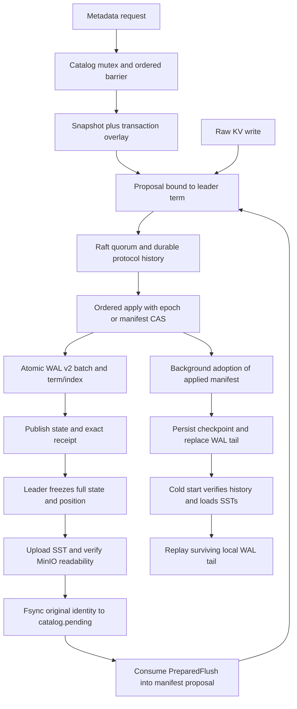

# Takeover audit and implementation record

Date: 2026-09-08. Audit base: `master`, `739ca1d`, repository `c4pt0r/kv9`.
The audit read `DESIGN.md`, metadata/object-storage design and testing contracts, runtime and crate implementations,
and all open GitHub issues. This record describes delivered behavior; [ROADMAP.md](ROADMAP.md) defines future order.

## Architecture assessment

The direction remains useful: one binary, self-hosted metadata, an established Raft implementation, immutable SSTs,
and Raft-managed manifests. The implementation needs stronger boundaries and accurate status reporting as it moves
toward disaggregated storage.

| Layer | Current responsibility | Remaining architectural gap |
|---|---|---|
| Metadata | Relational catalog schemas, row/index encoding, snapshot-plus-overlay atomic batch planning | No SQL service or dynamic DDL executor; L0/L1 sharding is not running |
| Bootstrap/membership | Root descriptor, store incarnation, election-first bootstrap, admission tickets, learners and promotion | Snapshot install, joining after log truncation and broader failure matrices |
| Consistency | raft-rs 0.7, persist-before-send Ready handling, one apply owner, exact receipts, quorum ReadIndex, apply-side epoch fences | Metadata and user data share one `META_REGION_0` |
| Local persistence | `DiskRaftStorage` stores protocol history; `WalEngine` stores applied state; positioned WAL v2 is now connected | Dual logs, per-write fsync, no group commit or Raft compaction |
| Remote storage | Existing MinIO/SST primitives now connect freeze, upload, manifest, reclamation and restore | Full-state memory/checkpoints; no incremental LSM, block cache or GC |
| APIs | Raw KV, keyspace creation/listing, region queries and membership administration | Transaction execution, TTL and split/merge are not implemented |

Catalog tables include tenants, keyspaces, txn_groups, nodes, regions, region_peers, id_sequences, cluster_meta,
node_admissions and root_meta. Some future tables have schemas only. Catalog data lives in the reserved system
keyspace and follows the same Raft history; no external etcd/PD was introduced.

The write and recovery path is:

Public Raw/catalog reads establish quorum ReadIndex and local apply before reading a stable view.
Diagnostic `status` remains local observation, not a substitute for a consistent data query.

## Metadata and recovery defects repaired

| Defect | Repair | Regression evidence |
|---|---|---|
| Failed unique update could remove the old index before new-value validation failed | Stage each statement independently; merge its overlay only after every fallible check | Original code loses the old index; repaired transaction still resolves it |
| Parent deletion allowed dangling foreign keys | Check child references in the same snapshot/overlay; permit child-then-parent deletion | Original code permits an orphan; ordered deletion is a positive control |
| Sequence overflow could panic/wrap; keyspace width was unchecked | Checked arithmetic, 24-bit namespace bounds and typed errors | Original overflow panic; rejected allocation preserves sequence state |
| Unknown API values defaulted to Txn; narrowing IDs could misroute | Refuse unknown codes and out-of-range namespace conversion | Invalid-code/ID tests plus valid Raw/Txn controls |
| Row values could disagree with physical PK or routing-index start key | Validate known types and PK binding on writes/reads/scans; validate full routing binding | Targeted physical corruption refuses queries; valid routing still works |
| Local mutex did not drain earlier ambiguous catalog proposals or prevent stale-term plans | Commit an ordered Noop before planning; compare planning term under the append lock | Frozen apply blocks the next planner; wrong term does not append |
| Initial bootstrap could plan before current-term apply or recreate committed seed rows after losing its receipt | Barrier on every initialization path, locked catalog recheck, same-term append, committed-root adoption and lifecycle retry | Both original-path tests fail; both pass after repair |
| Public keyspace/region/cluster-info reads bypassed quorum confirmation | Add ReadIndex barriers | Real follower reads return typed NotLeader; partition-read acceptance remains |
| WAL v2 was a scaffold while Raft apply still used an in-band index | Persist data and exact term/index in one CRC record/fsync; narrow apply capability; verify committed history at startup | Byte truncation, CRC fields, restart, poisoned apply and durable-position mutation |
| Complete valid-CRC nonmonotonic records could be treated as a recoverable prefix; writes could continue after failed append | Refuse the entire invalid open without editing input; poison after append/fsync failure until reopen | Duplicate/decreasing-position tests and forced append failure |
| Legacy prefixes were never reclaimable, but large legacy state could not fit one new record | Atomic full rewrite when it fits; otherwise retain the prefix and append only a verified position transition | Marker removal, cross-CF/delete preservation and durable later writes; bounded test threshold exercises large-state fallback |
| Migration placeholder panicked | Return explicit NotImplemented | Executor remains a future deliverable |

`MetaTxn` supplies local catalog constraints. Production cross-request ordering comes from the runtime mutex,
ordered barrier and term binding. A standalone `MetaStore` is not automatically a Raft-isolated database.

## Existing GitHub issue mapping

The initial query found four open issues. This audit does not claim their remote state was closed.

| Issue | Implementation delivered | Remaining boundary |
|---|---|---|
| [#5 Deterministic MinIO deadlines](https://github.com/c4pt0r/kv9/issues/5) | Shared clock origin, stamp/enqueue and worker gates, direct observation of caller budget; caller finishes before worker release | Two deterministic tests do not rely on service speed; real network behavior has separate integration coverage |
| [#6 ManifestChange Phase B](https://github.com/c4pt0r/kv9/issues/6) | FrozenFlush, non-cloneable PreparedSst, remote verification, canonical identity, epoch/CAS, positive effect history, production worker and restore; temporary source-name stopline removed | Durable pending, historical-winner reconciliation and two process cuts are included; full Phase-2 matrix, segmented WAL and GC remain future work |
| [#7 WAL v2 and Raft composition](https://github.com/c4pt0r/kv9/issues/7) | Atomic data/position reader/writer, v1 compatibility, nonmonotonic refusal, typed durable recovery and actual Raft apply composition, retaining manifest/fence behavior | Old binaries cannot read v2; no rolling downgrade promise; large legacy stores retain unpositioned prefixes |
| [#8 Real-joiner leader-hint race](https://github.com/c4pt0r/kv9/issues/8) | Wait for every seed's actual registration backend to expose the correct non-seed leader hint before starting the joiner | Real gRPC join and membership assertions remain; unknown hints do not count as success |

## Concrete MinIO delivery

- `crates/engine/src/checkpoint.rs` and `flush_journal.rs`: atomic data/position freeze, prepared capabilities,
  verified SST restore and a durable pending identity published before first proposal.
- `crates/server/src/remote_storage.rs`: configured background upload/adoption; leaders upload and each replica
  reclaims only after its own ordered apply.
- `crates/raft` and `crates/region`: prepared-capability consumption, canonical validation, epoch/CAS and
  add-only effect/historical transition evidence.
- `scripts/minio-kv-e2e.sh` and `.py`: three independent processes, real MinIO, failover, actual WAL-prefix removal,
  complete restart and surviving unflushed-tail recovery.
- `crates/engine/tests/minio_checkpoint.rs`: missing/corrupt objects refuse reopen; repaired objects permit recovery;
  all-CF frozen-cut/tail semantics and original pending identity are separately covered.
- `scripts/minio-pending-e2e.sh`: kill after durable prepare/before proposal and after apply/before cleanup,
  advance the majority several generations, recover the original identity and continue flushing.
  Corrupt/wrong-term pending files refuse startup.
- CI checks actual selection and terminal markers so empty or prematurely exited tests cannot pass vacuously.

`catalog.checkpoint` is a recovery pointer to an applied manifest, not authority granted by upload success.
Production first confirms ordered apply, then persists the reference and safely replaces the WAL tail.
`catalog.pending` records an unresolved attempt before first proposal; it does not authorize reclamation and is
cleared only on authoritative settlement. Apply performs no remote I/O. Upload failure cannot reclaim WAL early.
The production path does not yet delete remote objects.

## Evidence boundaries

[TAKEOVER-VALIDATION.md](TAKEOVER-VALIDATION.md) records actual local results and rerunnable commands.
Passing locally does not imply GitHub Actions ran or every possible failure was covered.

- Real MinIO tests exercise actual S3 operations. MemoryObjectStore tests establish format/state-machine behavior only.
- Multi-process gRPC tests run on one host; they are not cross-machine performance or multiple failure-domain tests.
- Kill/restart, bytewise truncation and controlled errors are covered; the full power-loss/fsync/rename matrix is not.
- Remote recovery and catalog WAL reclamation work. Raft history remains retained, so total log growth is not yet bounded
  and bucket-only recovery is not supported.
- No unmeasured throughput figures are published. Per-record fsync, full-state memory and O(tail) reclamation are
  explicit priorities for the next stages.

[QUICKSTART.md](QUICKSTART.md) documents execution; [ROADMAP.md](ROADMAP.md) orders consistency/recovery,
bounded storage and throughput, multi-group ownership, transactions and operations.
