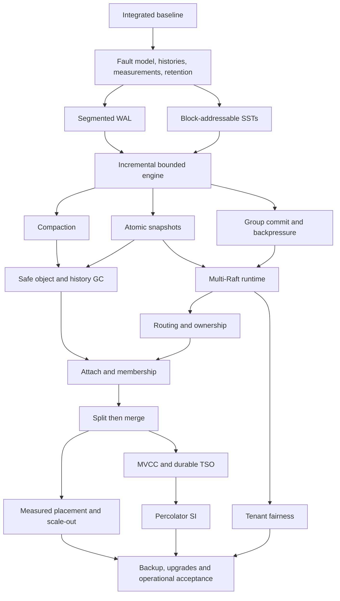

<!-- kv9-roadmap-20260908:epic -->
This is the execution tracker for evolving kv9 from its basic distributed Raw KV baseline into an industrial-grade distributed database. Priorities are consistency, recoverability, bounded resources, measured throughput and scalable ownership. Complex private-network TLS configuration is P4 work.

**Latest development checkpoint:** [CRC main integration source/proof/recovery](https://github.com/c4pt0r/kv9/blob/f0bd3c3ed995866f0d5d25ddded8b64ea73c0b98/docs/crc-main-integration-v1/README.md) passes at `bd42e60`: **789 tests/doctests (23 existing ignored)**, formatting/Clippy, experimental-lease compilation, **47 distinct Lean statements**, fresh restoration and eight negative controls. Clean default release and all 859 source files pass readback. Streaming/unary recovery retains **353 operations: 325 OK / 28 unknown**, six drains and seven exited lifetimes. Main push awaits this binary's actual Chaos Mesh acceptance; old e748 results are not reattributed. The accepted full CRC performance matrix remains **35,103,005 one-attempt successes**, loaded batch **1,062,523 items/s (+17.119%)**, p99 **7.406–7.471 ms**, and point **139,532/s (+2.203%)**. Mixed batch gains16.898%; pure GET changes-0.191%. See the [full result](https://github.com/c4pt0r/kv9/blob/69101d7f55168adab7132bfa781ff729b6bc205b/docs/WRITE-CRC-FULL-REGRESSION-PERFORMANCE.md). No new performance run.

## Current product sequence (2026-09-12)

1. Hold read optimization at selected ThinLTO/Safe ReadIndex; optimize write throughput and latency toward Redis with one primary and two replicas. Use same-connection WAIT 1 as the primary replication-confirmed reference and also report WAIT 2. Neither is Raft consistency or fsync equivalence. Preserve every KV9 Raft commit/durable-apply/response fence. Separate volatile tmpfs and real-disk panels; report latency percentiles, errors and unknown writes alongside successful QPS. Read parity is unachieved but no longer the prerequisite for this write phase.
2. Then implement dynamic multi-Raft (#22), range/epoch routing (#23) and recoverable learner/membership changes (#24), followed by automatic size/load-triggered range splits (#25) and measured placement/scale-out (#27). Preserve #26's separate merge/recovery prerequisite for complete D06 acceptance.
3. Split recovery must survive leader loss, partition and restart without overlapping ownership, lost acknowledged writes or unsafe retries. Require source-mapped safety/conditional-liveness proofs and actual Chaos Mesh histories. Metadata and scheduling authority must remain replicated or safely replaceable; only the object-store dependency may be a service-critical singleton.

**Read-path implementation phase:** the isolated pending-ReadIndex admission credit is reapplied to selected CRC source as [de37c71](https://github.com/c4pt0r/kv9/commit/de37c71009e8199859b931e0037818f490e8d3f6), still experimental. Current local gates pass **716 workspace tests/doctests (23 ignored)**, formatting, warnings-denied Clippy, **14 compiled semantic control triples**, and the unchanged **37-case formal gate: 28 distinct theorems / 265 baseline obligations**. The relevant read implementation matches the earlier proven 57ff candidate; its historical performance is not a fresh result for this reapplication. See the [source-scoped design and validation](https://github.com/c4pt0r/kv9/blob/de37c71009e8199859b931e0037818f490e8d3f6/docs/READ-INDEX-CREDIT.md).

The first de37 release incorrectly reused e566 binary bytes from the shared Cargo target and was **excluded before any runtime or benchmark use**. Requested-source manifests and Cargo graph labels alone did not detect stale code. A retained first-party release-cache clean and rebuild produced new binaries (server SHA prefix **5464adee**, workload **6447feee**); every first-party library was compiled and the server relinked. Ordinary three-voter streaming/unary process recovery and the independent complete-history audit pass for that rebuilt release. The retained-build fix is now merged into master as [86a689c8](https://github.com/c4pt0r/kv9/commit/86a689c8b13ae929a2abff2ef8c5794b50ebd639). It serializes cooperating builders, invalidates first-party packages once per build sequence, verifies actual compilation and rejects retained output inside the Cargo target. The real older-mtime regression reproduces stale A behavior without invalidation and obtains correct B behavior with the fix; lock contention/output-path refusals and dependency-cache preservation pass. Native combined and standalone Redis release integration also pass; see the [validation and scope](https://github.com/c4pt0r/kv9/blob/86a689c8b13ae929a2abff2ef8c5794b50ebd639/docs/BUILD-CACHE-SAFETY.md). Raw Cargo still requires owner coordination.

**Latest completed performance phase:** the [read-credit-on-CRC full comparison](https://github.com/c4pt0r/kv9/blob/e2c207185ea535909ad7e16514895dec1501d2d0/docs/READ-CREDIT-CRC-PERFORMANCE.md) and [portable reporting evidence](https://github.com/c4pt0r/kv9/blob/e2c207185ea535909ad7e16514895dec1501d2d0/docs/read-credit-crc-performance-v1/README.md) are published at **e2c20718**. All 36 smoke cohorts and **72 timed cohorts** pass. The two forward/reverse 10-second repetitions retain **81,041,621 measured calls**, all successful in one attempt, and all **240 recorded lifetimes** exited. No failed cohort was rerun or omitted. The first auditor's stale predecessor argument-hash pin was corrected against the pre-run frozen inputs; both audit attempts remain retained and no runtime result changed.

| GET metric | CRC control | Read-credit candidate | Redis |
| --- | ---: | ---: | ---: |
| c64 calls/s | 344,473 | 372,211 | 513,378 |
| c64 mean us | 185.665 | 171.820 | 124.556 |
| c64 p99 us | 352.256–356.351 | 294.912–299.007 | 229.376–231.423 |
| c1 mean us | 37.676 | 37.549 | 5.673 |
| c1 p99 us | 50.176–50.687 | 49.664–50.175 | 7.232–7.295 |

C64 pure GET improves **8.052%** (+8.285% / +7.819% by repetition), leaving a **1.379x Redis throughput gap**. C64 BatchGet(64) reaches **2,296,816 keys/s** (+1.666%) versus Redis **5,954,693**. Isolated GET mean remains **6.619x Redis**. In c64 mixed traffic, GET mean worsens **4.548%** and batch GET mean **3.516%**; mixed p99 worsens in both repetitions even where combined read/write throughput improves. **Candidate de37c71 remains experimental; no general promotion.**

Current main is **86a689c8**, containing the build-tool correction only; selected database runtime behavior remains CRC **ca0002c7**. Next prioritize read-specific admission/confirmation waiting and a bounded reduction in owner/RPC handoffs, measuring c1 and mixed-read tails as well as loaded GET throughput. Preserve fresh quorum authorization, cancellation bounds and apply-before-read. Exact-source Chaos Mesh for this read candidate and the Redis-class read milestone remain open. KV9's measured WALs are on **tmpfs**, while standalone Redis has persistence disabled: these are memory-path diagnostics, not equal-durability or physical-disk write measurements. All validation remains local; no hosted CI was dispatched.

**Held read-latency checkpoint:** The experimental lease path binds GET/BatchGet to a fresh commit frontier and one exact retained applied view, including deferred metadata/value checks. Refusal preserves the original reservation/context/deadline through Safe ReadIndex. The [explicit Linux clock](https://github.com/c4pt0r/kv9/blob/9efe5594c5d386879380ae4d995508d8cdb4c69d/docs/LEASE-CLOCK.md) now samples CLOCK_BOOTTIME and rechecks declared drift/error bounds against the durable policy before opt-in. Sampling failures fence the clock. Installation still requires an explicit caller; ordinary startup remains Safe ReadIndex.

[Local clock validation](https://github.com/c4pt0r/kv9/blob/9efe5594c5d386879380ae4d995508d8cdb4c69d/docs/lease-clock-v1/README.md): **593 library tests pass** (136 Engine, 250 Raft, 207 server; seven new unit tests), zero failed and one pre-existing server workload test ignored. Default restart protection, default/experimental compilation and Clippy pass. An actual owned SIGSTOP/SIGCONT child observes 300,169,571 ns elapsed; both existing and new lease read authority expire. This is a process-stop/controller test, not host suspend or three-node Chaos. Three SMT queries prove sampled-time containment, recovery and the shared error margin; three weakened formulas yield countermodels. Prior authority TLAPS proofs and read-view/service/source-fault evidence remain applicable. Physical clocks and a complete Rust refinement are not thereby proved.

**Next:** Finish exact-main CRC Chaos Mesh acceptance, publish the integration, then measure the frame-buffer candidate under the [write plan](https://github.com/c4pt0r/kv9/blob/69101d7f55168adab7132bfa781ff729b6bc205b/docs/WRITE-PERFORMANCE-NEXT.md). Preserve every Raft/sync fence and original benchmark binary identity. Unused BuildKit cleanup reclaimed46.95GB without deleting historical evidence, images, containers or volumes; full CRC runtime retains84.59GB. Refresh capacity after integration builds before another performance campaign. CI remains local. No original industrial checkbox closes.

[Latest measured baseline](https://github.com/c4pt0r/kv9/blob/9efe5594c5d386879380ae4d995508d8cdb4c69d/docs/OWNER-POLL-PERFORMANCE.md), selected `11113f6` / Safe ReadIndex: c1/c64 GET **28,252.671 / 374,812.758 calls/s**, Redis **173,925.251 / 511,910.764**. Mean GET latency is **35.280 / 170.629 us**, Redis **5.673 / 124.910 us**. Owner polling stays rejected. Redis parity and industrial gates remain open before multi-Raft/splits. Only object storage may be a singleton. CI stays local; no original checkbox closes here.

**Previous completed write-only phase:** the [indexed-receipt write-only screen](https://github.com/c4pt0r/kv9/blob/fff1b1e3e4fb4d6c20068041edc389f73edc403f/docs/INDEXED-RECEIPT-PERFORMANCE.md) and original-source process recovery are published at **fff1b1e3**. Candidate **74d24116 remains experimental**: c64 point PUT throughput improves **3.812%**, with lower mean and p99 in both repetitions, while BatchPut(64) changes **+2.264% / -4.361%**, pooling to **-1.064%**. The batch second-run p99 worsens from **9.044-9.175 ms to 9.568-9.699 ms**; an equal pooled p99 bucket does not erase that difference. Neither repeat is discarded or rerun. There is no general promotion, blanket candidate rejection or established cause of batch variation. Selected runtime behavior remains CRC **ca0002c7**, using **tonic streaming gRPC**.

That write-only recording's **same-recording c64 writes**: selected CRC **123,846 PUT/s / 863,705 BatchPut(64) keys/s**; indexed candidate **128,566 PUT/s / 854,511 batch keys/s**; Redis **494,304 SET/s / 6,051,110 MSET(64) keys/s**. Candidate PUT mean/p99 are **497.664 us / 802.816-811.007 us**, versus CRC **516.636 us / 835.584-843.775 us** and Redis **129.324 us / 233.472-235.519 us**. Candidate whole-batch mean/p99 are **4.792 ms / 8.913-9.044 ms**, versus CRC **4.741 ms / 8.913-9.044 ms** and Redis **0.672 ms / 1.016-1.024 ms**. Candidate throughput gaps to Redis are **3.84x / 7.08x**. At c1, candidate PUT mean is **59.496 us**, versus Redis **5.749 us**, still **10.35x** apart. These short shared-host measurements do not establish significance or sustained capacity.

**Reads and mixed traffic were not rerun.** The [previous full matrix](https://github.com/c4pt0r/kv9/blob/fff1b1e3e4fb4d6c20068041edc389f73edc403f/docs/OWNED-BUFFER-PERFORMANCE.md) remains the latest selected-source read evidence: CRC **346,056 GET/s**, **170,717 point mixed calls/s**, **1,312,289 batch mixed keys/s** and **2,267,868 BatchGet(64) keys/s** at c64. Same-recording Redis GET/MGET reach **509,859 calls/s / 5,925,161 keys/s**. CRC GET mean/p99 are **184.812 us / 352.256-356.351 us**, versus Redis **125.410 us / 231.424-233.471 us**; c1 GET means are **37.735 us / 5.695 us**. These earlier measurements do not establish indexed-candidate reads. Owned-apply **9be0c196** and owned-proposal **71c9d996** remain rejected for performance; their original evidence remains published.

All **24 timed write cohorts** and the first independent audit pass: **22,498,455 measured calls / 242,280,129 input keys**, all successful on one observed attempt, with zero refusals, unknown writes, read failures, client rejections or dropped slots. Separate **12 smoke cohorts** pass **1,882,289 calls**. Auditing verifies **80 exited lifetimes, 48 fresh drains/bindings**, original source/build inputs and owned-container restoration. The [screen index](https://github.com/c4pt0r/kv9/blob/fff1b1e3e4fb4d6c20068041edc389f73edc403f/scripts/redis-reference/indexed-receipt-screen-v1/index.json) binds **165 copies / 35,560,784 decoded bytes / 5,511,836 stored bytes**, including all 24 reports and resource coverage. Two ten-second forward/reverse repeats use 128-byte values: three-voter KV9 quorum/sync with tmpfs WAL versus standalone Redis without persistence or pipelining. Batch latency covers the full call. This is not equal durability, a complete benchmark operation ledger, full-workload acceptance or new Chaos coverage.

**New exact-source recovery:** candidate **74d24116** has its own original default-feature release, all **592 source files** and original Cargo/runtime binary bindings. The independent process checker accepts **378 complete-history calls: 347 OK / 31 unknown** across streaming (194 calls) and unary (184), overlapping point/batch operations, leader SIGKILL and original-directory restart. Unknowns remain in histories/witnesses; all two client/five server lifetimes exit and both cases obtain fresh three-voter drains. The [process index](https://github.com/c4pt0r/kv9/blob/fff1b1e3e4fb4d6c20068041edc389f73edc403f/scripts/redis-reference/indexed-receipt-process-v1/index.json) retains **63 exact copies / 2,237,047 bytes**. This is ordinary-WAL local process recovery, not storage/power-loss or whole-system refinement. Ancillary first build-reader and publication-listing failures are retained; no workload was rerun to remove a failure. **No indexed-candidate Chaos runtime has run.**

The candidate preserves complete receipts and first-match behavior using a checked ordering certificate and bounded deque. Its [source checks](https://github.com/c4pt0r/kv9/blob/fff1b1e3e4fb4d6c20068041edc389f73edc403f/scripts/redis-reference/indexed-receipt-source-v1/index.json) pass two focused regressions, **711 workspace tests/doctests (23 ignored)**, Clippy and formatting after the retained fixture type correction. The [controlled TLA+/TLAPS representation proof](https://github.com/c4pt0r/kv9/blob/4d9af2af4b6d5629afd3105ab1afab05ce1591a0/docs/INDEXED-RECEIPT-PROOF.md) is now published at **4d9af2af**: **13 parameterized theorems / 122 fresh obligations**, capacity-1/2 exploration and all 14 controlled cases pass. Wrong certificate and wrong-end eviction produce attributable counterexamples; omitted proof and an unapproved false axiom are rejected after parsing. Four positive phases recheck the same 122 obligations; 488 is not the distinct obligation count. The original 3/55 draft failure and typed correction remain retained. The [194-file proof index](https://github.com/c4pt0r/kv9/blob/4d9af2af4b6d5629afd3105ab1afab05ce1591a0/scripts/redis-reference/indexed-receipt-proof-v1/index.json) binds exact source/proof/log/trace inputs. This is local FIFO/certificate/full-receipt refinement under standard-library and unchanged caller-locking premises, not whole-Rust/Raft, liveness or crash correctness. Broader reads/mixed workloads and exact-source Chaos remain prerequisites for general selection.

**Next bottleneck work:** the [accepted post-CRC CPU diagnostic](https://github.com/c4pt0r/kv9/blob/4d9af2af4b6d5629afd3105ab1afab05ce1591a0/docs/POST-CRC-CPU-PROFILE.md) is published with its [exact-byte evidence bundle](https://github.com/c4pt0r/kv9/blob/4d9af2af4b6d5629afd3105ab1afab05ce1591a0/scripts/redis-reference/crc-active-prefix-cpu-v1/BUNDLE.json): **174 original files / 26,646,826 decoded bytes / 4,859,862 stored bytes**. Runtime and unchanged decoder each pass once; both intervals satisfy prefix/tail, edge, 32-bin, clock, zero-loss and retention checks. There are **645,559 successful measured calls**, 256 successful unmeasured priming reads and no remaining tracked lifetimes. Of **3,103 selected batch samples**, engine `frame_crc` accounts for **561 (18.079%)**, Raft `write_record_unsynced` for **283 (9.120%)**, and receipt lookup for **27 (0.870%)**. Exact disassembly maps all 283 sampled Raft-method leaf instruction sites to its inlined FNV loop; it does not assign all method/callee CPU to hashing. These are CPU sample fractions, not latency fractions or predicted speedups. Priming changes cache/CPU state; the instrumented run supplies no replacement QPS. The prior rejected batch-prefix recording remains retained.

**Latest completed correctness phase:** [slicing-by-eight IEEE CRC qualification](https://github.com/c4pt0r/kv9/blob/65511010e2fda8adba04efd831a39bcdca1979a4/docs/CRC32-SLICING-QUALIFICATION.md) is published for experimental source [e5662bb](https://github.com/c4pt0r/kv9/commit/e5662bbce1443e6907e3d832a7b300881796340c). Local source checks pass **710 workspace tests/doctests (23 ignored)**, Clippy and formatting. The separate source-bound Lean gate passes **47 distinct theorem statements**, all **256 fallback + 2,048 slicing entries**, and **eight rejected controls**, with a fresh 47-statement restoration. Its repository-integrated gate also passes; 94 is the repeated-check count, not distinct theorems. The [478-file proof/source index](https://github.com/c4pt0r/kv9/blob/65511010e2fda8adba04efd831a39bcdca1979a4/scripts/redis-reference/crc-slicing8-proof-v1/index.json) preserves exact inputs, table values, logs, earlier failed attempts and controls. The historical byte-table checker remains unchanged and rejects the new function. The proof covers CRC arithmetic under explicit Rust/stdlib premises, not whole-Rust/WAL/Raft refinement.

The original default-feature release binds **596 source files**. Three-voter ordinary-WAL process recovery and unchanged independent history checks pass **360 complete calls: 333 successful and 27 unknown outcomes**, across streaming/unary atomic batches and overlapping point operations, leader termination and original-directory restart. Unknowns remain in the histories. Both cases retain fresh three-voter Serving/empty drains; all five server and two client lifetimes exit. The [process evidence](https://github.com/c4pt0r/kv9/blob/65511010e2fda8adba04efd831a39bcdca1979a4/scripts/redis-reference/crc-slicing8-process-v1/original-path-index.json) remains separate from actual Chaos Mesh acceptance.

**No new database performance result or general promotion is claimed.** The same-polynomial slicing candidate keeps Raft acknowledgements, sync calls, fences, checksum coverage and log format. Its standalone warm-cache 8/16-KiB checksum improvements of approximately 4.48x/4.56x are only function timings; tiny inputs slightly worsen. Exact-source Chaos Mesh and paired c1/c64 read/write/mixed measurements remain pending, and master stays **ca0002c7**. After this bounded checksum qualification, focus returns to **GET throughput and single-request latency**. Current memory-write comparisons use tmpfs and a Redis reference without persistence; do not trade consistency or durability for that reference's write QPS. Development checks remain local; no hosted CI was dispatched.

**Latest completed actual Chaos phase:** [owned-apply acceptance](https://github.com/c4pt0r/kv9/blob/fff1b1e3e4fb4d6c20068041edc389f73edc403f/docs/OWNED-BUFFER-ACCEPTANCE.md) remains scoped to exact source **9be0c196**: **2,047 calls, 1,740 OK / 220 refused / 87 unknown**, eleven client-link/quorum windows and **154 verified netem leaf drops**. Complete histories, inconclusive zero-unknown-effect search and valid guided witness remain retained. Full-client-partition/quorum-loss windows have zero successes; drains and owned cleanup pass. The exact TCP reset is non-Chaos. This one-host volatile-WAL acceptance does not complete the full storage/inter-voter matrix or transfer to newer candidates.

Full formal composition, industrial fault coverage, Redis throughput/latency parity and dynamic multi-Raft/splits remain open. CI stays local; no hosted workflow was dispatched. All **25 original roadmap checkbox lines remain unchanged**; scoped performance/process progress does not complete their broader requirements.

Earlier measurement and implementation history follows; the current selected baseline and latest comparable results are above.

The earlier isolated read increment was `5ee897a`: **344,412–344,790 GET/s**, mean latency **185.490–185.700 us**, versus same-run Redis GET **497,503–505,913/s**. Paired gains over event8 are **4.795% / 5.381%**, with improved GET p99 in both repetitions. BatchGet(1) reaches **335,694–337,822 calls/s** (+5.069% / +5.434%). Local 707/717-test workspace runs and exact-source eleven-window Chaos acceptance pass (2,114 complete-history calls, 183 verified new leaf drops, fresh drains and owned cleanup). The paired Redis GET gap remains **1.44–1.47x**. This is a five-second, single-host, three-voter volatile-tmpfs read comparison; the completed write/mixed/larger-batch refresh is linked below; sustained acceptance, formal composition and master/default promotion remain open. [Current evidence and scope](https://github.com/c4pt0r/kv9/blob/7642086a5fa3b53233e7700c54186875a388bc91/docs/RPC-WORKER-PAIR-PERFORMANCE.md). The rejected one-worker, peer-enqueue, fixed-global-queue and two-persistent-stream-worker experiments are excluded.

The [accepted-source GET concurrency curve](https://github.com/c4pt0r/kv9/blob/7642086a5fa3b53233e7700c54186875a388bc91/docs/GET-CONCURRENCY-CURVE.md) now passes its first 24-cohort run and independent audit. At c1, KV9 mean latency is **37.975–38.012 us** versus Redis **5.789–5.806 us** (about 6.5x); at c64, KV9 reaches **342,979–344,681 successful GET/s** with all calls succeeding. Offered c128/c256 exceed the unchanged public admission limit of 64, producing about **30% / 50% admission-count refusals**; c256 successful throughput falls to 306,181–308,856/s. All **45,300,391** terminal calls remain accounted for: 40,665,456 successes and 4,634,935 refusals. This diagnostic changes no production source and does not establish intrinsic capacity or Redis parity. The completed low-concurrency mapping and next transport experiment are below.

The [c1 lifecycle-only recording](https://github.com/c4pt0r/kv9/blob/7642086a5fa3b53233e7700c54186875a388bc91/docs/LOW-CONCURRENCY-READ-LIFECYCLE.md) now independently passes: GET has a **24.448-us sampled read barrier**, comprising **1.473 us admission**, **20.997 us confirmation (85.9%)**, **0.285 us confirmation-to-send** and **1.693 us result notification**. All 258,976 measured calls succeed; 4,249 successful lifecycle samples have exact integer phase conservation across twelve validated metric documents. This reuses existing instrumentation and changes no production source. Historical c64 also ran perf, so its larger notification interval does not isolate a concurrency-only effect. Next investigate removal of the intermediate peer batch channel; the [conditional design review](https://github.com/c4pt0r/kv9/blob/7642086a5fa3b53233e7700c54186875a388bc91/docs/PEER-DIRECT-BODY-REVIEW.md) requires per-RPC receive ownership, stale-body/waker fencing and independent stalled-stream supervision before performance screening.

The [direct peer request-body screening](https://github.com/c4pt0r/kv9/blob/1052d73ace3964ec373751170984e90a8ee06a93/docs/DIRECT-PEER-BODY-SCREENING.md) is complete and candidate **6707bcc is rejected for performance**. All eight matched c1/c64 GET and BatchGet(1) throughput comparisons regress, and all eight mean latencies increase: GET throughput changes by **-4.093% / -3.760% at c1** and **-3.456% / -2.290% at c64**. The independently audited first 24-cohort recording contains **27,724,506 successful calls**, zero non-success outcomes and one observed attempt per call. Pre-screening passed **224 Raft tests**, Clippy, **nine source-control triples (27 compiled executions)** and independently checked leader-loss/restart process E2E (**352 calls: 324 OK, 28 unknown**). Report and exact helpers are committed and pushed at **1052d73**; failed preparation/control attempts are retained. The accepted production control remains **5ee897a**. No new candidate Chaos Mesh acceptance or machine-checked whole-system refinement is claimed. The next unmeasured hypothesis removes the producer-to-watchdog notification using bounded idle checks while preserving the three-second backlog deadline and independent supervision; it still requires implementation, adversarial tests and matched screening.

The [bounded idle-watchdog screen](https://github.com/c4pt0r/kv9/blob/ad8bdf5825283337ee28347a72fe062472e4c066/docs/PEER-IDLE-WATCHDOG-SCREENING.md) is complete: candidate **f62c08e is not selected**. Seven of eight matched throughput comparisons regress and seven mean latencies worsen, despite lower p99 buckets in all eight pairs. c64 GET changes **-0.618% / -2.915%** and BatchGet(1) **-3.189% / -3.457%**. The first independent audit accepts **27,821,713 successful calls**, zero non-success outcomes/dropped slots, one observed attempt per call and all 80 process exits with exact environment restoration. Local gates pass **228 Raft tests**, Clippy, **14 source-control triples / 42 executions**, and independently checked process recovery (**379 calls: 346 OK, 33 unknown**). Source **f62c08e** and report/evidence **206c1ba**, with exact patch-format preservation at **ad8bdf5**, are committed and pushed. Accepted control **5ee897a** is unchanged; no new candidate Chaos Mesh acceptance or whole-protocol proof completion is claimed. Independently checked cumulative endpoint counters show only about **2.03 GET / 2.01 BatchGet(1) members per admitted ReadIndex group at c64**. The next hypothesis returns to accepted source and studies bounded unconfirmed-group admission, preserving fresh sealed membership, immediate idle admission, applied-index checks and cancellation/deadline progress; canceled registry entries must not be confused with retracted Raft contexts. The implemented follow-on and its validation scope are described below.

The [pending ReadIndex admission candidate](https://github.com/c4pt0r/kv9/blob/57ff6851e40ed63c837189d6eb0a11190704725a/docs/READ-INDEX-CREDIT.md) is implemented and pushed at **57ff6851**, based directly on accepted **5ee897a**. Local admission uses the actual Raft pending queue under the submission lock; cancellation does not refund protocol occupancy, late groups require fresh confirmation, and idle admission has no new batching timer. Local gates pass **714 workspace tests/doctests (23 ignored)**, warnings-denied Clippy, **218 Raft tests/doctests** and **14 compiled semantic-control triples / 42 executions**. Independent source/formal readback accepts **28 parameterized theorems / 265 fresh obligations** and 37 formal cases. The proof projects a single invocation to the existing admission contract and establishes conditional admission under stated fairness/availability premises; whole grouped-read/Ready/Rust composition remains open. Process E2E and independent audit now pass **353 complete operations (324 OK, 29 unknown)** across streaming/unary leader loss and original-directory restart, with all seven process lifetimes exited. Exact-source [local eleven-window Chaos acceptance](https://github.com/c4pt0r/kv9/blob/3c5bcdbb4739f72132825d100682e379560ac65d/docs/READ-CREDIT-CHAOS-ACCEPTANCE.md) now also passes its first fixture and unchanged independent audit: **2,079 calls, 1,780 OK / 224 refused / 75 unknown**, with all uncertainty retained and a valid atomic-history witness. Actual Service-VIP delay, 30% loss, client partition and quorum loss are verified; the exact native netem leaf records **153 drops**, without summing parent and child counters. Both contained negative windows have zero successful operations. The exact TCP reset remains explicitly non-Chaos. All owned lifetimes and fresh drains pass; the new namespace/directories are removed and historical UIDs preserved. This one-host volatile-WAL protocol does not establish the full industrial fault matrix or power-loss/cross-host recovery.

The [read-credit matched screen](https://github.com/c4pt0r/kv9/blob/3c5bcdbb4739f72132825d100682e379560ac65d/docs/READ-GROUP-CREDIT-SCREENING.md) completes its first 24-cohort run and unchanged independent audit: **28,847,557 issued logical calls, all successful, one measured attempt each, no dropped slots or non-success outcomes**. At c64, single GET reaches **371,789-374,086/s**, improving **8.031% / 8.220%**, with **170.956-172.010 us mean** and lower p99 in both repeats. BatchGet(1) improves **8.479% / 7.919%**. Same-run standalone Redis GET reaches **506,966-509,004/s**, leaving a **1.36-1.37x** throughput gap. At c1, point GET is **0.083% / 0.573% slower**, with worse mean/p99 in both repeats; no c1 no-regression claim is made. Retain this as a promising c64 candidate, not general promotion: **5ee897a remains the general baseline**. The [full readout](https://github.com/c4pt0r/kv9/blob/455907437a8035c685164ebc637e4b3f25a2bce9/scripts/redis-reference/read-group-credit-v1/READOUT.md) retains all populations. The short shared-host test uses three-voter volatile tmpfs WAL with normal sync calls versus standalone memory Redis without persistence or pipelining; it establishes neither equal durability nor sustained capacity. All fixture lifetimes exit and owned CPU masks are restored. Earlier model/audit-adapter failures and exact helper/evidence copies remain retained. No hosted CI runs. A separate predeclared [four-repeat, 30-second c1 follow-up](https://github.com/c4pt0r/kv9/blob/3c5bcdbb4739f72132825d100682e379560ac65d/docs/READ-CREDIT-C1-FOLLOWUP.md) now completes all 24 cohorts and its first unchanged audit: **53,783,436 issued calls = attempts, all successful**, zero non-success outcomes or dropped slots. Pooled GET changes **26,335.687 -> 26,447.329/s (+0.424%)**, mean **37.848 -> 37.681 us**; BatchGet(1) changes **26,154.315 -> 26,334.887/s (+0.690%)**, mean **38.103 -> 37.838 us**. GET p99 improves in two repeats and worsens in two. Same-study Redis GET is **172,509.024/s / 5.721245 us mean**. All four pairs, Redis controls, original p99 intervals and the earlier short-screen regressions remain retained; no significance or c1 no-regression claim is made. All 80 owned lifetimes exit, 48 fresh drains pass, CPU masks restore exactly, and all 528 retained files verify. This does not promote the candidate to the general baseline.

The [Redis execution-path analysis](https://github.com/c4pt0r/kv9/blob/b557e4754a57925847748893aa94a64fc11d9fea/docs/REDIS-EXECUTION-PATH.md) identifies short command execution, local state ownership, buffer reuse and amortized I/O as useful design principles. Full-fixture c64 endpoint counters in the read-credit study increase from about **2 to 15 members per ReadIndex group**, including setup/warmup/verification; these are not timed-only causal attribution. The longer c1 study still measures about **37.68 us versus Redis 5.72 us**, so quorum amortization and shortening the isolated request path need separate work.

The [inbox-vector matched screen](https://github.com/c4pt0r/kv9/blob/b557e4754a57925847748893aa94a64fc11d9fea/docs/RAFT-INBOX-DRAIN-SCREENING.md) completes the first 48-cohort recording and unchanged independent audit: **117,886,444 calls = issued = attempts = successes**, zero other outcomes/reasons, connection failures or dropped slots. Direct parent **57ff6851** is the control; candidate **c3131800** removes the repeated vector allocation/move. Four predeclared F/R/R/F repetitions use ten-second windows at c1/c64 and the fixed native03c1/Redisb8ec clients. Pooled c64 GET changes **371,609.668 -> 373,178.659/s (+0.422%)**, mean **172.098 -> 171.374 us**; BatchGet(1) changes **+0.006%**. Pooled c1 GET changes **+0.140%**, mean **37.670 -> 37.615 us**. Seven of sixteen individual QPS pairs regress; p99 is lower in ten, unchanged/overlapping in three and higher in three. **Do not select c3131800 as the next performance increment or advance it to a broader fault campaign**: these small, mixed observations do not establish a consistent useful throughput-and-latency benefit or statistical significance. Its prior source/process correctness evidence remains valid. [All sixteen pairs and Redis controls](https://github.com/c4pt0r/kv9/blob/b557e4754a57925847748893aa94a64fc11d9fea/scripts/redis-reference/inbox-drain-v1/READOUT.md) remain retained. All 160 owned lifetimes exit, 96 drains/writer bindings pass, all 1,056 retained files verify, and CPU masks restore exactly. The shared-host three-voter tmpfs-WAL versus standalone memory Redis configuration does not establish equivalent durability or sustained capacity. **5ee897a remains the general baseline**.

The [WorkSignal notification screen](https://github.com/c4pt0r/kv9/blob/008c515ed83ab432f807f21e84d8faf0ebf0ead4/docs/WORK-SIGNAL-SCREENING.md) is complete: **1b70dba6 is not selected as a general performance increment**. Four-repeat c64 GET throughput improves **0.798%**, but c1 GET throughput falls **0.290%** and mean latency rises **0.307%**; p99 worsens in seven of sixteen native pairs. The first 48-cohort recording and independent audit accept **118,432,733 successful calls**, one actual attempt per call, 160 exited lifetimes and 96 fresh drains, with exact owned-container CPU restoration. The experimental read-credit parent **57ff6851** reaches pooled **374,812.531 GET/s / 170.629087 us** at c64 versus same-recording Redis **512,144.140/s / 124.854313 us**; c1 remains **37.555366 us versus 5.717858 us**. These are shared-host, volatile-WAL read results, not equal-durability or Redis-parity acceptance. General baseline **5ee897a** remains unchanged; candidate-specific Chaos is unrun. Source gates and earlier process evidence remain linked in the report. The [updated Redis execution analysis](https://github.com/c4pt0r/kv9/blob/008c515ed83ab432f807f21e84d8faf0ebf0ead4/docs/REDIS-EXECUTION-PATH.md) prioritizes shorter ownership transfers and safe quorum amortization, with isolated latency and high-concurrency throughput measured separately.

The [v3 point-write/mixed measurement clients](https://github.com/c4pt0r/kv9/blob/0be806d9671e2c50701a64aa7889c8859b7648ba/docs/POINT-WRITE-MEASUREMENT.md) remain committed and pushed at **0be806d9**, with 70 focused local tests, format/Clippy, clean releases and the independently checked 670,684-call point/batch4 correctness smoke. The [completed point/batch64 workload refresh](https://github.com/c4pt0r/kv9/blob/52cd4a3d8444a32898b9f425c0c306584e11595f/docs/V3-WORKLOAD-PERFORMANCE.md) is now committed and pushed at **52cd4a3d**: **72 timed cohorts, 79,909,933 measured calls / 787,052,110 input keys, all successful and single-attempt**. At c64, candidate **57ff6851** reaches **373,909 GET/s, 117,729 PUT/s and 628,102 BatchPut(64) keys/s**, versus same-recording Redis **512,191 GET/s, 493,396 SET/s and 6,066,081 MSET(64) keys/s**: gaps of **1.37x / 4.19x / 9.66x**. Whole-call batch PUT mean is **6.519 ms versus 0.670 ms**, with p99 **12.321–12.452 ms versus 1.008–1.016 ms**. Both repeats, per-operation outcomes, pooled histograms, CPU and the separate 36-cohort smoke remain retained. The c64 point-read gain persists, but c1 and batch-mixed regressions keep general promotion open; **5ee897a remains the baseline**. This is a two-repeat ten-second shared-host diagnostic with three-voter KV9 quorum/sync on tmpfs and standalone Redis without persistence or pipelining. It does not establish equal durability, full-history linearizability, new Chaos acceptance or sustained capacity.

The same refresh independently validates **240 exited lifetimes, 144 fresh drains, 144 writer/listener bindings**, storage guards and exact environment restoration. The separate source-bound [write-stage analysis](https://github.com/c4pt0r/kv9/blob/52cd4a3d8444a32898b9f425c0c306584e11595f/docs/RAW-WRITE-EXECUTION-PATH.md) covers all 48 native cohorts: batch apply intervals grow while tmpfs sync means remain small. These overlapping endpoint metrics include setup/readback and are not an additive request-latency budget. Root's ancillary freeze-check launch error and postlaunch inventory, and the statistics reader's original empty-histogram failure, remain explicitly preserved; no benchmark or frozen audit was rerun or weakened. The completed CPU profile and next measured implementation are below. Preserve quorum confirmation, committed/applied receipts, snapshot and scan semantics, bounded resources and original deadlines; require source-mapped proofs and actual Chaos Mesh acceptance for selected implementation changes. Redis parity, complete formal composition, dynamic multi-Raft and automatic splits remain open. CI stays local; no hosted workflow is dispatched.

Initial RPC selection evidence (historical): **streaming gRPC with tonic** is selected for the next point-transport integration and optimization work. The [independently audited five-arm comparison](https://github.com/c4pt0r/kv9/blob/2ec8d26/scripts/redis-reference/results/40e813f-streaming-rpc-c64-tmpfs-diagnostic.md) measures 208,849 GET/s, 96,078 PUT/s and 123,137 mixed operations/s at clean experimental `40e813f`, exceeding both tarpc and unary controls. Redis remains approximately 2.38x, 4.99x and 3.95x faster. This is a short single-host volatile-memory diagnostic. Ordinary service/client integration and exact-source actual Chaos/proof gates remain required before changing the default runtime.

The existing storage, snapshot and retention dependencies remain acceptance requirements. This work order does not mark those prerequisites complete. [Detailed performance and next-stage path](https://github.com/c4pt0r/kv9/blob/7642086a5fa3b53233e7700c54186875a388bc91/docs/RAWKV-PERFORMANCE-PATH.md).

The [point/batch write CPU diagnostic](https://github.com/c4pt0r/kv9/blob/86b2afda92e3fa5ff56cad7f9bccf0581e77701b/docs/WRITE-APPLY-CPU-PROFILE.md) is complete and published at **86b2afda**. Exact-binary instruction attribution places **257/3,292 (7.807%) point PUT CPU samples and 1,299/3,100 (41.903%) BatchPut(64) samples inside the engine WAL's bitwise IEEE CRC loop**. All 611,162 measured calls succeed; no lost samples are reported. This is a separate five-second instrumented shared-host diagnostic, not a speedup or latency decomposition. The [updated Redis execution analysis](https://github.com/c4pt0r/kv9/blob/86b2afda92e3fa5ff56cad7f9bccf0581e77701b/docs/REDIS-EXECUTION-PATH.md) distinguishes required replicated work from checksum computation, repeated buffer ownership conversions and task handoffs.

Candidate **[ca0002c7](https://github.com/c4pt0r/kv9/blob/ca0002c7f8e9ee6f595efcc9f4151085ccce87cb/docs/CRC32-TABLE.md)** replaces the eight bit steps per byte with a compile-time 256-entry table, retaining the exact IEEE checksum, fragments, WAL format and write/sync/commit/apply ordering. Source gates pass **144 engine tests (22 ignored), 709 workspace tests (23 ignored), all-target Clippy and formatting**. The strict source-bound Lean gate accepts **22 theorems, all 256 actual rustc-generated entries and five rejected controls**, using only the three allowed foundation axioms; earlier failed proof gates remain retained. The clean default release has 590 source files. Source, proof and compact profile evidence are committed and pushed. This is an experimental candidate, with no new performance or process/Chaos acceptance claim. The completed write screen, process recovery and eleven-window Chaos acceptance are recorded below; the latest full matrix and baseline selection are above. Owned-buffer and index changes remain separate subsequent experiments. Redis parity, full formal composition and dynamic multi-Raft/splits remain open. No original roadmap checkbox changes and no hosted CI dispatch occur in this phase.

The [first CRC write screen and exact-source process recovery](https://github.com/c4pt0r/kv9/blob/e32346c466d3339b8e3084d0cd7438c55733aacc/docs/CRC-WRITE-SCREENING.md) are complete and published at **e32346c4**. Across twelve forward/reverse ten-second c64 cohorts, point PUT improves from **118,889 to 124,211 calls/s (+4.476%)**; BatchPut(64) improves from **626,908 to 868,181 keys/s (+38.486%)**. Batch whole-call mean falls **6.532 to 4.717 ms**, with pooled p99 **11.665-11.796 to 8.913-9.044 ms**. Both original repetitions improve throughput, mean and p99; all **17,094,412 measured calls / 165,788,461 input keys** succeed with one attempt. Independent auditing accepts forty exited lifetimes, twenty-four fresh drains/bindings, storage retention and exact environment restoration. The remaining same-recording Redis throughput ratios are **3.974x point / 6.977x batch**. This is shared-host volatile-tmpfs Raft versus standalone Redis without persistence or pipelining, not equal durability or sustained capacity.

The same exact server binary also passes streaming and unary leader-SIGKILL/original-directory restart E2E and the unchanged independent history auditor: **368 complete-history calls, 335 OK and 33 retained unknown outcomes**, two client/five server lifetimes and fresh drains on all replicas. The separately built same-source correctness client is bound to the unchanged timed server in an explicitly recorded aggregate recovery manifest. Original source/build/report artifacts and ancillary reader failures remain retained; no benchmark or frozen audit was rerun or weakened. The exact-source eleven-window Chaos fixture and its three independent final checks now pass; the completed result is recorded below. The broader 72-cohort c1/c64 point/batch read/mixed/write comparison is now complete, with unchanged workloads, resource budgets and accounting predicates; the current selection and explicit batch-read tradeoff are above. Redis parity, full formal composition and dynamic multi-Raft/splits remain open. No original roadmap checkbox changes or hosted CI dispatch occur in this phase.

The [CRC native client-link/quorum acceptance](https://github.com/c4pt0r/kv9/blob/152581160be6405658aa84ac71f6df4ed7d25181/docs/CRC-CHAOS-ACCEPTANCE.md) is complete and published at **15258116**. The complete atomic history contains **2,068 calls: 1,761 OK, 232 refused and 75 unknown**. The original zero-unknown-effect search rejection and subsequent valid guided witness are both retained. Actual Chaos Mesh delay/loss/partition injection is checked across eleven windows; the same native netem leaf advances **0 to 158 drops**, without adding parent counters. Exact TCP socket destruction is separately identified as non-Chaos injection. Independent checks confirm exact source/binary/image/default features, six post-client-exit observations, two fresh empty exports per voter, all five owned container lifetimes exited, the owned namespace and node directories removed, and eight historical namespace UIDs preserved. Runtime and all checks exited zero. This is one-host volatile-tmpfs client-link/quorum correctness, not full 21-window, inter-voter partial-loss, storage-stall or power-loss acceptance. The compact evidence index binds **52 exact copies / 8,069,119 bytes**; additional raw local inputs remain identified. No hosted workflow was dispatched and no original roadmap checkbox changed.

The [Redis execution-cost analysis](https://github.com/c4pt0r/kv9/blob/152581160be6405658aa84ac71f6df4ed7d25181/docs/REDIS-EXECUTION-PATH.md) now makes the next optimization sequence explicit: separate local CPU work, required network/persistence waits and queueing; distinguish fixed per-request/group work from per-key/byte work; retain c1 latency and loaded tails alongside throughput. The broader CRC matrix is now complete and selects the current baseline as recorded above. The separate owned-buffer candidate is committed locally and passes **712 local workspace tests (23 ignored), Clippy, formatting and its own process recovery audit**. Its actual Chaos fixture and all three independent checks pass; the detailed acceptance update is above. The subsequent full performance matrix rejects this candidate, as recorded above. A future bounded-worker prototype will test one mutable-state execution owner per range replica while preserving Raft authorization, apply-before-success, cancellation accounting and snapshots. This is a proposed experiment, not an established speedup; tonic streaming remains the selected external RPC. Redis parity and dynamic multi-Raft/splits remain open.

## Published baseline

Implementation commit: [ec50678](https://github.com/c4pt0r/kv9/commit/ec506780f273663da9b1d37fe9357495d549bf7c). The baseline adds metadata repairs, atomic WAL v2 data/position recovery, real MinIO checkpoints and durable pending-flush reconciliation. Existing #5, #6, #7 and #8 retain their original scope; C00 owns integrated acceptance.

Local evidence: 413 normal tests, 20 doctests, 21 real MinIO tests and eight E2E paths. These numbers do not assert hosted CI success. The full dataset still resides in memory, checkpoints have a 48 MiB serialized ceiling, Raft history is retained, and there is no incremental LSM or multi-group data runtime yet.

Hosted baseline acceptance: [GitHub Actions run 34274338807](https://github.com/c4pt0r/kv9/actions/runs/34274338807) completed successfully with all nine jobs passing. This is evidence for the published implementation, not completion of the future work packages.

## Mandatory correctness and availability gates

These requirements supplement every work package without removing existing deliverables. Full contract: [correctness gates](https://github.com/c4pt0r/kv9/blob/master/docs/CORRECTNESS-GATES.md).

- Core algorithms require rigorous proofs with explicit state, transitions, invariants, safety and conditional liveness. Machine-check protocol lemmas and document their mapping to implementation events; bounded model checking and E2E tests do not replace proofs.
- E2E must run actual Chaos Mesh fault injection with positive effect observations, independent operation histories and retained success/failure artifacts. SIGKILL is not a power-loss model.
- The database must have no service-critical single point of failure except the object-store dependency. Cover metadata, TSO, schedulers, coordinators, discovery and client routing. Availability is conditional on the stated quorum/failure budget; test every voter and later separate host failure domains.

Each issue remains open until its applicable proof, fault and availability obligations have evidence. An abstract lemma does not establish a complete implementation proof, and a one-host Kind run does not establish host-loss tolerance.

## Execution rules

1. Follow the explicit issue dependencies. Stage exit gates are additional acceptance requirements; interface/design work may overlap, but later-stage claims require the earlier gates.
2. Start C00, then develop deterministic faults, history checking, measurement and retention contracts. Keep the same correctness workload while changing persistence, batching and ownership.
3. Snapshot installation and its recovery anchor precede Raft truncation. Durable pins and pending-history evidence precede SST/history GC.
4. Measure throughput with unchanged durability and read semantics. A matching final state, mock-only storage run, zero selected tests or unknown checker result is not acceptance.
5. Do not silently weaken cross-region Raw semantics. Unsupported atomic operations must refuse before side effects; unknown writes remain unknown unless deduplication proves a safe retry.
6. Close implementation issues only with linked commits and check evidence. Phase gates and the tracker remain open until all applicable acceptance criteria are met. Dates are not promised without capacity estimates.

## Stages and issue checklist

### P0 - Verified foundation

C00 integrates the baseline; C01/C02/C03/C04 can start independently afterward. Complete the fault model, history checker, measurements and retention contract before accepting P1 capacity or performance claims.

- [x] [#10](https://github.com/c4pt0r/kv9/issues/10) **C00** - Integrate the takeover fixes and establish a reproducible acceptance baseline
- [ ] [#11](https://github.com/c4pt0r/kv9/issues/11) **C01** - Build deterministic fault injection and a persistence recovery matrix
- [ ] [#12](https://github.com/c4pt0r/kv9/issues/12) **C02** - Record and check linearizable Raw KV and metadata histories
- [ ] [#13](https://github.com/c4pt0r/kv9/issues/13) **C03** - Establish observability and reproducible single-group performance baselines
- [ ] [#14](https://github.com/c4pt0r/kv9/issues/14) **C04** - Define format compatibility, recovery anchors and shared retention rules

Status reconciled on 2026-09-09 against the original work-package acceptance criteria: **1 of 25 original items is complete: C00 / #10.** Its [acceptance record](https://github.com/c4pt0r/kv9/issues/10) covers the integrated baseline, proof scope, real MinIO, actual Chaos Mesh and applicable quorum/failover evidence. P0 remains open.

The remaining P0 packages have accepted increments, but still have outstanding requirements:

| Original item | Accepted progress and evidence | Remaining work before checking the original item |
|---|---|---|
| **C01 / #11** | Deterministic Raft persistence controls, every-voter EIO/ENOSPC and recovery checks; registration/seed fixes (#36, #37), root-formation recovery (#44), restart-fixture repair (#45), and the completed receive/replacement acceptance (#42). The [latest accepted matrix](https://github.com/c4pt0r/kv9/blob/24618388de938b11b70c4a05c5c746461bb916b9/docs/ENDPOINT-RECOVERY.md#accepted-local-increment) passes all 21 actual Chaos Mesh windows. | Complete the named engine/checkpoint/pending-publication persistence cuts and network-fault matrix, with replayable schedules, positive arrival evidence and applicable implementation controls. |
| **C02 / #12** | Independent CLI and persistent-client histories, explicit unknown outcomes, negative controls, and accepted search repairs (#46, #49). The latest full matrix independently validates all 4,024 CLI operations and 1,194 persistent-client operations. | Add production-size multi-chunk range deletion and typed partial-result histories under actual faults; complete the remaining joint C01 fault-history coverage and protocol-to-implementation proof obligations. |
| **C03 / #13** | Bounded public admission (#38), request/Raft/durability timing (#39), and persistent-channel workloads with reproducible reports (#40). [Repeated local measurements](https://github.com/c4pt0r/kv9/blob/ce508efadee81461ddb3c0b7a28b1ddb695a3b9b/docs/BENCHMARK-VALIDATION.md) retain all 54 performance trials and 18 complete-history guards. | Complete I/O amplification, recovery timing, cold/warm and hotspot comparisons, remaining metric/resource bounds and representative repeated measurements. #41 tracks the separate measured scheduling work. |
| **C04 / #14** | Durable Ready publication (#35) and source-mapped protocol proofs; accepted versioned endpoint authority, durable recovery and writer/wire compatibility fencing (#47). | Finish the common recovery-anchor and retention-owner contract, durable pin transfer/release/recovery, crash-state/refusal matrix, checkpoint/retention proof composition and dual-WAL ADR. |

Completed supporting issues do not automatically complete their parent work packages. All P1-P4 original items remain unchecked. The [latest implementation acceptance](https://github.com/c4pt0r/kv9/issues/9#issuecomment-5610029924) records the exact revisions, local test/proof results, complete histories and retained artifacts. Single-host Kind evidence does not establish cross-host availability; the tested stop/upgrade/restart boundary does not establish mixed-generation availability. Daily verification remains local; hosted workflows are manual-only before releases or at key milestones.

### P1 - Bounded storage and throughput

Implement segmented WAL and block reads, then incremental views. Compaction, snapshot installation and batching follow their explicit dependencies. Enable physical GC only after retention and snapshot safety are proven. Exit with a dataset larger than RAM, bounded resources and unchanged correctness guarantees.

- [ ] [#15](https://github.com/c4pt0r/kv9/issues/15) **S01** - Implement segmented engine WAL and watermark-based reclamation
- [ ] [#16](https://github.com/c4pt0r/kv9/issues/16) **S02** - Add block-addressable SST reads and a bounded cache
- [ ] [#17](https://github.com/c4pt0r/kv9/issues/17) **S03** - Integrate incremental flush and immutable versioned read views
- [ ] [#18](https://github.com/c4pt0r/kv9/issues/18) **S04** - Implement compaction with safe point and range tombstone retention
- [ ] [#19](https://github.com/c4pt0r/kv9/issues/19) **S05** - Implement atomic Raft snapshot installation and safe log truncation
- [ ] [#20](https://github.com/c4pt0r/kv9/issues/20) **S06** - Add proposal batching, group commit and end-to-end backpressure
- [ ] [#21](https://github.com/c4pt0r/kv9/issues/21) **S07** - Implement pin-aware SST garbage collection and manifest history pruning

### P2 - Multi-group ownership and scale-out

Build the group runtime and routing before replica attachment, split/merge and automatic placement. Exit with recoverable ownership transitions and measured independent-hotspot scaling across machines.

- [ ] [#22](https://github.com/c4pt0r/kv9/issues/22) **D01** - Build RegionManager and a resource-bounded multi-Raft runtime
- [ ] [#23](https://github.com/c4pt0r/kv9/issues/23) **D02** - Route requests to real regions with epoch fencing and bounded retries
- [ ] [#24](https://github.com/c4pt0r/kv9/issues/24) **D03** - Implement remote learner attachment and recoverable replica migration
- [ ] [#25](https://github.com/c4pt0r/kv9/issues/25) **D04** - Implement recoverable pre-sharding and region splits
- [ ] [#26](https://github.com/c4pt0r/kv9/issues/26) **D05** - Implement adjacent region merges with crash recovery
- [ ] [#27](https://github.com/c4pt0r/kv9/issues/27) **D06** - Add load-aware placement, hotspot control and scale-out acceptance

### P3 - Transactions and tenant isolation

Land MVCC/TSO before Percolator SI and its independent checker. Tenant fairness may overlap late P2 once shared resource interfaces are stable. Exit with verified SI and bounded noisy-neighbor impact.

- [ ] [#28](https://github.com/c4pt0r/kv9/issues/28) **T01** - Implement MVCC storage and durable TSO/timeline authority
- [ ] [#29](https://github.com/c4pt0r/kv9/issues/29) **T02** - Implement Percolator SI, lock recovery and transaction history checking
- [ ] [#30](https://github.com/c4pt0r/kv9/issues/30) **T03** - Implement tenant quotas, fair scheduling and resource accounting

### P4 - Operational delivery

Deliver complete backup/PITR and versioned upgrade protocols, then long-duration operational acceptance. TLS/mTLS and backend compatibility remain explicit later priorities. Exit with actual restore/upgrade/soak evidence, not a production-readiness label based on short tests.

- [ ] [#31](https://github.com/c4pt0r/kv9/issues/31) **O01** - Deliver complete backup and point-in-time recovery
- [ ] [#32](https://github.com/c4pt0r/kv9/issues/32) **O02** - Implement format migration and verified rolling upgrades
- [ ] [#33](https://github.com/c4pt0r/kv9/issues/33) **O03** - Complete operational controls, diagnostics and long-duration acceptance
- [ ] [#34](https://github.com/c4pt0r/kv9/issues/34) **O04** - Add TLS configuration, credential rotation and S3 backend compatibility

## Dependency index

| Key | Deliverable | Depends on |
|---|---|---|
| C00 | [#10](https://github.com/c4pt0r/kv9/issues/10) Integrate the takeover fixes and establish a reproducible acceptance baseline | Existing #5-#8 integration |
| C01 | [#11](https://github.com/c4pt0r/kv9/issues/11) Build deterministic fault injection and a persistence recovery matrix | [#10](https://github.com/c4pt0r/kv9/issues/10) (C00) |
| C02 | [#12](https://github.com/c4pt0r/kv9/issues/12) Record and check linearizable Raw KV and metadata histories | [#10](https://github.com/c4pt0r/kv9/issues/10) (C00) |
| C03 | [#13](https://github.com/c4pt0r/kv9/issues/13) Establish observability and reproducible single-group performance baselines | [#10](https://github.com/c4pt0r/kv9/issues/10) (C00) |
| C04 | [#14](https://github.com/c4pt0r/kv9/issues/14) Define format compatibility, recovery anchors and shared retention rules | [#10](https://github.com/c4pt0r/kv9/issues/10) (C00) |
| S01 | [#15](https://github.com/c4pt0r/kv9/issues/15) Implement segmented engine WAL and watermark-based reclamation | [#11](https://github.com/c4pt0r/kv9/issues/11) (C01), [#14](https://github.com/c4pt0r/kv9/issues/14) (C04) |
| S02 | [#16](https://github.com/c4pt0r/kv9/issues/16) Add block-addressable SST reads and a bounded cache | [#13](https://github.com/c4pt0r/kv9/issues/13) (C03), [#14](https://github.com/c4pt0r/kv9/issues/14) (C04) |
| S03 | [#17](https://github.com/c4pt0r/kv9/issues/17) Integrate incremental flush and immutable versioned read views | [#15](https://github.com/c4pt0r/kv9/issues/15) (S01), [#16](https://github.com/c4pt0r/kv9/issues/16) (S02), [#12](https://github.com/c4pt0r/kv9/issues/12) (C02), [#14](https://github.com/c4pt0r/kv9/issues/14) (C04) |
| S04 | [#18](https://github.com/c4pt0r/kv9/issues/18) Implement compaction with safe point and range tombstone retention | [#17](https://github.com/c4pt0r/kv9/issues/17) (S03), [#11](https://github.com/c4pt0r/kv9/issues/11) (C01), [#12](https://github.com/c4pt0r/kv9/issues/12) (C02), [#14](https://github.com/c4pt0r/kv9/issues/14) (C04) |
| S05 | [#19](https://github.com/c4pt0r/kv9/issues/19) Implement atomic Raft snapshot installation and safe log truncation | [#15](https://github.com/c4pt0r/kv9/issues/15) (S01), [#17](https://github.com/c4pt0r/kv9/issues/17) (S03), [#11](https://github.com/c4pt0r/kv9/issues/11) (C01), [#14](https://github.com/c4pt0r/kv9/issues/14) (C04) |
| S06 | [#20](https://github.com/c4pt0r/kv9/issues/20) Add proposal batching, group commit and end-to-end backpressure | [#11](https://github.com/c4pt0r/kv9/issues/11) (C01), [#12](https://github.com/c4pt0r/kv9/issues/12) (C02), [#13](https://github.com/c4pt0r/kv9/issues/13) (C03), [#17](https://github.com/c4pt0r/kv9/issues/17) (S03) |
| S07 | [#21](https://github.com/c4pt0r/kv9/issues/21) Implement pin-aware SST garbage collection and manifest history pruning | [#18](https://github.com/c4pt0r/kv9/issues/18) (S04), [#19](https://github.com/c4pt0r/kv9/issues/19) (S05), [#12](https://github.com/c4pt0r/kv9/issues/12) (C02), [#14](https://github.com/c4pt0r/kv9/issues/14) (C04) |
| D01 | [#22](https://github.com/c4pt0r/kv9/issues/22) Build RegionManager and a resource-bounded multi-Raft runtime | [#19](https://github.com/c4pt0r/kv9/issues/19) (S05), [#20](https://github.com/c4pt0r/kv9/issues/20) (S06) |
| D02 | [#23](https://github.com/c4pt0r/kv9/issues/23) Route requests to real regions with epoch fencing and bounded retries | [#22](https://github.com/c4pt0r/kv9/issues/22) (D01), [#12](https://github.com/c4pt0r/kv9/issues/12) (C02) |
| D03 | [#24](https://github.com/c4pt0r/kv9/issues/24) Implement remote learner attachment and recoverable replica migration | [#22](https://github.com/c4pt0r/kv9/issues/22) (D01), [#23](https://github.com/c4pt0r/kv9/issues/23) (D02), [#19](https://github.com/c4pt0r/kv9/issues/19) (S05), [#21](https://github.com/c4pt0r/kv9/issues/21) (S07) |
| D04 | [#25](https://github.com/c4pt0r/kv9/issues/25) Implement recoverable pre-sharding and region splits | [#23](https://github.com/c4pt0r/kv9/issues/23) (D02), [#24](https://github.com/c4pt0r/kv9/issues/24) (D03), [#18](https://github.com/c4pt0r/kv9/issues/18) (S04), [#21](https://github.com/c4pt0r/kv9/issues/21) (S07), [#12](https://github.com/c4pt0r/kv9/issues/12) (C02) |
| D05 | [#26](https://github.com/c4pt0r/kv9/issues/26) Implement adjacent region merges with crash recovery | [#25](https://github.com/c4pt0r/kv9/issues/25) (D04), [#24](https://github.com/c4pt0r/kv9/issues/24) (D03), [#21](https://github.com/c4pt0r/kv9/issues/21) (S07), [#12](https://github.com/c4pt0r/kv9/issues/12) (C02) |
| D06 | [#27](https://github.com/c4pt0r/kv9/issues/27) Add load-aware placement, hotspot control and scale-out acceptance | [#24](https://github.com/c4pt0r/kv9/issues/24) (D03), [#25](https://github.com/c4pt0r/kv9/issues/25) (D04), [#26](https://github.com/c4pt0r/kv9/issues/26) (D05), [#13](https://github.com/c4pt0r/kv9/issues/13) (C03) |
| T01 | [#28](https://github.com/c4pt0r/kv9/issues/28) Implement MVCC storage and durable TSO/timeline authority | [#23](https://github.com/c4pt0r/kv9/issues/23) (D02), [#25](https://github.com/c4pt0r/kv9/issues/25) (D04), [#18](https://github.com/c4pt0r/kv9/issues/18) (S04), [#14](https://github.com/c4pt0r/kv9/issues/14) (C04) |
| T02 | [#29](https://github.com/c4pt0r/kv9/issues/29) Implement Percolator SI, lock recovery and transaction history checking | [#28](https://github.com/c4pt0r/kv9/issues/28) (T01), [#24](https://github.com/c4pt0r/kv9/issues/24) (D03), [#26](https://github.com/c4pt0r/kv9/issues/26) (D05), [#12](https://github.com/c4pt0r/kv9/issues/12) (C02) |
| T03 | [#30](https://github.com/c4pt0r/kv9/issues/30) Implement tenant quotas, fair scheduling and resource accounting | [#20](https://github.com/c4pt0r/kv9/issues/20) (S06), [#22](https://github.com/c4pt0r/kv9/issues/22) (D01), [#13](https://github.com/c4pt0r/kv9/issues/13) (C03) |
| O01 | [#31](https://github.com/c4pt0r/kv9/issues/31) Deliver complete backup and point-in-time recovery | [#14](https://github.com/c4pt0r/kv9/issues/14) (C04), [#19](https://github.com/c4pt0r/kv9/issues/19) (S05), [#21](https://github.com/c4pt0r/kv9/issues/21) (S07), [#29](https://github.com/c4pt0r/kv9/issues/29) (T02) |
| O02 | [#32](https://github.com/c4pt0r/kv9/issues/32) Implement format migration and verified rolling upgrades | [#14](https://github.com/c4pt0r/kv9/issues/14) (C04), [#24](https://github.com/c4pt0r/kv9/issues/24) (D03), [#29](https://github.com/c4pt0r/kv9/issues/29) (T02) |
| O03 | [#33](https://github.com/c4pt0r/kv9/issues/33) Complete operational controls, diagnostics and long-duration acceptance | [#27](https://github.com/c4pt0r/kv9/issues/27) (D06), [#29](https://github.com/c4pt0r/kv9/issues/29) (T02), [#30](https://github.com/c4pt0r/kv9/issues/30) (T03), [#31](https://github.com/c4pt0r/kv9/issues/31) (O01), [#32](https://github.com/c4pt0r/kv9/issues/32) (O02), [#13](https://github.com/c4pt0r/kv9/issues/13) (C03) |
| O04 | [#34](https://github.com/c4pt0r/kv9/issues/34) Add TLS configuration, credential rotation and S3 backend compatibility | [#14](https://github.com/c4pt0r/kv9/issues/14) (C04), [#24](https://github.com/c4pt0r/kv9/issues/24) (D03) |

## Critical path

The diagram is a critical-path summary; the dependency index and each issue define the complete prerequisites.

## Release evidence

- P0: reproducible fault cuts, independent histories, typed refusal/unknown semantics, retention and compatibility contracts.
- P1: a dataset exceeding configured RAM, bounded live resource usage across compaction cycles, safe truncation/GC and repeatable throughput results.
- P2: actual groups and recoverable ownership changes, with byte-accounted attachment and cross-machine scaling evidence.
- P3: independently verified SI and measured tenant isolation under overload.
- P4: empty-environment restore, real mixed-version upgrades, measured RPO/RTO, and completed long-duration runs. TLS remains a later deployment capability.

Reference documents: [architecture](https://github.com/c4pt0r/kv9/blob/ec506780f273663da9b1d37fe9357495d549bf7c/DESIGN.md), [roadmap](https://github.com/c4pt0r/kv9/blob/ec506780f273663da9b1d37fe9357495d549bf7c/docs/ROADMAP.md), [object-storage contract](https://github.com/c4pt0r/kv9/blob/ec506780f273663da9b1d37fe9357495d549bf7c/docs/OBJECT-STORAGE.md), and [testing rules](https://github.com/c4pt0r/kv9/blob/ec506780f273663da9b1d37fe9357495d549bf7c/docs/TESTING.md).
