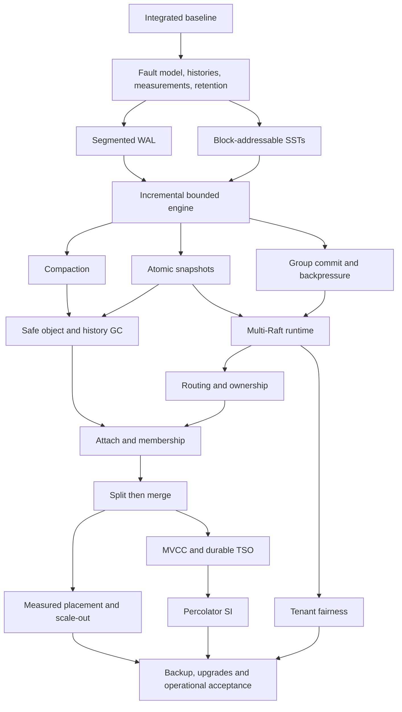

<!-- kv9-roadmap-20260908:epic -->
This is the execution tracker for evolving kv9 from its basic distributed Raw KV baseline into an industrial-grade distributed database. Priorities are consistency, recoverability, bounded resources, measured throughput and scalable ownership. Complex private-network TLS configuration is P4 work.

## Current checkpoint (2026-09-15 UTC)

**Receipt write comparison is prepared; a bounded lossless WAL patch pilot passes.** The fixed CRC `bd42e60`, receipt `a6ac335` and native v3 `0be806d` roles pass fresh original source/binary/compiler/default-feature binding (859 / 869 / 581 source files). Eight source-binding and eight smoke-reader controls pass (`b4e952/0`); the complete 8-smoke/16-timed protocol and storage-v3 policy are unchanged. [Frozen preparation and original checks](https://github.com/c4pt0r/kv9/blob/4086c6205f69d94cc3c832ae6b0eef3400d99fb3/docs/receipt-tail-performance-preparation-v1/README.md) have complete portable byte readback (`1097f4/0`). Separately, six selected closed-store WAL members pass full original-hash patch reconstruction and eight wrong-base/corrupt-patch controls. Base-inclusive ordinary-compression size reductions are **63.404% for the selected point triplet and 66.568% for the selected batch triplet**; these are storage samples, not database speedups or predicted fleet savings. All 30 codec lifetimes exit (`99674/8dfa0b/0`, `73260/ac2d2e/0`). [Original pilot, failure and metadata evidence](https://github.com/c4pt0r/kv9/blob/4086c6205f69d94cc3c832ae6b0eef3400d99fb3/docs/cross-voter-retention-pilot-v1/README.md) passes portable readback (`bc637f/0`). **No original object has been retired, no capacity has been reclaimed by this pilot, and no new QPS/p99 is claimed.** Approximately 25 GB remains available versus an estimated 80–100 GB complete-screen launch budget. The subsequent exact-object follow-up also passes (`70c91b/0`, `35f5d0/0`): all six original compressed SHA/length identities (67,878,587 bytes) and complete decoded WAL identities (100,639,065 bytes), with all twelve codec lifetimes exited. It reproduces the original regular-file stdin mode; it does not substitute the earlier named-file comparison encodings. Portable follow-up readback passes (`4b3867/0`). The separately accepted CRC full-regression metadata adds 27,797,909,504 bytes of eligible target allocation, bringing the four-scope ceiling to 79,671,627,776 bytes; this is not predicted or reclaimed capacity. Next qualify one complete cohort migration, exact original-path restoration and the unchanged legacy reader, then measure actual free space before wider retirement or the full write comparison. CRC stays selected. [Updated development route](https://github.com/c4pt0r/kv9/blob/4086c6205f69d94cc3c832ae6b0eef3400d99fb3/docs/WRITE-PERFORMANCE-NEXT.md). All work is local; hosted CI was not dispatched.

**Receipt tail hint now passes the complete actual 21-window Chaos Mesh campaign.** Exact default runtime `a6ac335` passes all original voter, partition, admission, delay, EIO/ENOSPC, missing-log/replacement-PVC refusal and endpoint-migration windows. Independent complete histories accept **9,360 operations: 8,852 OK / 484 unknown / 24 refused**, with every invocation matched to a return and unknown outcomes retained. Four final replicas each publish two fresh drained statuses. **All 32 observed server lifetimes / 25 containers exit**, the exact owned namespace is absent, and all eight historical namespace UIDs remain unchanged. Runtime `9509/1578ac/0` and all six post phases `73715/d1e0ca/0` are terminal. The full local archive verifies 4,479 members / 891,033,646 original file bytes before cleanup. [Complete report](https://github.com/c4pt0r/kv9/blob/ce9c8309877f6aef150ee3361cf517fe002af2ef/docs/WRITE-RECEIPT-TAIL-CHAOS.md); [portable original histories, faults, audit and cleanup evidence](https://github.com/c4pt0r/kv9/blob/10c946b198fdf11c99369034578b9cab70389c28/docs/receipt-tail-chaos-v1/README.md). Packaging `93527/eee8ee/0` and independent readback `74789c/0` verify **2,304 portable members / 416,355,930 decoded bytes** and independently recompute the three complete history populations. The explicit Chaos-v3 operational floor is 8 GiB with the unchanged 12 GiB maximum decrease across runtime and every post phase; all 117 samples pass. Workload, Raft quorum/sync/reply fences, fault effects, histories and retained failures remain unchanged. **Receipt correctness qualification is complete for this scope; matched throughput/p99 testing is next after fresh capacity qualification. CRC remains selected, and no new performance result or broader industrial checkbox completion is claimed.** [Development route](https://github.com/c4pt0r/kv9/blob/ce9c8309877f6aef150ee3361cf517fe002af2ef/docs/WRITE-PERFORMANCE-NEXT.md). All work is local; hosted CI was not dispatched.

**Receipt tail hint now passes its exact default release and ordinary three-voter recovery.** Candidate `a6ac335` remains separate from the measured FNV and directory candidates. The detached source matches all 869 qualified files and all 12 proof-bound Git blobs; reversing only the receipt adapter reconstructs the selected parent driver. Independent default-feature/ThinLTO/codegen and executable checks pass. Both stream and unary full histories survive actual leader SIGKILL and original-directory restart: **359 complete operations, 329 OK / 30 unknown**, with unknown outcomes included in the consistency checks. Six fresh drains pass and all five server/two client lifetimes exit. Release `18954/924704/0`, release readback `9ade34/0`, recovery `57860/f5f864/0`, and independent audit `23d005/0` are terminal. [Updated report](https://github.com/c4pt0r/kv9/blob/12d96d9c98d72c22a70461f9e64e79f97cc3d275/docs/WRITE-RECEIPT-TAIL-HINT.md); [original release/recovery evidence and verifier](https://github.com/c4pt0r/kv9/blob/12d96d9c98d72c22a70461f9e64e79f97cc3d275/docs/receipt-tail-recovery-v1/README.md). Portable readback `163612/0` verifies all **160 members / 4,381,993 decoded bytes**. The explicit operational storage policy changes the host floor to 8 GiB while retaining the full 16 GiB consumption cap, source/default-feature/history/sync gates and failure retention; six boundary controls pass. The actual Chaos campaign subsequently passed as recorded above; matched timing remains pending. **No new QPS, latency improvement or default promotion is claimed.** CI remains local.

**The complete published-directory write comparison passes; keep CRC main selected.** Exact candidate `483b8c3` improves batch throughput and p99 in both orders, while loaded point throughput regresses slightly in both orders. All **8 smoke / 16 timed cohorts** pass independent acceptance: **7,252,679 measured calls / 64,934,408 items**, all successful on one attempt, with zero refused calls, unknown writes, read/client failures or dropped slots.

| Latest c64 metric | Paired CRC main | Directory candidate |
| --- | ---: | ---: |
| Point Put calls/s | 139,457.016 | 138,734.094 (-0.518%) |
| Point mean / p99 us | 458.798 / 745.472–753.663 | 461.186 / 745.472–753.663 |
| BatchPut(64) items/s | 1,056,344.501 | 1,076,849.048 (+1.941%) |
| Whole-batch mean / p99 ms | 3.877 / 7.537–7.602 | 3.803 / 6.554–6.619 |

Batch throughput improves **+2.166% / +1.717%** at c64 by order, with lower p99 in both. Loaded point changes **-0.820% / -0.215%**. Keep the directory candidate as a batch improvement; do not replace the general CRC baseline or claim Redis parity. Independent acceptance includes 64 timed and 32 smoke lifetimes exited, 48 fresh timed drains, exact CPU restoration, and full decoding of **74,033,997,777 logical bytes** across all 24 cohorts. Combined retained allocation is **52,208,918,528 bytes**. Smoke `24363/c3d554/0`, readback `5664a6/0`, timing/restoration `16255/bf3870/0`, and audit `62866/c1c5d3/0` pass. A pre-workload Git ownership refusal remains preserved; no measured cohort was retried. [Complete results and decision](https://github.com/c4pt0r/kv9/blob/fce70cdc619a470c49b39bfbc92c779401910979/docs/WRITE-PUBLISHED-DIRECTORY-PERFORMANCE.md); [1,123 original evidence members and pooled-statistic verifier](https://github.com/c4pt0r/kv9/blob/fce70cdc619a470c49b39bfbc92c779401910979/docs/published-directory-performance-v1/README.md). Portable verification `c94bda/0` checks all 152,832,812 decoded bytes and recomputes rates/mean/p99 from original reports. These remain shared-host volatile-tmpfs measurements with original Raft quorum/sync/apply/reply fences; Redis was not rerun.

**Earlier completed FNV writer comparison (unchanged): keep CRC main selected.** All **8 smoke / 16 timed cohorts** and independent acceptance pass: **7,283,648 measured calls / 65,259,587 items**, all successful on one attempt, with zero errors, unknown writes or dropped slots. Experimental `12f44d3` is compared with exact CRC main `bd42e60`, using the fixed native v3 client and two opposite complete orders.

| c64 metric | Paired CRC main | FNV writer |
| --- | ---: | ---: |
| Point Put calls/s | 139,388.631 | 139,878.372 (+0.351%) |
| Point mean / p99 us | 459.024 / 737.280–745.471 | 457.411 / 745.472–753.663 |
| BatchPut(64) items/s | 1,053,049.319 | 1,096,549.396 (+4.131%) |
| Whole-batch mean / p99 ms | 3.889 / 7.602–7.668 | 3.734 / 9.830–9.961 |

Batch throughput improves **+1.365% / +6.864%** by order, but the first FNV batch p99 worsens to **12.059–12.190 ms**, while the second improves to **6.685–6.750 ms**. Point throughput reverses direction (**+1.490% / -0.782%**). No order is discarded or rerun, and the cause of the tail variation is unestablished. The mean improvement does not cancel the worse tail. This result does not support default promotion or a full promotion matrix. [Complete c1/c64 results and decision](https://github.com/c4pt0r/kv9/blob/0495214efb4a84d4f3981b924606d0ea1da4fc46/docs/WRITE-FNV-WRITER-PERFORMANCE.md); [portable original reports, per-order histograms, samples, controls and audit evidence](https://github.com/c4pt0r/kv9/blob/fd2e18bd9471ad4f4e8aab6e3d0cd6f8c145e0ce/docs/fnv-writer-performance-v2/README.md). Three voters retain quorum, WAL sync, apply and response fences on **volatile tmpfs WAL**; this is a shared-host loopback diagnostic. Redis was not rerun, and no disk, power-loss, cross-host or equal-durability claim is made.

Independent audit verifies **64 timed / 32 smoke lifetimes exited**, **48 fresh timed drains**, 2,327 source-file checks and 3,073 resource samples. All **74,608,085,855 logical WAL bytes** are independently decoded; combined retained allocation is **52,612,304,896 bytes**. Smoke `36365/df736d/0`, timing `61012/61e0b7/0`, full audit `89236/321c49/0` and reporting `2fe68b/0` are terminal. The portable package contains **2,472 files / 319,208,049 decoded bytes** in 19 parts totaling 38,598,684 compressed bytes; packaging `13753/8c9728/0` and independent verification `d4fbb5/0` pass. The original publisher's synthetic/runtime catalog counting refusal and narrow correction are preserved; no runtime was repeated.

The separate [storage policy v2](https://github.com/c4pt0r/kv9/blob/0495214efb4a84d4f3981b924606d0ea1da4fc46/docs/WRITE-FNV-STORAGE-POLICY.md) passes **71 environment controls** and fixes cleanup being skipped when pre-cleanup metadata cannot be written. It explicitly versions the operational host floors: 64 GiB before/during measurement, 48 GiB during retention plus the unchanged serial restore allowance. Tmpfs/workload/retention caps and every original byte remain. Another inactive dev-cache cleanup releases **6,261,227,520 bytes**; all six protected executable hashes match. Fresh whole/remaining-campaign space checks pass. The original v1 preparation is unchanged. Post-audit available space is 74,389,651,456 bytes; future restores still require a fresh capacity check.

**The next write candidate now passes source and syscall qualification.** Separate experimental `483b8c3` starts from selected CRC `bd42e60`. Initial creation/recovery still synchronize the complete ancestor directory chain. Successful rotation transfers a private live directory capability, verifies canonical path and Unix device/inode identity, then synchronizes the new segment file and its immediate directory before the unchanged topology publication. It avoids repeated ancestor fsync during normal rotation. Every Raft quorum, append sync, publication and response fence remains. **12 conditional TLAPS statements / 24 fresh obligations**, **793 tests/doctests (23 existing ignored)**, formatting and Clippy pass. Five actual syscall cases and four refusal controls pass, including EIO before/after successor-file and parent sync, failure fencing/recovery, and reader rejection of omitted real ancestor/parent sync. Proof `ef45a2/0`, source `98335/7c7935/0`, syscall gate `16016/2057de/0` are terminal. [Design, exact premises and remaining gates](https://github.com/c4pt0r/kv9/blob/aa784a75810d29f9033cc92bbfe57f04c86ee096/docs/WRITE-PUBLISHED-DIRECTORY.md); [portable source/proof/fault evidence](https://github.com/c4pt0r/kv9/blob/483b8c3629b033734f5d7a2b8653a1352304a4b5/docs/published-directory-source-v1/README.md). The archive retains 175 original members / 8,553,269 decoded bytes and passes independent member verification. This source/syscall checkpoint is separate from release/recovery below, physical power-loss, actual Chaos Mesh and performance acceptance.

The [all-16 retained FNV sample analysis](https://github.com/c4pt0r/kv9/blob/aa784a75810d29f9033cc92bbfe57f04c86ee096/docs/WRITE-FNV-TAIL-ANALYSIS.md) finds higher global IO pressure in the worst-tail batch cohort, without a corresponding sampling-gap, CPU, RSS or thread-count anomaly. It does not establish individual-call causality or prove that ancestor sync caused the FNV tail. All original cohorts remain included. **The measured performance table above is unchanged; no speedup is claimed for directory reuse yet.**

**The directory candidate now also passes clean default release and ordinary recovery.** Exact `483b8c3` builds all 871 clean source files with default features, ThinLTO/opt-level 3 and one codegen unit. Independent readback checks source/proof lineage, first-party cache invalidation, actual compiler flags and both retained binary hashes. Streaming and unary recovery histories contain **364 complete operations / 333 OK / 31 unknown**, including successful work with a voter lost and after its original-directory restart, six fresh exporter drains and all five voter/two client lifetimes exited. Unknown outcomes remain unknown. Release `80235/57e676/0`, readback `f68dc7/0`, recovery `39585/962723/0` and independent audit `027b71/0` pass. [Exact artifacts and recovery scope](https://github.com/c4pt0r/kv9/blob/b750da547e32d65d7679c12e361132de4d6357df/docs/WRITE-PUBLISHED-DIRECTORY-RECOVERY.md); [138 original evidence members with verified decode](https://github.com/c4pt0r/kv9/blob/4e8cd198587b556abe6534260c09bf921615f077/docs/published-directory-runtime-v1/README.md). The explicit release/recovery v2 resource policy budgets 16 GiB above a 48 GiB continuous floor, plus 8 MiB metadata at launch; original helpers and all runtime/history requirements remain. A scoped inactive first-party dev-cache retirement reclaims 5,172,379,648 observed bytes, with eight retained binary hashes unchanged. No original payload or source is removed. These are process-recovery results, not actual Chaos Mesh or new performance measurements.

**The directory candidate now passes the actual 21-window Chaos Mesh baseline.** Exact default runtime `483b8c3` retains **9,372 complete operations: 8,844 OK / 505 unknown / 23 refused**, with original classifications unchanged. Independent fault-effect and complete catalog/point/atomic-batch history checks pass, as do four fresh final replica drains, full archive readback and exact-owned cleanup. All **33 observed server lifetimes / 25 containers** exit; all eight historical namespace UIDs remain unchanged. Runtime `81428/548855/0` and all six post phases `71123/2a4eb4/0` are terminal. [Acceptance report and exact scope](https://github.com/c4pt0r/kv9/blob/c2bc12253709ce7ebe4875ae6ccfad8782f96c1b/docs/WRITE-PUBLISHED-DIRECTORY-CHAOS.md); [portable original histories, fault evidence and independent audit](https://github.com/c4pt0r/kv9/blob/6e44598043be90c5f509c16b5ec7700944660b32/docs/published-directory-chaos-v1/README.md). The full local archive retains 4,279 files / 900,304,014 decoded bytes. The portable package verifies 2,370 members / 421,046,560 decoded bytes in 11 parts totaling 21,956,844 compressed bytes; packaging `63977/2b5843/0` and independent verification `6fe983/0` pass. The first portable selector's missing recovery-root references and narrow repair are retained; no workload or acceptance audit was repeated.

**The directory candidate now passes complete actual rotation and leader-kill recovery.** Exact default `483b8c3` selects generation 2 / active segment 2 on all three voters, survives an actual Chaos Mesh leader container-kill on the same Pod/PVC/store, recovers every acknowledged final value, then selects generation 3 / active segment 3 on all three voters after a second burst. Both complete 56-call histories pass: **112/112 calls OK**, including **5,760 traffic write items / 47,185,920 input value bytes**. Five fresh drains and all three full 65-key public readbacks pass. Runtime `91616/8d6682/0`, independent audit `15025/2cf21d/0`, archive/readback `98295/355350/0`, and exact cleanup `99235/092c9f/0` are terminal. All five remaining containers/processes exit; the old killed leader and two native workload exits are separately accounted for. Eight historical namespace UIDs remain unchanged. The earlier namespace-opt-in failure and subsequent no-op watermark fixture failure remain failed and preserved. The corrected checker requires unified driver-applied==committed and command progress covering independently derived acknowledged receipts, without inserting extra writes or weakening Raft semantics. [Report](https://github.com/c4pt0r/kv9/blob/2eb1c7a88b756bf9693b0026ae8c9a1f2586b4bb/docs/WRITE-PUBLISHED-DIRECTORY-ROTATION.md); [complete original success/failure archives and verifier](https://github.com/c4pt0r/kv9/blob/2eb1c7a88b756bf9693b0026ae8c9a1f2586b4bb/docs/published-directory-rotation-v1/README.md). Portable verification reads all 2,638 members / 342,942,668 decoded bytes. No new QPS or latency result is claimed.

**Next:** run the independent matched write screen for receipt tail hint `a6ac335` against CRC after fresh capacity qualification; source/proof/default-release/ordinary-recovery/full21 Chaos gates now pass. Retain the directory candidate's batch benefit and point regression; consider combinations only after separate evidence. The directory comparison is complete, so another campaign requires a new fresh capacity check; post-timing available space was 27,476,590,592 bytes. [Updated development route](https://github.com/c4pt0r/kv9/blob/fce70cdc619a470c49b39bfbc92c779401910979/docs/WRITE-PERFORMANCE-NEXT.md). Read optimization stays held at ThinLTO/Safe ReadIndex. Dynamic multi-Raft, epoch routing, recoverable membership and automatic range splits follow the write phase. Both stage commits and original evidence are pushed; CI stays local and no original industrial work-package checkbox closes.

**A separate validated receipt tail-hint candidate now passes source qualification.** Experimental runtime `a6ac335` starts from selected CRC `bd42e60` and is not combined with the FNV writer. For consecutive indexes it computes a candidate receipt slot, checks bounds and the stored index, and returns the original complete term/index/verdict. Gaps fall back to ordered search; duplicate or decreasing appends permanently retain original oldest-first lookup. Vec retention and all surrounding driver decisions remain byte-identical under the source adapter mapping. **18 parameterized TLA+/TLAPS statements / 158 fresh obligations** pass, including finite gap/certificate counterexamples and semantic/output rejection controls. The clean 869-file source passes **793 workspace tests/doctests (23 existing ignored)**, formatting, Clippy and experimental-feature compilation; the 49 driver tests are included in that total. Proof `99436/5ef6ec/0` and source `56653/93bf26/0` are terminal. The pre-commit proof inputs are independently matched to all 12 committed blobs. [Design, proof limits and next gates](https://github.com/c4pt0r/kv9/blob/7a905ebb5113817ef098ab28be78d0ec9ebedc70/docs/WRITE-RECEIPT-TAIL-HINT.md); [portable original proof, counterexamples and source checks](https://github.com/c4pt0r/kv9/blob/09c8f4d4f324e2cca84cd6fe7b778c0adfd9d4fc/docs/receipt-tail-hint-source-v1/README.md). Default release, ordinary recovery and actual full21 Chaos now pass as recorded above; matched database timing remains pending for this candidate. **No performance gain or default promotion is claimed.** The FNV write screen is now complete as recorded above; the receipt candidate is still separate. The [experiment index](https://github.com/c4pt0r/kv9/blob/7a905ebb5113817ef098ab28be78d0ec9ebedc70/docs/PERFORMANCE-EXPERIMENT-INDEX.md) now reflects completed CRC integration and the separate candidates. Hosted CI remains manual and was not dispatched.

**The exact FNV writer now also passes the eleven-window client-link/reset/quorum-loss campaign.** Default runtime `12f44d3` retains **2,126 complete operations: 1,835 OK / 63 unknown / 228 refused**. Independent full-history, packet-effect and source checks pass. After quiescence, the client-partition window has **37 fully contained unknown calls and zero successes**; quorum loss has **136 fully contained refused calls and zero successes**. Independent same-netem-leaf readback verifies 203 drops without adding parent counters. Three fresh empty replica drains, all five owned container lifetimes and owned cleanup pass; all eight historical namespace UIDs and the protected historical PodChaos UID remain unchanged. Actual runtime `69956/d310bf/0` and post checks `38527/a8923f/0` are terminal. These mixed-traffic windows do not guarantee a selected write is pending at injection; boundary calls remain in the full history. Exact TCP reset uses SOCK_DESTROY; delay/loss/partitions use Chaos Mesh. [Acceptance report and limits](https://github.com/c4pt0r/kv9/blob/1424f8aa4fd9a86970fc364247235e48662dc80c/docs/WRITE-FNV-WRITER-LINK-CHAOS.md). [Portable Link11 histories, controls and independent audit evidence](https://github.com/c4pt0r/kv9/blob/642747635a38b38d1133cf10815f73a3639bf23d/docs/fnv-writer-link-v1/README.md) are now published: 8,421 members / 107,594,169 decoded bytes in four parts totaling 6,317,411 compressed bytes. Package `41511/c130fe/0` and independent verification `d3e11f/0` pass. The original data archive remains local with explicit payload references. This adds correctness evidence, **not a new performance result**.

**Earlier capacity checkpoint under the original v1 policy: 11.49 GB reclaimed.** Exact inactive Cargo cleanup removed 5,985 generated intermediates after retaining 2,912 fingerprint directories and 12 native completion markers. Actual filesystem free space increased by **11,491,069,952 bytes**; all six protected executable hashes match. A nondestructive two-object compression pilot reproduces both original raw and original compressed hashes, but stronger compression saves only 1.6–1.8%; it does not justify bulk history migration. The cleanup checkpoint leaves 122,947,051,520 available bytes versus the unchanged empirical 173,650,006,016-byte requirement: a **50,702,954,496-byte planning gap**, before subsequent evidence allocations. [Capacity results and next gate](https://github.com/c4pt0r/kv9/blob/1424f8aa4fd9a86970fc364247235e48662dc80c/docs/WRITE-FNV-CAPACITY.md); [portable original metadata, failures and independent verification](https://github.com/c4pt0r/kv9/blob/30f1fd2506f76fb59f2bfa0877a5a968a2e6fd2d/docs/fnv-writer-capacity-v1/README.md). These figures describe the original-policy checkpoint. The separate storage-v2 qualification and completed write comparison are recorded above; original evidence is unchanged.

**The bounded FNV writer now passes actual 21-window Chaos Mesh acceptance.** Exact default runtime `12f44d3` retains **9,872 complete-history operations: 9,300 OK / 541 unknown / 31 refused**. Independent full-history checking, four fresh final replica drains, full archive readback and owned cleanup pass; all **31 server lifetimes and 25 containers exit**, and all eight historical namespace UIDs remain unchanged. Actual runtime session 18770 ends `6a6ff0/0`; all six post phases pass in session 60785, `93d95b/0`, without retry. Machine source/binary identities bind the candidate; inherited `bd42e60` scope prose is explicitly documented and original evidence stays unchanged. [Acceptance report and limits](https://github.com/c4pt0r/kv9/blob/f4c6c261a0ff9726d81599648f5bb48e2637dc0b/docs/WRITE-FNV-WRITER-CHAOS.md); [portable complete histories and original audit evidence](https://github.com/c4pt0r/kv9/blob/e61c5c46237994b97753f5ecd1da75bca5438e6b/docs/fnv-writer-chaos-v1/README.md). All **28 performance-helper controls** also pass. The subsequent matched write screen is complete above; CRC main remains selected. At that checkpoint, the paired screen needed 173,650,006,016 available bytes versus approximately 112 GB; the later capacity work and remaining gap are recorded above. The subsequent storage-v2 screen completes all eight smokes and sixteen timed cohorts. No original payload was deleted, benchmark guard relaxed or hosted CI dispatched.

**The bounded FNV writer now passes default release and ordinary recovery.** Exact tested source `12f44d3` builds with empty production features, ThinLTO and unchanged Raft/sync/response fences; independent readback binds all **887 source files**, compiler settings and retained server/client binaries. Streaming and explicit unary recovery retain **365 complete operations: 337 OK / 28 unknown**, six fresh voter drains and all **five voter plus two client lifetimes exited**. Complete histories and the unchanged independent audit pass. The first preflight on the later documentation commit exceeded the unchanged evidence-inventory ceiling by 143,017 bytes and is preserved; a new clean worktree at the exact tested commit resolves that packaging limit without deleting evidence or changing runtime code/guards. [Release and recovery report](https://github.com/c4pt0r/kv9/blob/739bbe4c3ec13627d7349c8e73e9f43dc74caa2d/docs/WRITE-FNV-WRITER-RECOVERY.md); [portable full original histories, payloads, build and audit evidence](https://github.com/c4pt0r/kv9/blob/c9d84fa236b45fccb626ef8afd13c91c95984183/docs/fnv-writer-runtime-v1/README.md). Subsequent **21-window Chaos Mesh acceptance now passes**, as recorded above; the matched write comparison is now complete above. This is process recovery, not Chaos acceptance or a new performance result; CRC main remains selected and hosted CI was not dispatched.

**Bounded FNV writer integration now passes source qualification.** Experimental runtime `12f44d3` stages at most four existing Entry bodies within a **64 KiB total body budget**, flushes within the current call, and preserves frame order, scalar fallback and the original Raft sync/publication/failure fences. **15 writer plus six kernel Lean statements**, seven writer plus six kernel rejection controls, and **797 workspace tests/doctests (23 existing ignored)** pass; formatting, warnings-denied Clippy and explicit experimental-lease compilation also pass. Five new persistence tests cover 70 byte-stream/budget shapes and **1,512 deterministic failure combinations**, including actual raft-rs follower acknowledgment fencing. These are filesystem-model cases, **not actual Chaos Mesh events**. The focused 35 storage tests are included in the workspace population. First failed proof/control attempts are retained. [Implementation, proof scope and next gates](https://github.com/c4pt0r/kv9/blob/13320b8c3b4a76dcfe9ebe15ce8b7fcaddc67e3a/docs/WRITE-FNV-WRITER.md); [portable original source/proof/test evidence](https://github.com/c4pt0r/kv9/blob/37a491eea64a8cd4acc425939335d21c42f1b392/docs/fnv-writer-source-v1/README.md). Default release, ordinary recovery and subsequent actual Chaos Mesh now pass as recorded above; the matched write comparison is now complete above. The candidate remains unselected because the measured tail result does not support promotion. Hosted CI was not dispatched.

**Historical standalone kernel checkpoint: proved and measured before writer integration.** Experimental source `c00b574` was unlinked to the database writer at that checkpoint. Six source-bound universal Lean statements, four Rust equivalence tests in both debug and optimized builds, and six rejection controls pass. One fixed **108-row** hot-buffer kernel matrix finds **3.342x** speedup for four equal 206-byte bodies and **3.969x** for four equal 10,601-byte bodies, with consistent opposite orders. Very uneven bodies gain little and empty groups cost more. These are checksum-kernel results, **not database QPS**, request p99 or Ready-group frequency. [Results and integration contract](https://github.com/c4pt0r/kv9/blob/44d529dca9dd377c36143883467fdae00a41fe12/docs/WRITE-FNV-INTERLEAVE-KERNEL.md); [source, proof and original portable evidence](https://github.com/c4pt0r/kv9/blob/2fe34ba33eabe74d6a2468aefacd8a2774886597/docs/fnv-interleave-kernel-v1/README.md). Earlier failed proof-development attempts are retained. Runtime and accepted database throughput remain unchanged.

**Current CRC main CPU attribution is complete.** The exact bd42e60 release passes both bounded c64 CPU fixtures and the unchanged independent decoder: **3,259 point / 3,106 batch selected samples**, complete measurement coverage, **zero sample loss**, and successful workload/retention/cleanup checks. Fresh exact-binary disassembly attributes **365/3,106 batch samples (11.751%)** to the legacy Raft WAL FNV loop and **166/3,259 point samples (5.094%)** to receipt linear search. The FNV loop is already compiler-unrolled. These are on-CPU observations, not latency fractions or new QPS results; runtime and the accepted throughput panel remain unchanged. [Current CPU report](https://github.com/c4pt0r/kv9/blob/9de2deb35862dc4e0f941f583efe1e8e27d6cf48/docs/WRITE-CRC-MAIN-CPU-PROFILE.md); [portable source, sample and execution evidence](https://github.com/c4pt0r/kv9/blob/13cdb54175e170eed6493d4187dab746a95c9ee8/docs/crc-main-current-cpu-v1/README.md).

**The frame-buffer-on-CRC write screen is complete; keep CRC main.** [Candidate e9249f2](https://github.com/c4pt0r/kv9/commit/e9249f2cbd069dcdc44312be826a68494cf694db) remains experimental. At c64, point Put changes **-0.517%**; BatchPut(64) changes **+0.379% with worse pooled p99**. Both loaded workloads reverse throughput direction between the two orders. The small c1 batch improvement does not establish general selection. All **8 smokes / 16 timed cohorts** and independent acceptance pass, with **7,247,954 one-attempt successful measured calls / 65,011,016 input items**, zero errors, unknown writes or dropped slots. [Complete results and decision](https://github.com/c4pt0r/kv9/blob/d0830af0388b5c47a2364c29b4fd98afc059f2ea/docs/WRITE-FRAME-BUFFER-CRC-PERFORMANCE.md); [portable reports, CPU samples and original audit evidence](https://github.com/c4pt0r/kv9/blob/6d52e3cefc0d7ff7f462be5bb3b2069b430eb680/docs/frame-buffer-crc-performance-v1/README.md).

The exact candidate also passes **790 tests/doctests (23 existing ignored)**, the three-property SMT frame proof with three countermodels, the unchanged 47-statement CRC Lean proof, clean release and ordinary recovery (**337 operations: 309 OK / 28 unknown**). Actual Chaos Mesh passes all **21 windows**, retaining **9,805 complete-history operations: 9,170 OK / 613 unknown / 22 refused**, four final drains and all 33 server lifetime exits. Full archive readback and owned cleanup pass. [Published correctness evidence](https://github.com/c4pt0r/kv9/blob/fdebb0bd6fba798c67b2d5e49e500238ac0c2aad/docs/frame-crc-correctness-v1/README.md). These checks establish the stated qualification scope, not a performance gain or whole-Rust/Raft proof.

**CRC write optimization is integrated and locally qualified on main.** Runtime source is [bd42e60](https://github.com/c4pt0r/kv9/commit/bd42e60f84657e22e36e34924a5c80a08eac623a); the [integration report and next steps](https://github.com/c4pt0r/kv9/blob/1ffd98a83f7095048970e51e629acda444885ef8/docs/CRC32-SLICING-INTEGRATION.md) are published at `1ffd98a`. Slicing-by-eight preserves the IEEE checksum and WAL bytes, Raft commit, synchronization, durable apply, response fences and default Safe ReadIndex.

- Source acceptance: **789 workspace tests/doctests pass, 23 existing ignored**; formatting, warnings-denied Clippy and explicit experimental-lease compilation pass. The source-bound Lean checker verifies **47 distinct statements**, fresh restoration, 256 fallback and 2,048 slicing entries, with eight rejection controls. Rust primitive, iterator and compiler semantics remain explicit premises; this is not a proof of the whole Rust implementation or Raft.
- Clean default release and independent readback cover all 859 source files. Production server, native and point-client features are empty. Seventeen pressure-feature controls keep test-only Raft features separate from production. Ordinary streaming/unary WAL recovery accepts **353 operations: 325 OK / 28 unknown**, six fresh drains and seven exited lifetimes. [Original source/proof/recovery evidence](https://github.com/c4pt0r/kv9/blob/f0bd3c3ed995866f0d5d25ddded8b64ea73c0b98/docs/crc-main-integration-v1/README.md).
- **Actual exact-main Chaos Mesh acceptance passes all 21 windows**, including voter failures, partition, overload, delay, EIO/ENOSPC, missing-log/replacement-PVC refusals and recovery, and endpoint migration. Independent complete histories retain **11,316 operations: 10,683 OK / 602 unknown / 31 refused**. Four fresh final drains, all 31 observed server lifetime exits, complete archive readback and scoped cleanup pass; all eight historical namespace UIDs remain. [Portable full-history evidence](https://github.com/c4pt0r/kv9/blob/a9dc6b0977bdf354b8219f2e35ef823cc7c78bce/docs/crc-main-chaos-v1/README.md) separately verifies 2,291 selected files in 12 archive parts. Unknown writes remain unknown.

**Historical exact-main/frame-buffer write measurements (bd42e60):** c64 point Put **139,188.639 calls/s**, mean **459.683 us**, p99 **737.280–745.471 us**; BatchPut(64) **1,065,680.142 items/s**, mean **3.843 ms**, whole-call p99 **6.947–7.012 ms**. The candidate records 138,469.020 point calls/s and 1,069,721.142 batch items/s, with higher pooled p99 for both. These are two-order, ten-second shared-host volatile-tmpfs measurements, not statistical significance, production capacity or equal-durability Redis claims. Redis was not rerun. The [earlier e748 full matrix](https://github.com/c4pt0r/kv9/blob/1ffd98a83f7095048970e51e629acda444885ef8/docs/WRITE-CRC-FULL-REGRESSION-PERFORMANCE.md) remains separate and retains the latest full read/mixed coverage.

The independent screen audit checks **64 timed / 32 smoke exited lifetimes**, 48 fresh timed drains and writer bindings, exact source and environment restoration, and all **74,191,158,465 logical retained WAL bytes**. Resident allocation is 52,317,179,904 bytes. Prior exact inactive-Cargo cleanup recovered an observed 59,290,816,512 bytes; smoke and remaining-timing reservations passed without lowering any resource floor or restoration reserve. Historical available-space observations do not reserve another run.

## Next development steps

1. Continue write throughput and latency work on CRC main. The complete directory candidate `483b8c3` now passes proof/source/syscall/default-release/recovery/full21/rotation gates and all eight smokes/sixteen timed cohorts. It improves c64 batch throughput 1.941% and p99, but point throughput regresses 0.518%; keep CRC selected and retain the batch improvement separately. Receipt tail hint `a6ac335` now passes default release, ordinary recovery and actual full21 Chaos; next run its independent matched write screen after fresh capacity qualification. Preserve every original failure and all Raft quorum/sync/publication/reply fences. Recheck actual capacity for each new run; prior free-space observations reserve nothing. Do not repeat rejected owned-buffer, worker or transport sweeps without changed causal evidence. [Latest results](https://github.com/c4pt0r/kv9/blob/fce70cdc619a470c49b39bfbc92c779401910979/docs/WRITE-PUBLISHED-DIRECTORY-PERFORMANCE.md); [development order](https://github.com/c4pt0r/kv9/blob/fce70cdc619a470c49b39bfbc92c779401910979/docs/WRITE-PERFORMANCE-NEXT.md).
2. Hold read optimization at selected ThinLTO/Safe ReadIndex. Experimental lease work retains its separate clock/proof/Chaos gates; read parity is unachieved and no longer a prerequisite for this write phase. Compare Redis primary plus two replicas using same-connection WAIT 1 and WAIT 2, with separate durability interpretation. Neither reference establishes Raft or fsync equivalence. Keep real-disk and volatile-tmpfs panels separate. DPDK work needs cross-host/NIC evidence.
3. After the write phase, implement bounded dynamic multi-Raft (#22), range/epoch routing (#23), recoverable membership (#24), automatic size/load-triggered range splits (#25), and placement/scale-out (#27). Preserve #26's separate merge/recovery prerequisite for complete D06 acceptance. Split recovery must survive leader loss, partition and restart without overlapping ownership, lost acknowledged writes or unsafe retries.
4. Continue source-mapped safety and conditional-liveness proofs plus actual Chaos Mesh E2E coverage. Dedicated client-link/quorum-loss, real power-loss, cross-host and scale-out gates remain open. Metadata and scheduling authority must be replicated or safely replaceable; only object storage may be a service-critical singleton.

CI remains local; hosted workflows are manual and reserved for releases or selected key milestones. No hosted CI was dispatched for this checkpoint. **No original industrial work-package checkbox closes for this write experiment.**

The prior issue body, including all accumulated progress notes, is preserved [byte-for-byte in the repository](https://github.com/c4pt0r/kv9/blob/1ffd98a83f7095048970e51e629acda444885ef8/docs/roadmap-history/ISSUE-9-20260914-173814.md), with [timestamp and SHA256](https://github.com/c4pt0r/kv9/blob/1ffd98a83f7095048970e51e629acda444885ef8/docs/roadmap-history/ISSUE-9-20260914-173814.json). The original roadmap below, including all 25 checkbox lines, is unchanged.

## Published baseline

Implementation commit: [ec50678](https://github.com/c4pt0r/kv9/commit/ec506780f273663da9b1d37fe9357495d549bf7c). The baseline adds metadata repairs, atomic WAL v2 data/position recovery, real MinIO checkpoints and durable pending-flush reconciliation. Existing #5, #6, #7 and #8 retain their original scope; C00 owns integrated acceptance.

Local evidence: 413 normal tests, 20 doctests, 21 real MinIO tests and eight E2E paths. These numbers do not assert hosted CI success. The full dataset still resides in memory, checkpoints have a 48 MiB serialized ceiling, Raft history is retained, and there is no incremental LSM or multi-group data runtime yet.

Hosted baseline acceptance: [GitHub Actions run 34274338807](https://github.com/c4pt0r/kv9/actions/runs/34274338807) completed successfully with all nine jobs passing. This is evidence for the published implementation, not completion of the future work packages.

## Mandatory correctness and availability gates

These requirements supplement every work package without removing existing deliverables. Full contract: [correctness gates](https://github.com/c4pt0r/kv9/blob/master/docs/CORRECTNESS-GATES.md).

- Core algorithms require rigorous proofs with explicit state, transitions, invariants, safety and conditional liveness. Machine-check protocol lemmas and document their mapping to implementation events; bounded model checking and E2E tests do not replace proofs.
- E2E must run actual Chaos Mesh fault injection with positive effect observations, independent operation histories and retained success/failure artifacts. SIGKILL is not a power-loss model.
- The database must have no service-critical single point of failure except the object-store dependency. Cover metadata, TSO, schedulers, coordinators, discovery and client routing. Availability is conditional on the stated quorum/failure budget; test every voter and later separate host failure domains.

Each issue remains open until its applicable proof, fault and availability obligations have evidence. An abstract lemma does not establish a complete implementation proof, and a one-host Kind run does not establish host-loss tolerance.

## Execution rules

1. Follow the explicit issue dependencies. Stage exit gates are additional acceptance requirements; interface/design work may overlap, but later-stage claims require the earlier gates.
2. Start C00, then develop deterministic faults, history checking, measurement and retention contracts. Keep the same correctness workload while changing persistence, batching and ownership.
3. Snapshot installation and its recovery anchor precede Raft truncation. Durable pins and pending-history evidence precede SST/history GC.
4. Measure throughput with unchanged durability and read semantics. A matching final state, mock-only storage run, zero selected tests or unknown checker result is not acceptance.
5. Do not silently weaken cross-region Raw semantics. Unsupported atomic operations must refuse before side effects; unknown writes remain unknown unless deduplication proves a safe retry.
6. Close implementation issues only with linked commits and check evidence. Phase gates and the tracker remain open until all applicable acceptance criteria are met. Dates are not promised without capacity estimates.

## Stages and issue checklist

### P0 - Verified foundation

C00 integrates the baseline; C01/C02/C03/C04 can start independently afterward. Complete the fault model, history checker, measurements and retention contract before accepting P1 capacity or performance claims.

- [x] [#10](https://github.com/c4pt0r/kv9/issues/10) **C00** - Integrate the takeover fixes and establish a reproducible acceptance baseline
- [ ] [#11](https://github.com/c4pt0r/kv9/issues/11) **C01** - Build deterministic fault injection and a persistence recovery matrix
- [ ] [#12](https://github.com/c4pt0r/kv9/issues/12) **C02** - Record and check linearizable Raw KV and metadata histories
- [ ] [#13](https://github.com/c4pt0r/kv9/issues/13) **C03** - Establish observability and reproducible single-group performance baselines
- [ ] [#14](https://github.com/c4pt0r/kv9/issues/14) **C04** - Define format compatibility, recovery anchors and shared retention rules

Status reconciled on 2026-09-09 against the original work-package acceptance criteria: **1 of 25 original items is complete: C00 / #10.** Its [acceptance record](https://github.com/c4pt0r/kv9/issues/10) covers the integrated baseline, proof scope, real MinIO, actual Chaos Mesh and applicable quorum/failover evidence. P0 remains open.

The remaining P0 packages have accepted increments, but still have outstanding requirements:

| Original item | Accepted progress and evidence | Remaining work before checking the original item |
|---|---|---|
| **C01 / #11** | Deterministic Raft persistence controls, every-voter EIO/ENOSPC and recovery checks; registration/seed fixes (#36, #37), root-formation recovery (#44), restart-fixture repair (#45), and the completed receive/replacement acceptance (#42). The [latest accepted matrix](https://github.com/c4pt0r/kv9/blob/24618388de938b11b70c4a05c5c746461bb916b9/docs/ENDPOINT-RECOVERY.md#accepted-local-increment) passes all 21 actual Chaos Mesh windows. | Complete the named engine/checkpoint/pending-publication persistence cuts and network-fault matrix, with replayable schedules, positive arrival evidence and applicable implementation controls. |
| **C02 / #12** | Independent CLI and persistent-client histories, explicit unknown outcomes, negative controls, and accepted search repairs (#46, #49). The latest full matrix independently validates all 4,024 CLI operations and 1,194 persistent-client operations. | Add production-size multi-chunk range deletion and typed partial-result histories under actual faults; complete the remaining joint C01 fault-history coverage and protocol-to-implementation proof obligations. |
| **C03 / #13** | Bounded public admission (#38), request/Raft/durability timing (#39), and persistent-channel workloads with reproducible reports (#40). [Repeated local measurements](https://github.com/c4pt0r/kv9/blob/ce508efadee81461ddb3c0b7a28b1ddb695a3b9b/docs/BENCHMARK-VALIDATION.md) retain all 54 performance trials and 18 complete-history guards. | Complete I/O amplification, recovery timing, cold/warm and hotspot comparisons, remaining metric/resource bounds and representative repeated measurements. #41 tracks the separate measured scheduling work. |
| **C04 / #14** | Durable Ready publication (#35) and source-mapped protocol proofs; accepted versioned endpoint authority, durable recovery and writer/wire compatibility fencing (#47). | Finish the common recovery-anchor and retention-owner contract, durable pin transfer/release/recovery, crash-state/refusal matrix, checkpoint/retention proof composition and dual-WAL ADR. |

Completed supporting issues do not automatically complete their parent work packages. All P1-P4 original items remain unchecked. The [latest implementation acceptance](https://github.com/c4pt0r/kv9/issues/9#issuecomment-5610029924) records the exact revisions, local test/proof results, complete histories and retained artifacts. Single-host Kind evidence does not establish cross-host availability; the tested stop/upgrade/restart boundary does not establish mixed-generation availability. Daily verification remains local; hosted workflows are manual-only before releases or at key milestones.

### P1 - Bounded storage and throughput

Implement segmented WAL and block reads, then incremental views. Compaction, snapshot installation and batching follow their explicit dependencies. Enable physical GC only after retention and snapshot safety are proven. Exit with a dataset larger than RAM, bounded resources and unchanged correctness guarantees.

- [ ] [#15](https://github.com/c4pt0r/kv9/issues/15) **S01** - Implement segmented engine WAL and watermark-based reclamation
- [ ] [#16](https://github.com/c4pt0r/kv9/issues/16) **S02** - Add block-addressable SST reads and a bounded cache
- [ ] [#17](https://github.com/c4pt0r/kv9/issues/17) **S03** - Integrate incremental flush and immutable versioned read views
- [ ] [#18](https://github.com/c4pt0r/kv9/issues/18) **S04** - Implement compaction with safe point and range tombstone retention
- [ ] [#19](https://github.com/c4pt0r/kv9/issues/19) **S05** - Implement atomic Raft snapshot installation and safe log truncation
- [ ] [#20](https://github.com/c4pt0r/kv9/issues/20) **S06** - Add proposal batching, group commit and end-to-end backpressure
- [ ] [#21](https://github.com/c4pt0r/kv9/issues/21) **S07** - Implement pin-aware SST garbage collection and manifest history pruning

### P2 - Multi-group ownership and scale-out

Build the group runtime and routing before replica attachment, split/merge and automatic placement. Exit with recoverable ownership transitions and measured independent-hotspot scaling across machines.

- [ ] [#22](https://github.com/c4pt0r/kv9/issues/22) **D01** - Build RegionManager and a resource-bounded multi-Raft runtime
- [ ] [#23](https://github.com/c4pt0r/kv9/issues/23) **D02** - Route requests to real regions with epoch fencing and bounded retries
- [ ] [#24](https://github.com/c4pt0r/kv9/issues/24) **D03** - Implement remote learner attachment and recoverable replica migration
- [ ] [#25](https://github.com/c4pt0r/kv9/issues/25) **D04** - Implement recoverable pre-sharding and region splits
- [ ] [#26](https://github.com/c4pt0r/kv9/issues/26) **D05** - Implement adjacent region merges with crash recovery
- [ ] [#27](https://github.com/c4pt0r/kv9/issues/27) **D06** - Add load-aware placement, hotspot control and scale-out acceptance

### P3 - Transactions and tenant isolation

Land MVCC/TSO before Percolator SI and its independent checker. Tenant fairness may overlap late P2 once shared resource interfaces are stable. Exit with verified SI and bounded noisy-neighbor impact.

- [ ] [#28](https://github.com/c4pt0r/kv9/issues/28) **T01** - Implement MVCC storage and durable TSO/timeline authority
- [ ] [#29](https://github.com/c4pt0r/kv9/issues/29) **T02** - Implement Percolator SI, lock recovery and transaction history checking
- [ ] [#30](https://github.com/c4pt0r/kv9/issues/30) **T03** - Implement tenant quotas, fair scheduling and resource accounting

### P4 - Operational delivery

Deliver complete backup/PITR and versioned upgrade protocols, then long-duration operational acceptance. TLS/mTLS and backend compatibility remain explicit later priorities. Exit with actual restore/upgrade/soak evidence, not a production-readiness label based on short tests.

- [ ] [#31](https://github.com/c4pt0r/kv9/issues/31) **O01** - Deliver complete backup and point-in-time recovery
- [ ] [#32](https://github.com/c4pt0r/kv9/issues/32) **O02** - Implement format migration and verified rolling upgrades
- [ ] [#33](https://github.com/c4pt0r/kv9/issues/33) **O03** - Complete operational controls, diagnostics and long-duration acceptance
- [ ] [#34](https://github.com/c4pt0r/kv9/issues/34) **O04** - Add TLS configuration, credential rotation and S3 backend compatibility

## Dependency index

| Key | Deliverable | Depends on |
|---|---|---|
| C00 | [#10](https://github.com/c4pt0r/kv9/issues/10) Integrate the takeover fixes and establish a reproducible acceptance baseline | Existing #5-#8 integration |
| C01 | [#11](https://github.com/c4pt0r/kv9/issues/11) Build deterministic fault injection and a persistence recovery matrix | [#10](https://github.com/c4pt0r/kv9/issues/10) (C00) |
| C02 | [#12](https://github.com/c4pt0r/kv9/issues/12) Record and check linearizable Raw KV and metadata histories | [#10](https://github.com/c4pt0r/kv9/issues/10) (C00) |
| C03 | [#13](https://github.com/c4pt0r/kv9/issues/13) Establish observability and reproducible single-group performance baselines | [#10](https://github.com/c4pt0r/kv9/issues/10) (C00) |
| C04 | [#14](https://github.com/c4pt0r/kv9/issues/14) Define format compatibility, recovery anchors and shared retention rules | [#10](https://github.com/c4pt0r/kv9/issues/10) (C00) |
| S01 | [#15](https://github.com/c4pt0r/kv9/issues/15) Implement segmented engine WAL and watermark-based reclamation | [#11](https://github.com/c4pt0r/kv9/issues/11) (C01), [#14](https://github.com/c4pt0r/kv9/issues/14) (C04) |
| S02 | [#16](https://github.com/c4pt0r/kv9/issues/16) Add block-addressable SST reads and a bounded cache | [#13](https://github.com/c4pt0r/kv9/issues/13) (C03), [#14](https://github.com/c4pt0r/kv9/issues/14) (C04) |
| S03 | [#17](https://github.com/c4pt0r/kv9/issues/17) Integrate incremental flush and immutable versioned read views | [#15](https://github.com/c4pt0r/kv9/issues/15) (S01), [#16](https://github.com/c4pt0r/kv9/issues/16) (S02), [#12](https://github.com/c4pt0r/kv9/issues/12) (C02), [#14](https://github.com/c4pt0r/kv9/issues/14) (C04) |
| S04 | [#18](https://github.com/c4pt0r/kv9/issues/18) Implement compaction with safe point and range tombstone retention | [#17](https://github.com/c4pt0r/kv9/issues/17) (S03), [#11](https://github.com/c4pt0r/kv9/issues/11) (C01), [#12](https://github.com/c4pt0r/kv9/issues/12) (C02), [#14](https://github.com/c4pt0r/kv9/issues/14) (C04) |
| S05 | [#19](https://github.com/c4pt0r/kv9/issues/19) Implement atomic Raft snapshot installation and safe log truncation | [#15](https://github.com/c4pt0r/kv9/issues/15) (S01), [#17](https://github.com/c4pt0r/kv9/issues/17) (S03), [#11](https://github.com/c4pt0r/kv9/issues/11) (C01), [#14](https://github.com/c4pt0r/kv9/issues/14) (C04) |
| S06 | [#20](https://github.com/c4pt0r/kv9/issues/20) Add proposal batching, group commit and end-to-end backpressure | [#11](https://github.com/c4pt0r/kv9/issues/11) (C01), [#12](https://github.com/c4pt0r/kv9/issues/12) (C02), [#13](https://github.com/c4pt0r/kv9/issues/13) (C03), [#17](https://github.com/c4pt0r/kv9/issues/17) (S03) |
| S07 | [#21](https://github.com/c4pt0r/kv9/issues/21) Implement pin-aware SST garbage collection and manifest history pruning | [#18](https://github.com/c4pt0r/kv9/issues/18) (S04), [#19](https://github.com/c4pt0r/kv9/issues/19) (S05), [#12](https://github.com/c4pt0r/kv9/issues/12) (C02), [#14](https://github.com/c4pt0r/kv9/issues/14) (C04) |
| D01 | [#22](https://github.com/c4pt0r/kv9/issues/22) Build RegionManager and a resource-bounded multi-Raft runtime | [#19](https://github.com/c4pt0r/kv9/issues/19) (S05), [#20](https://github.com/c4pt0r/kv9/issues/20) (S06) |
| D02 | [#23](https://github.com/c4pt0r/kv9/issues/23) Route requests to real regions with epoch fencing and bounded retries | [#22](https://github.com/c4pt0r/kv9/issues/22) (D01), [#12](https://github.com/c4pt0r/kv9/issues/12) (C02) |
| D03 | [#24](https://github.com/c4pt0r/kv9/issues/24) Implement remote learner attachment and recoverable replica migration | [#22](https://github.com/c4pt0r/kv9/issues/22) (D01), [#23](https://github.com/c4pt0r/kv9/issues/23) (D02), [#19](https://github.com/c4pt0r/kv9/issues/19) (S05), [#21](https://github.com/c4pt0r/kv9/issues/21) (S07) |
| D04 | [#25](https://github.com/c4pt0r/kv9/issues/25) Implement recoverable pre-sharding and region splits | [#23](https://github.com/c4pt0r/kv9/issues/23) (D02), [#24](https://github.com/c4pt0r/kv9/issues/24) (D03), [#18](https://github.com/c4pt0r/kv9/issues/18) (S04), [#21](https://github.com/c4pt0r/kv9/issues/21) (S07), [#12](https://github.com/c4pt0r/kv9/issues/12) (C02) |
| D05 | [#26](https://github.com/c4pt0r/kv9/issues/26) Implement adjacent region merges with crash recovery | [#25](https://github.com/c4pt0r/kv9/issues/25) (D04), [#24](https://github.com/c4pt0r/kv9/issues/24) (D03), [#21](https://github.com/c4pt0r/kv9/issues/21) (S07), [#12](https://github.com/c4pt0r/kv9/issues/12) (C02) |
| D06 | [#27](https://github.com/c4pt0r/kv9/issues/27) Add load-aware placement, hotspot control and scale-out acceptance | [#24](https://github.com/c4pt0r/kv9/issues/24) (D03), [#25](https://github.com/c4pt0r/kv9/issues/25) (D04), [#26](https://github.com/c4pt0r/kv9/issues/26) (D05), [#13](https://github.com/c4pt0r/kv9/issues/13) (C03) |
| T01 | [#28](https://github.com/c4pt0r/kv9/issues/28) Implement MVCC storage and durable TSO/timeline authority | [#23](https://github.com/c4pt0r/kv9/issues/23) (D02), [#25](https://github.com/c4pt0r/kv9/issues/25) (D04), [#18](https://github.com/c4pt0r/kv9/issues/18) (S04), [#14](https://github.com/c4pt0r/kv9/issues/14) (C04) |
| T02 | [#29](https://github.com/c4pt0r/kv9/issues/29) Implement Percolator SI, lock recovery and transaction history checking | [#28](https://github.com/c4pt0r/kv9/issues/28) (T01), [#24](https://github.com/c4pt0r/kv9/issues/24) (D03), [#26](https://github.com/c4pt0r/kv9/issues/26) (D05), [#12](https://github.com/c4pt0r/kv9/issues/12) (C02) |
| T03 | [#30](https://github.com/c4pt0r/kv9/issues/30) Implement tenant quotas, fair scheduling and resource accounting | [#20](https://github.com/c4pt0r/kv9/issues/20) (S06), [#22](https://github.com/c4pt0r/kv9/issues/22) (D01), [#13](https://github.com/c4pt0r/kv9/issues/13) (C03) |
| O01 | [#31](https://github.com/c4pt0r/kv9/issues/31) Deliver complete backup and point-in-time recovery | [#14](https://github.com/c4pt0r/kv9/issues/14) (C04), [#19](https://github.com/c4pt0r/kv9/issues/19) (S05), [#21](https://github.com/c4pt0r/kv9/issues/21) (S07), [#29](https://github.com/c4pt0r/kv9/issues/29) (T02) |
| O02 | [#32](https://github.com/c4pt0r/kv9/issues/32) Implement format migration and verified rolling upgrades | [#14](https://github.com/c4pt0r/kv9/issues/14) (C04), [#24](https://github.com/c4pt0r/kv9/issues/24) (D03), [#29](https://github.com/c4pt0r/kv9/issues/29) (T02) |
| O03 | [#33](https://github.com/c4pt0r/kv9/issues/33) Complete operational controls, diagnostics and long-duration acceptance | [#27](https://github.com/c4pt0r/kv9/issues/27) (D06), [#29](https://github.com/c4pt0r/kv9/issues/29) (T02), [#30](https://github.com/c4pt0r/kv9/issues/30) (T03), [#31](https://github.com/c4pt0r/kv9/issues/31) (O01), [#32](https://github.com/c4pt0r/kv9/issues/32) (O02), [#13](https://github.com/c4pt0r/kv9/issues/13) (C03) |
| O04 | [#34](https://github.com/c4pt0r/kv9/issues/34) Add TLS configuration, credential rotation and S3 backend compatibility | [#14](https://github.com/c4pt0r/kv9/issues/14) (C04), [#24](https://github.com/c4pt0r/kv9/issues/24) (D03) |

## Critical path

The diagram is a critical-path summary; the dependency index and each issue define the complete prerequisites.

## Release evidence

- P0: reproducible fault cuts, independent histories, typed refusal/unknown semantics, retention and compatibility contracts.
- P1: a dataset exceeding configured RAM, bounded live resource usage across compaction cycles, safe truncation/GC and repeatable throughput results.
- P2: actual groups and recoverable ownership changes, with byte-accounted attachment and cross-machine scaling evidence.
- P3: independently verified SI and measured tenant isolation under overload.
- P4: empty-environment restore, real mixed-version upgrades, measured RPO/RTO, and completed long-duration runs. TLS remains a later deployment capability.

Reference documents: [architecture](https://github.com/c4pt0r/kv9/blob/ec506780f273663da9b1d37fe9357495d549bf7c/DESIGN.md), [roadmap](https://github.com/c4pt0r/kv9/blob/ec506780f273663da9b1d37fe9357495d549bf7c/docs/ROADMAP.md), [object-storage contract](https://github.com/c4pt0r/kv9/blob/ec506780f273663da9b1d37fe9357495d549bf7c/docs/OBJECT-STORAGE.md), and [testing rules](https://github.com/c4pt0r/kv9/blob/ec506780f273663da9b1d37fe9357495d549bf7c/docs/TESTING.md).
